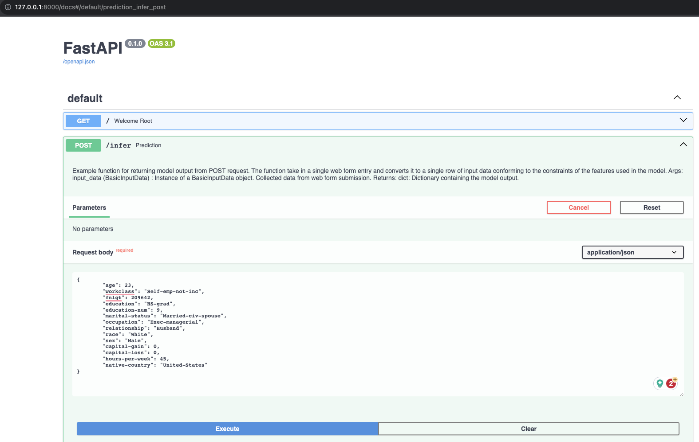

# Machine Learning in Production

## 1. Introduction
Build machine learning project in production. This repo contains the following topics:
- Clean code principles
- Testing
- Logging
- Data versioning
- Model versioning
- CI/CD
- Monitoring

Technologies stack used:
- Language: Python
- Lint and formatter: Autopep8, Pylint
- Testing: Pytest
- Pre-commit hooks: pre-commit
- Configuration: Hydra
- Model versioning: MLflow
- Experiment tracking: Weights & Biases

Inspired by Machine Learning DevOps Engineer by Udacity.


## 2. Installation
### 2.1. Create virtual environment
```bash
make poetry-download
make install
```

### 2.2. Install pre-commit hooks
```bash
make pre-commit-install
```

## 3. Data
### 3.1. Download data
```bash
data/census.csv
```
Link: https://archive.ics.uci.edu/ml/datasets/census+income

### 3.2. EDA
EDA in notebook: [](EDA.ipynb)

### 3.3. Data versioning
```bash
dvc init
mkdir ../local_remote
dvc remote add -d localremote ../local_remote
dvc add data/census.csv
dvc add data/census_clean.csv
git add data/.gitignore data/census.csv.dvc data/census_clean.csv.dvc
git commit -m "Add data"
dvc push
```

## 4. Train Model
```bash
python module/train_model.py
```
Result
```
2023-08-24 22:52:51,274 - INFO - Splitting data into train and test sets...
2023-08-24 22:52:51,281 - INFO - Processing data...
2023-08-24 22:52:51,488 - INFO - Training model...
2023-08-24 22:52:51,729 - INFO - LogisticRegression(max_iter=1000, random_state=8071)
2023-08-24 22:52:51,730 - INFO - Saving model...
2023-08-24 22:52:51,731 - INFO - Model saved.
2023-08-24 22:52:51,731 - INFO - Inference model...
2023-08-24 22:52:51,732 - INFO - Calculating model metrics...
2023-08-24 22:52:51,743 - INFO - >>>Precision: 0.7110332749562172
2023-08-24 22:52:51,743 - INFO - >>>Recall: 0.2617666021921341
2023-08-24 22:52:51,743 - INFO - >>>Fbeta: 0.3826578699340245
2023-08-24 22:52:51,743 - INFO - Calculating model metrics on slices data...
2023-08-24 22:52:52,730 - INFO - >>>Precision with slices data: 1.0
2023-08-24 22:52:52,730 - INFO - >>>Recall with slices data: 1.0
2023-08-24 22:52:52,730 - INFO - >>>Fbeta with slices data: 1.0
```

## 5. Run sanity checks
```bash
python sanity_checks.py
```
Result
```
============= Sanity Check Report ===========
2023-08-24 23:16:57,951 - INFO - Your test cases look good!
2023-08-24 23:16:57,951 - INFO - This is a heuristic based sanity testing and cannot guarantee the correctness of your code.
2023-08-24 23:16:57,951 - INFO - You should still check your work against the rubric to ensure you meet the criteria.
```

## 6. Run tests
```bash
pytest tests/
```
Result
```
tests/test_api.py ....                                                [ 44%]
tests/test_model.py .....                                             [100%]
```

## 7. Request API
### 7.1. Local
```bash
uvicorn module.api:app --reload
```
Result


### 7.2. Render
URL: https://vnk8071-api-deployment.onrender.com/docs

