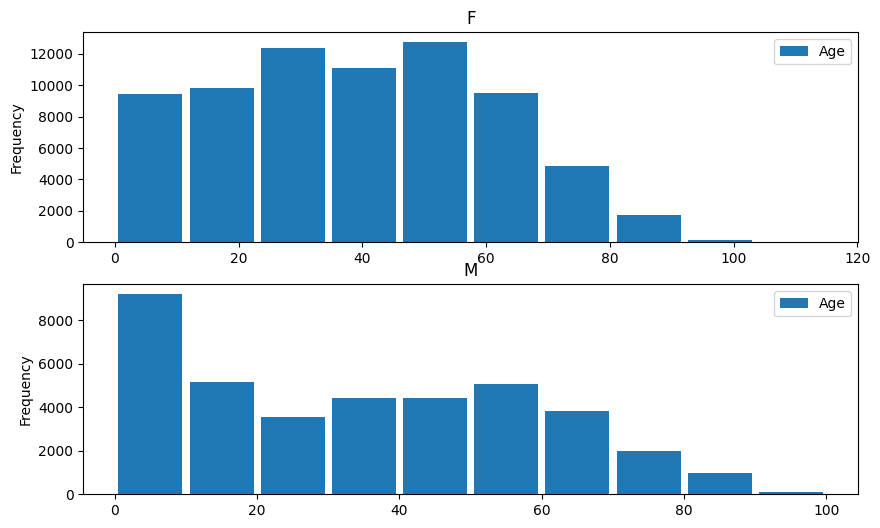
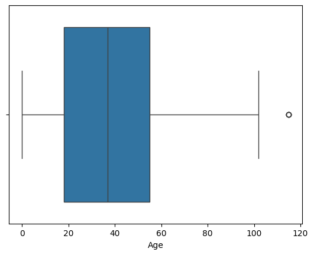
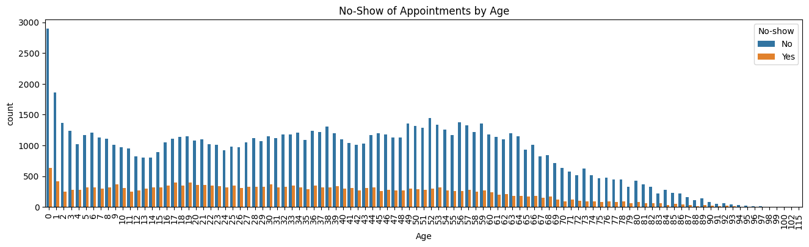
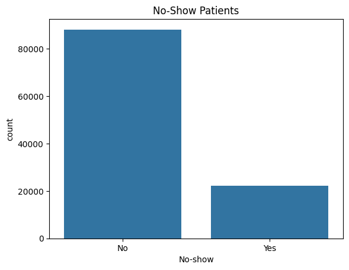
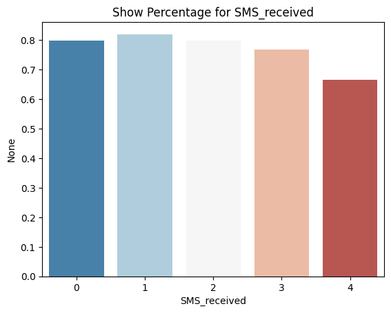
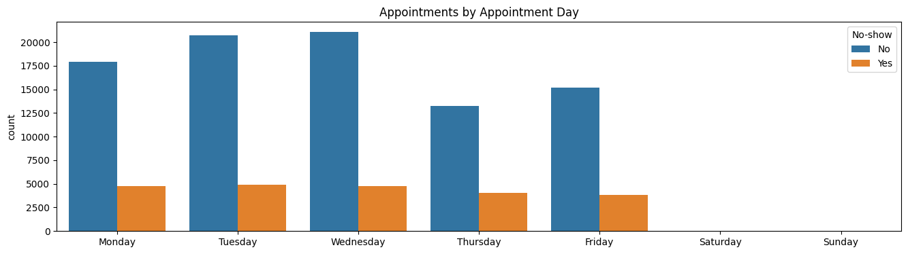

# No-show appointments dataset analysis

## Introduction
### Work directory
```bash
├── KhoiVN_investigate_data.ipynb
├── KaggleV2-May-2016.csv
├── README.md
└── requirements.txt
```

### Dataset Overview
This dataset collects information from 100k medical appointments in Brazil and is focused on the question of whether or not patients show up for their appointment. A number of characteristics about the patient are included in each row.

Link dataset: https://www.kaggle.com/datasets/joniarroba/noshowappointments

### Data Description
PatientId,AppointmentID,Gender,ScheduledDay,AppointmentDay,Age,Neighbourhood,Scholarship,Hipertension,Diabetes,Alcoholism,Handcap,SMS_received,No-show
- `PatientId`: Identification of a patient
- `AppointmentID`: Identification of each appointment
- `Gender`: Male or Female (M/F). Female is the greater proportion, woman takes way more care of they health in comparison to man.
- `ScheduledDay`: The day someone called or registered the appointment, this is before appointment of course.
- `AppointmentDay`: The day of the actual appointment, when they have to visit the doctor.
- `Age`: How old is the patient.
- `Neighborhood`: Where the appointment takes place.
- `Scholarship`: True or False (0/1). Observation, this is a broad topic, consider reading this article https://en.wikipedia.org/wiki/Bolsa_Fam%C3%ADlia
- `Hipertension`: True or False (0/1).
- `Diabetes`: True or False (0/1).
- `Alcoholism`: True or False (0/1).
- `Handcap`: True or False (0/1).
- `SMS_received`: 1 or more messages sent to the patient.
- Be careful about the encoding of the last column: it says `No` if the patient showed up to their appointment, and `Yes` if they did not show up.

### Questions for Analysis
1. Data Wrangling:
- Does dataset have any missing or duplicate values?
- Does dataset have any outliers?
- Does dataset have any wrong data types?

2. Exploratory Data Analysis:
- What factors are important for us to know in order to predict if a patient will show up for their scheduled appointment?
- What are the relationship between the age, gender and the no-show rate?
- Are the patients who received SMS reminders more likely to show up for their scheduled appointment?
- What is the relationship between the no-show rate and the day of the week?

## Installation
This project requires Python 3.x and the following Python libraries installed:
```bash
pip install -r requirements.txt
```

## Data Wrangling
### Read Dataset
```python
df = pandas.read_csv('KaggleV2-May-2016.csv')
```

### Check Missing Values and Data Types
```python
df.info()
```

### Check Duplicate Values
```python
df.duplicated().sum()
```

### Check Outliers
```python
df.describe()
```

## Data Cleaning
```python
df = df[df['Age'] >= 0]
df.rename(columns={'Hipertension': 'Hypertension', 'Handcap': 'SMS_received', 'SMS_received': 'Handicap'}, inplace=True)
df.head()
```

## Exploratory Data Analysis
### Histogram


### Boxplot


### Relationship Between Age and Noshow

### Bar Chart


### Percentage Bar Chart


### Feature Engineering
```python
df['ScheduledDay'] = pandas.to_datetime(df['ScheduledDay'])
df['AppointmentDay'] = pandas.to_datetime(df['AppointmentDay'])
```

Get weekday from `AppointmentDay` column
```python
df['AppointmentWeekday'] = df['AppointmentDay'].dt.weekday
```


## Conclusions
### Answer Questions
1. Data Wrangling:
Does dataset have any missing or duplicate values?
-> No.
Does dataset have any outliers?
-> Yes in column `Age`.
- Does dataset have any wrong data types?
-> Yes in column `PatientId`, `ScheduledDay` and `AppointmentDay`.

2. Exploratory Data Analysis:
What factors are important for us to know in order to predict if a patient will show up for their scheduled appointment?
-The age of patient.
-The day of the week of appointment.

What are the relationship between the age, gender and the no-show rate?
- Female have more appointments than male, however the ratio no-show of them almost the same. So this factor is not important for us to know in order to predict if a patient will show up for their scheduled appointment.
- We have left-skew figure in the relationship of age and no-show rate. It means that the older the patient, the more likely they will show up for their scheduled appointment.

What is the relationship between the no-show rate and the day of the week?
-> The no-show rate of patients who have appointment on Wednesday is highest. It means the trend of patient appointments is increasing from Monday to Wednesday and then decreasing from Wednesday to Friday.

Are the patients who received SMS reminders more likely to show up for their scheduled appointment?
-> Yes, the show rate of patients who received 2 and 3 SMS reminders is higher than the show rate of patients who did not receive SMS reminders.

### Limitations
The dataset does not have enough information about the patient's health, financial situation, education, etc. Lacking these information makes it difficult to predict if a patient will show up for their scheduled appointment.
