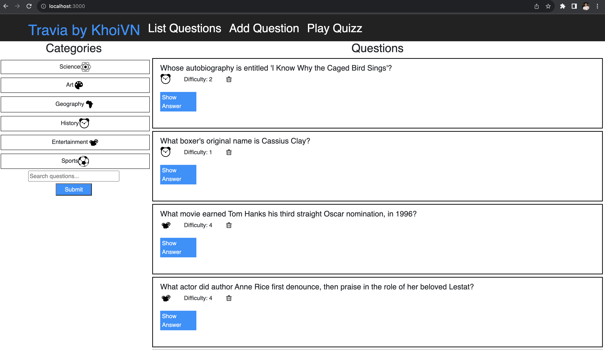
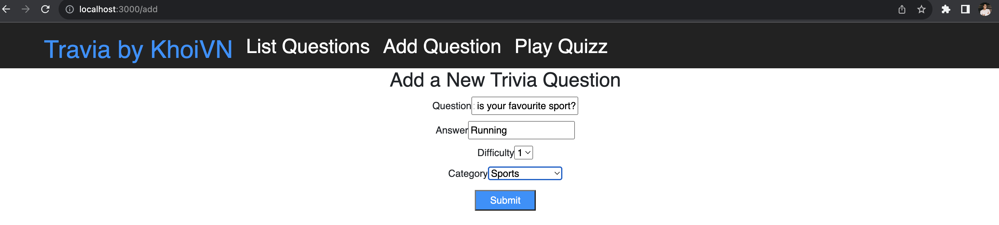
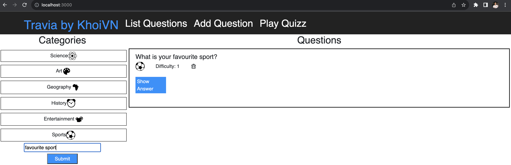
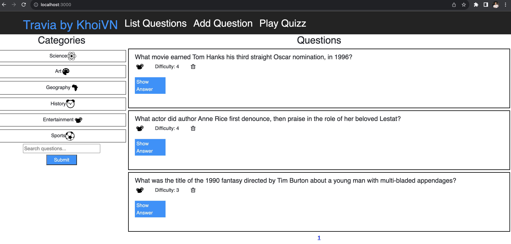
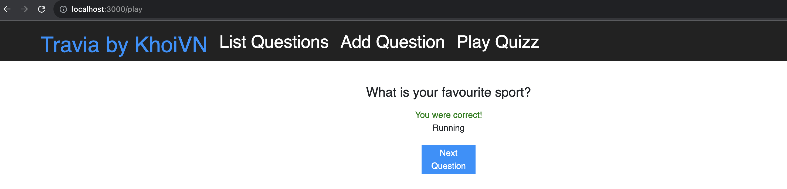

# API Development and Documentation Final Project

Source code: [vnk8071/api_development_documentation](https://github.com/vnk8071/machine-learning-in-production/tree/main/projects/api_development_documentation)

## Trivia App

Udacity is invested in creating bonding experiences for its employees and students. A bunch of team members got the idea to hold trivia on a regular basis and created a webpage to manage the trivia app and play the game, but their API experience is limited and still needs to be built out.

That's where you come in! Help them finish the trivia app so they can start holding trivia and seeing who's the most knowledgeable of the bunch. The application must:

1. Display questions - both all questions and by category. Questions should show the question, category and difficulty rating by default and can show/hide the answer.
2. Delete questions.
3. Add questions and require that they include question and answer text.
4. Search for questions based on a text query string.
5. Play the quiz game, randomizing either all questions or within a specific category.

Completing this trivia app will give you the ability to structure plan, implement, and test an API - skills essential for enabling your future applications to communicate with others.

## Installing Dependencies
```
pip install -r requirements.txt
```

## Migration
```
createdb trivia
psql trivia < trivia.psql
```

## Running the server
```
FLASK_APP=flaskr.app FLASK_DEBUG=true flask run
```

## Documentation
### Get Categories API
`GET '/api/v1.0/categories'`

- Fetches a dictionary of categories in which the keys are the ids and the value is the corresponding string of the category
- Request Arguments: None
- Returns: An object with keys `id` and `type` and values of corresponding `id` and `type` of categories

```json
{
    "categories": {
        "1": "Science",
        "2": "Art",
        "3": "Geography",
        "4": "History",
        "5": "Entertainment",
        "6": "Sports"
    },
    "success": true
}
```

```curl
curl -X GET http://127.0.0.1:5000/api/v1.0/categories
```

### Get Questions API
`GET '/api/v1.0/questions'`

- Fetches a dictionary of questions in which the keys are the ids and the value is the corresponding string of the question
- Request Arguments: None
- Returns: An object with `id`, `question`, `answer`, `difficulty` and `category_id` and values of them in database.

```
{
    "questions": [
        {
            "id": 1,
            "question": "What movie earned Tom Hanks his third straight Oscar nomination, in 1996?",
            "answer": "Apollo 13",
            "category": "5",
            "difficulty": 4
        },
        {
            "id": 2,
            "question": "What actor did author Anne Rice first denounce, then praise in the role of her beloved Lestat?",
            "answer": "Tom Cruise",
            "category": "5",
            "difficulty": 4
        },
        {
            "id": 3,
            "question": "Whose autobiography is entitled 'I Know Why the Caged Bird Sings'?",
            "answer": "Maya Angelou",
            "category": "4",
            "difficulty": 2
        }
    ],
    ,
    'total_questions': 3,
    'current_category': 1,
    'categories': {
        "1": "Science",
        "2": "Art",
        "3": "Geography",
        "4": "History",
        "5": "Entertainment",
        "6": "Sports"
    }
    "success": true
}
```

```curl
curl -X GET http://127.0.0.1:5000/api/v1.0/questions
```

### Create Question API
`POST '/api/v1.0/questions'`

- Creates a new question using the submitted question, answer, difficulty and category. Returns the id of the created question, success value and total questions
- Request Arguments: None
- Returns: An object with `id`, `success` and values of them in database.

```
{
    "created": 1,
    "success": true,
}
```

```curl
curl -X POST -H "Content-Type: application/json" -d '{"question":"What is the capital of Spain?", "answer":"Madrid", "difficulty":1, "category":3}' http://127.0.0.1:5000/api/v1.0/questions
```

### Delete Question API
`DELETE '/api/v1.0/questions/<int:question_id>'`

- Deletes the question of the given ID if it exists. Returns the id of the deleted question, success value and total questions
- Request Arguments: `question_id`
- Returns: An object with `id`, `success` and values of them in database.

```
{
    "deleted": 2,
    "success": true,
}
```

```curl
curl -X DELETE http://127.0.0.1:5000/api/v1.0/questions/2
```

### Search Question API
`POST '/api/v1.0/questions/search'`

- Searches the questions based on the search term. Returns the questions that match the search term, success value and total questions
- Request Arguments: `searchTerm`
- Returns: An object of Question with `id`, `question`, `answer`, `difficulty` and `category_id` and values of them in database.

```
{
    "questions": [
        {
            "id": 1,
            "question": "What movie earned Tom Hanks his third straight Oscar nomination, in 1996?",
            "answer": "Apollo 13",
            "category": "5",
            "difficulty": 4
        }
    ],
    "success": true
}
```

```curl
curl -X POST -H "Content-Type: application/json" -d '{"searchTerm":"Tom Hanks"}' http://127.0.0.1:5000/api/v1.0/questions/search
```

### Get Questions by Category API
`GET '/api/v1.0/categories/<int:category_id>/questions'`

- Fetches a dictionary of questions in which the keys are the ids and the value is the corresponding string of the question
- Request Arguments: `category_id`
- Returns: All objects of questions belong to `category_id`

```
{
    "current_category": "Science",
    "questions": [
        {
            "id": 1,
            "question": "What movie earned Tom Hanks his third straight Oscar nomination, in 1996?",
            "answer": "Apollo 13",
            "category": "5",
            "difficulty": 4
        },
        {
            "id": 2,
            "question": "What actor did author Anne Rice first denounce, then praise in the role of her beloved Lestat?",
            "answer": "Tom Cruise",
            "category": "5",
            "difficulty": 4
        }
    ],
    "success": true,
    "total_questions": 2
}
```

```curl
curl -X GET http://127.0.0.1:5000/api/v1.0/categories/5/questions
```

### Play Quiz API
`POST '/api/v1.0/quizzes'`

- Fetches a dictionary of questions in which the keys are the ids and the value is the corresponding string of the question
- Request Arguments: `previous_questions`, `quiz_category`
- Returns: An object of Question with `id`, `question`, `answer`, `difficulty` and `category_id` and values of them in database.

```
{
    "question": {
        "id": 1,
        "question": "What movie earned Tom Hanks his third straight Oscar nomination, in 1996?",
        "answer": "Apollo 13",
        "category": "5",
        "difficulty": 4
    },
    "success": true
}
```

```curl
curl -X POST -H "Content-Type: application/json" -d '{"previous_questions":[1,2], "quiz_category":{"type":"Science", "id":"5"}}' http://127.0.0.1:5000/api/v1.0/quizzes
```

## Testing
### Database Test Setup
```
dropdb trivia_test
createdb trivia_test
psql trivia_test < trivia.psql
```

### Unit Tests
```
python test_flaskr.py
```

Result:
```
----------------------------------------------------------------------
Ran 10 tests in 0.393s

OK
```

### Pytest Tests
```
pytest test_pytest_flaskr.py
```

Result:
```
==================================================================================== test session starts ====================================================================================
platform darwin -- Python 3.8.18, pytest-7.4.2, pluggy-1.3.0
rootdir: /Users/macos/projects/Kelvin/cd0037-API-Development-and-Documentation-project/backend
collected 10 items

test_pytest_flaskr.py ..........                                                                                                                                                      [100%]

============================================================================== 10 passed, 2 warnings in 0.73s ===============================================================================
```

## User Interface
### Home Page


### Add Question Page


### Search Question


### Filter Question by Category


### Play Quiz
Incorrect Answer


Correct Answer

