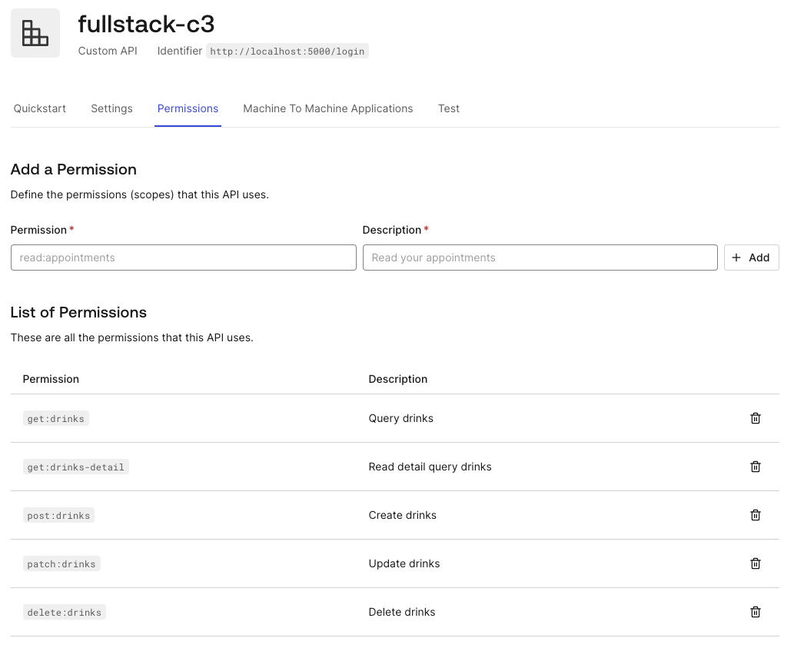
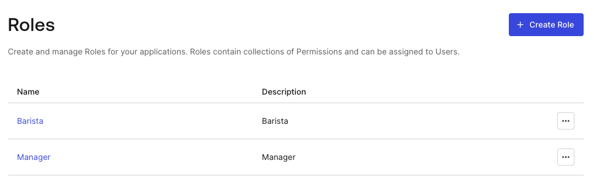
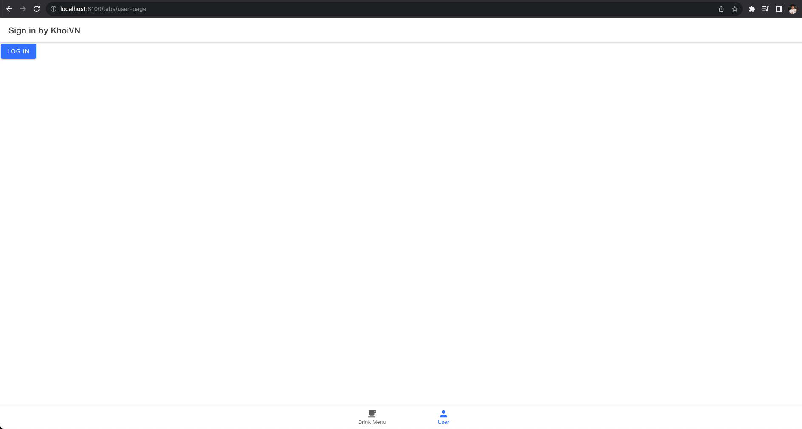
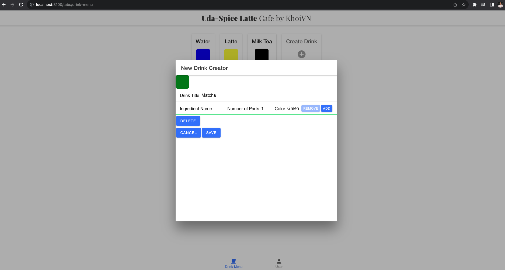
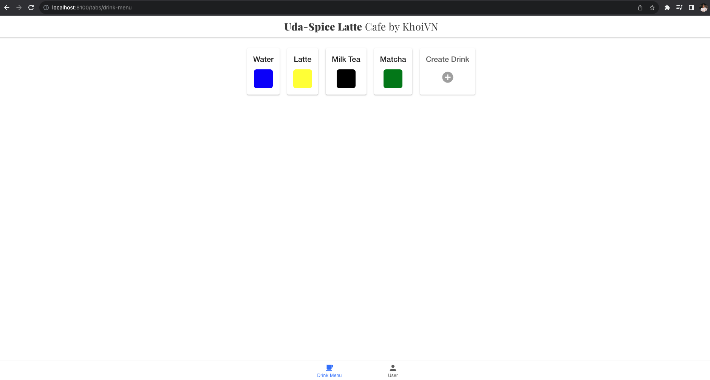

# Coffee Shop Full Stack

## Full Stack Nano - IAM Final Project

Udacity has decided to open a new digitally enabled cafe for students to order drinks, socialize, and study hard. But they need help setting up their menu experience.

You have been called on to demonstrate your newly learned skills to create a full stack drink menu application. The application must:

1. Display graphics representing the ratios of ingredients in each drink.
2. Allow public users to view drink names and graphics.
3. Allow the shop baristas to see the recipe information.
4. Allow the shop managers to create new drinks and edit existing drinks.

## Auth0 Setup
### Create Auth0 Application


### Create Auth0 API and Permissions


### Create Auth0 Roles and Users


## Backend
### Install Dependencies
```
cd backend
pip install -r requirements.txt
```

## Run Backend Server
```
FLASK_APP=api FLASK_DEBUG=true flask run
```

URL backend: http://localhost:5000/

## Frontend
### Install Dependencies
```
cd frontend
npm install
```

### Run Frontend Server
```
ionic serve
```

URL frontend: http://localhost:8100/

### Sign In Page


### Redirect to Auth0


### Create Drink


### Home Page


## Documentation
### API Reference

URL: http://localhost:5000/

`GET /drinks`

- Fetches a list of drinks in the database
- No permission required
- Request Arguments: None
- Returns: An object with a single key, drinks, that contains an array of drinks objects.
```
{
    "drinks": [
        {
            "id": 1,
            "recipe": [
                {
                    "color": "blue",
                    "parts": 1
                }
            ],
            "title": "Water"
        },
        {
            "id": 2,
            "recipe": [
                {
                    "color": "blue",
                    "parts": 1
                },
                {
                    "color": "yellow",
                    "parts": 1
                }
            ],
            "title": "Lemonade"
        }
    ],
    "success": true
}
```

`GET /drinks-detail`

- Fetches a list of drinks in the database
- Permission required: `get:drinks-detail`
- Request Arguments: None
- Returns: An object with a single key, drinks, that contains an array of drinks objects.
```
{
    "drinks": [
        {
            "id": 1,
            "recipe": [
                {
                    "color": "blue",
                    "name": "water",
                    "parts": 1
                }
            ],
            "title": "Water"
        },
        {
            "id": 2,
            "recipe": [
                {
                    "color": "blue",
                    "name": "water",
                    "parts": 1
                },
                {
                    "color": "yellow",
                    "name": "lemon",
                    "parts": 1
                }
            ],
            "title": "Lemonade"
        }
    ],
    "success": true
}
```

`POST /drinks`

- Creates a new drink in the database
- Permission required: `post:drinks`
- Request Arguments: None
- Returns: An object with a single key, drinks, that contains an array of drinks objects.
```
{
    "drinks": [
        {
            "id": 3,
            "recipe": [
                {
                    "color": "green",
                    "name": "matcha",
                    "parts": 3
                }
            ],
            "title": "Matcha"
        }
    ],
    "success": true
}
```

`PATCH /drinks/<id>`
- Updates a drink in the database
- Permission required: `patch:drinks`
- Request Arguments: None
- Returns: An object with a single key, drinks, that contains an array of drinks objects.
```
{
    "drinks": [
        {
            "id": 3,
            "recipe": [
                {
                    "color": "green",
                    "name": "matcha",
                    "parts": 3
                }
            ],
            "title": "Matcha"
        }
    ],
    "success": true
}
```

`DELETE /drinks/<id>`
- Deletes a drink in the database
- Permission required: `delete:drinks`
- Request Arguments: None
- Returns: An object with a single key, drinks, that contains an array of drinks objects.
```
{
    "delete": 3,
    "success": true
}
```

### Error Handling
Errors are returned as JSON objects in the following format:
```
{
    "success": False,
    "error": 404,
    "message": "resource not found"
}
```

The API will return three error types when requests fail:
- `400`: Bad Request
- `401`: Unauthorized
- `403`: Forbidden
- `404`: Resource Not Found
- `422`: Not Processable

### Users and Roles
`Public`
- Can view drinks and drink details

`Barista`
- All permissions a Public user has and…
- Can view drink details

`Manager`
- All permissions a Barista has and…
- Can create new drinks
- Can delete drinks

### Frontend

URL: http://localhost:8100/

`GET /tabs/drink-menu`
- Home page
- Public
- Shows drinks

`GET /tabs/user-page`
- Login page
- Public
- Redirects to Auth0

Configuration in `./src/environments/environments.ts`:
```javascript
export const environment = {
    production: false,
    apiServerUrl: 'http://127.0.0.1:5000',
    auth0: {
    url: 'dev-t1o1gxv473b4dc8o.us',
    audience: 'http://localhost:5000/login',
    clientId: 'KzQb4fWbJ0bDOwo3MOdG0ucz0Tvtu2SZ',
    callbackURL: 'http://localhost:8100',
    }
};
```

## Test Postman Collection
### Import Postman Collection
1. Open Postman
2. Click on Import
3. Click on Choose Files
4. Select the file `./backend/udacity-fsnd-udaspicelatte.postman_collection.json`

### Get JWT Tokens
Access the following link to get the JWT tokens for the users:
```
https://dev-t1o1gxv473b4dc8o.us.auth0.com/authorize?audience=http://localhost:5000/login&response_type=token&client_id=KzQb4fWbJ0bDOwo3MOdG0ucz0Tvtu2SZ&redirect_uri=http://localhost:8100/tabs/user-page
```

Then, import Bearer Tokens into Postman.

### Test Endpoints
1. Click on the arrow next to the collection name to expand the collection
2. Choose folder `public`, `barista`, or `manager` and run tests on the endpoints

Results:
- All tests should pass for `public` folder

- All tests should pass for `barista` folder

- All tests should pass for `manager` folder


Export the collection overwriting the `./backend/udacity-fsnd-udaspicelatte.postman_collection.json` file.
