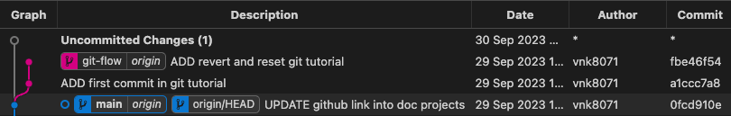
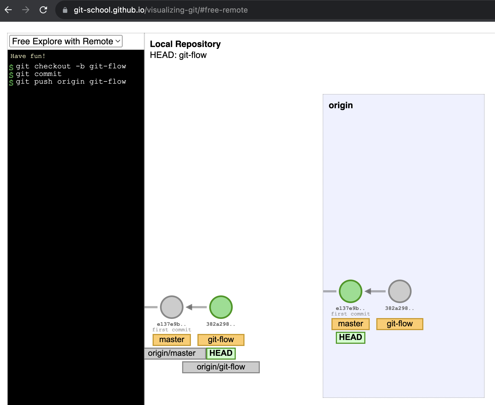
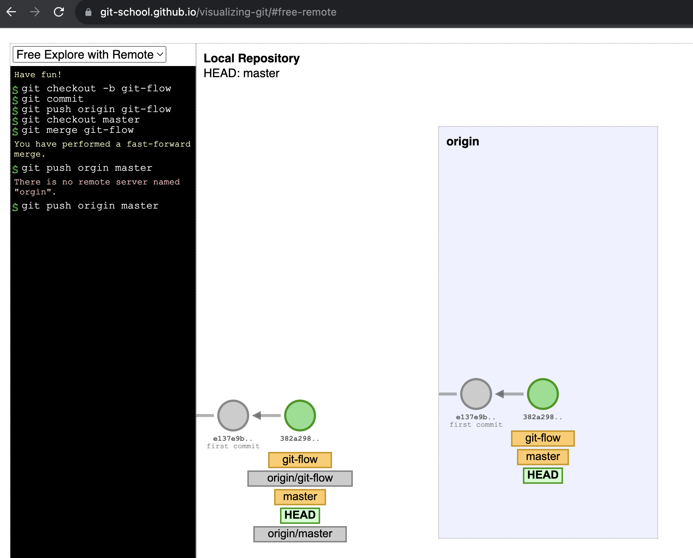
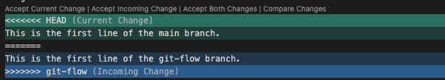
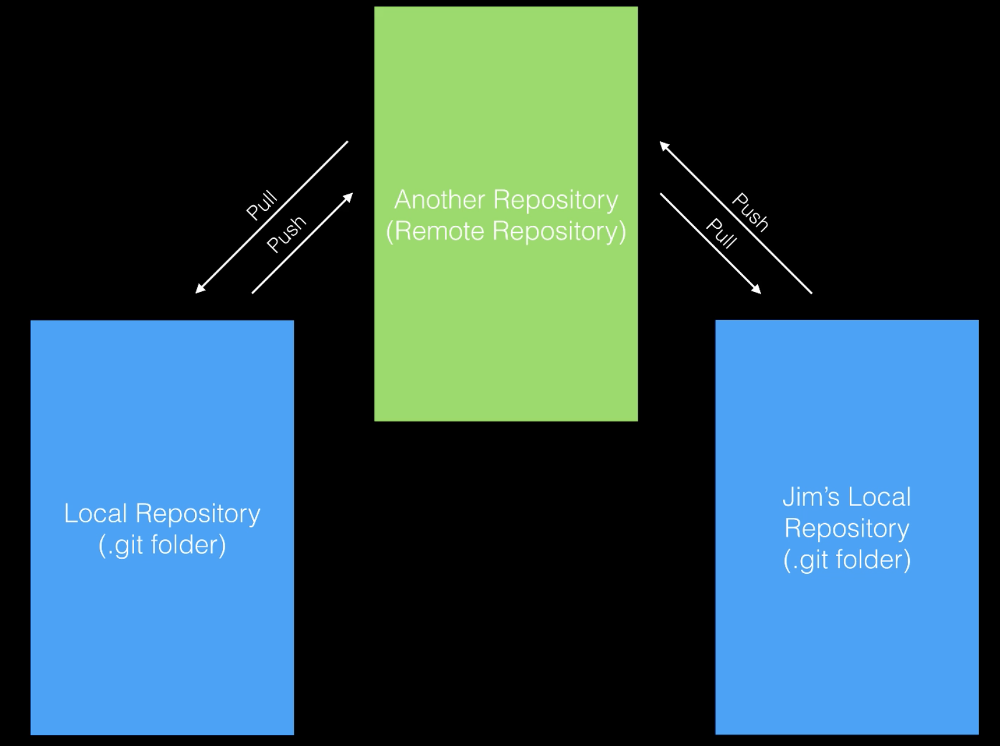
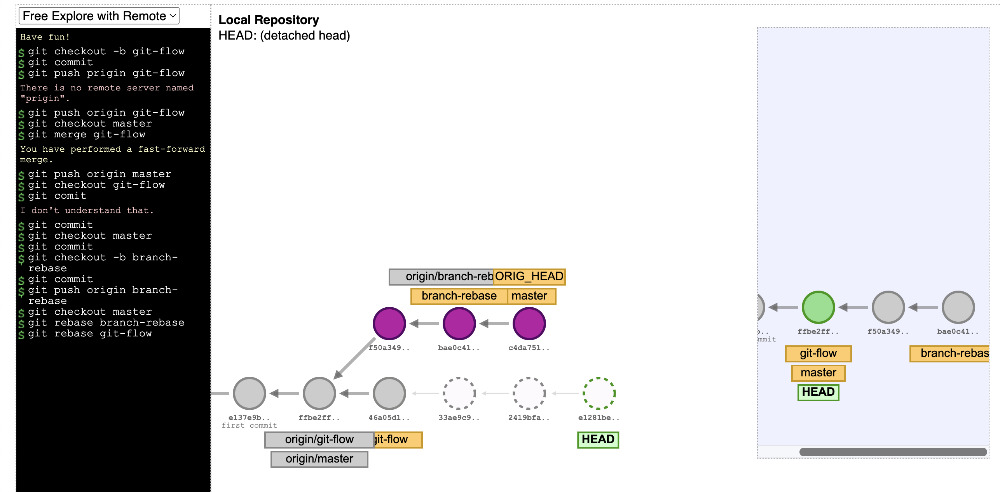
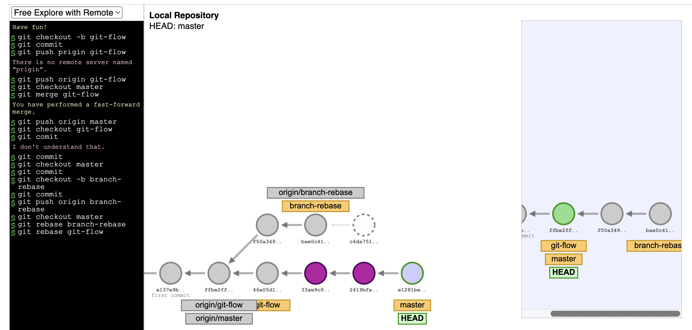

# GIT Tutorial

Source code: [vnk8071/git_tutorial](https://github.com/vnk8071/machine-learning-in-production/tree/main/examples/git_tutorial)

## Commands and definitions
| # | Command | Definition |
| --- | --- | --- |
| 1 | `git clone <url>.git` | Clone a repository into a new directory |
| 2 | `git checkout -b <branch_name>` | Create a new branch and switch to it |
| 3 | `git add .` | Add all files to staging area |
| 4 | `git commit -m "message"` | Commit changes to head |
| 5 | `git push origin <branch_name>` | Push changes to remote repository |
| 6 | `git log` | Show commit logs |
| 7 | `git revert <commit_hash>` | Revert a commit |
| 8 | `git reset --hard <commit_hash>` | Reset to a commit |
| 9 | `git branch` | List all local branches |
| 10 | `git branch -r` | List all remote branches |
| 11 | `git branch -a` | List all local and remote branches |
| 12 | `git branch -d <branch_name>` | Delete a local branch |
| 13 | `git push origin --delete <branch_name>` | Delete a remote branch |
| 14 | `git checkout <branch_name>` | Switch to a branch |
| 15 | `git checkout -` | Switch to the previous branch |
| 16 | `git checkout -- <file_name>` | Discard changes to a file |
| 17 | `git merge <branch_name>` | Merge a branch into the active branch |
| 18 | `git fetch` | Fetch changes from remote repository |
| 19 | `git pull` | Fetch and merge changes from remote repository |
| 20 | `git stash` | Stash changes in a dirty working directory |
| 21 | `git stash list` | List all stashed changesets |
| 22 | `git stash pop` | Apply stashed changes to working directory |
| 23 | `git stash drop` | Discard stashed changesets |
| 24 | `git rebase` | Reapply commits on top of another base tip |
| 25 | `git rebase -i HEAD~<number_of_commits>` | Rebase interactive |
| 26 | `git rebase --continue` | Continue rebase after resolving conflicts |
| 27 | `git rebase --abort` | Abort rebase |

**Note**:
- `git pull` = `git fetch` + `git merge`
- `git pull --rebase` = `git fetch` + `git rebase`

**Details** in [Git Cheat Sheet](https://github.github.com/training-kit/downloads/github-git-cheat-sheet.pdf) and [Book](https://git-scm.com/book/en/v2/)

## Basic flow
```git
git clone <url>.git
git checkout -b <branch_name>
git add .
git commit -m "message"
git push origin <branch_name>
```

Example:
Follow the instructions in `flow.py`:


Check remote branches:


## Back in time
### Revert
```git
git log
git revert <commit_hash>
git commit -m "[REVERT] <commit_hash>"
git push origin <branch_name>
```

Example:
Follow the instructions in `revert.py`:


We want to revert the commit `0fcd910e9488b06d2206ff59c556e92a03a6f4ca`:
```git
git revert 0fcd910e9488b06d2206ff59c556e92a03a6f4ca
git commit -m "[REVERT] 0fcd910e9488b06d2206ff59c556e92a03a6f4ca"
```

Result:
```
[git-flow 7e41a10] Revert "UPDATE github link into doc projects"
 7 files changed, 14 deletions(-)
```


We can see that the commit `0fcd910e9488b06d2206ff59c556e92a03a6f4ca` is reverted.

### Reset
```git
git log
git reset --hard <commit_hash>
git commit -m "[RESET] <commit_hash>"
git push origin <branch_name>
```


We can see that the commit `0fcd910e9488b06d2206ff59c556e92a03a6f4ca` is reset.


## Branches
### Create a branch
```git
git checkout -b <branch_name>
git push origin <branch_name>
```

Example:
Follow the instructions in `branch.py`:
```git
git checkout -b git-flow
```


```git
git push origin git-flow
```



### Delete a branch
```git
git branch -d <branch_name>
git push origin --delete <branch_name>
```

## Merge
```git
git checkout <branch_target>
git merge <branch_name>
git push origin <branch_target>
```


Follow the instructions in `merge.py`:
Ìf merge conflict, we need to resolve it first.

```git
git checkout main
git merge git-flow
```

Example:
```git
<<<<<<< HEAD
This is the first line of the main branch.
=======
This is the first line of the git-flow branch.
>>>>>>> git-flow
```


Then accept the changes could be current | incoming | both and commit:
```git
git add .
git commit -m "Resolve conflict"
git push origin main
```

## Check changes
```git
git status
git log
git diff <commit_hash_1> <commit_hash_2>
git diff <branch_name_1> <branch_name_2>
```

## Remote


Before we can push to a team repository, we need to pull and resolve conflicts first.
```git
git pull
```

Then we can push to the team repository.
```git
git push origin <branch_name>
```

## Stash
Using `git stash` to save changes in a dirty working directory and then pull latest changes from remote repository.
```git
git stash save
git pull
```

Then we can apply stashed changes to working directory.
```git
git stash pop

or

git stash apply
```

## Rebase
Similar to merge, but rebase reapply commits on top of another base tip.
```git
git rebase <branch_name>
```

Example:
It squashes all commits of <branch_name> into one commit and reapply on top of <branch_target>.



Then it rewrites the history of <branch_target> and we need to force push to the remote repository.



| # | Benefits | Drawbacks |
| --- | --- | --- |
| 1 | It keeps the history clean. | It is harder to resolve conflicts. |
| 2 | It is easier to revert a commit. | It loses the context of the commits. |
| 3 | Using in local branches. | It is not recommended to use in remote branches. |

## Squash
Using squash to combine multiple commits into one commit.
```git
git rebase -i HEAD~<number_of_commits>
```

**Note**: Not recommended to use in remote branches when colaborating with others.
