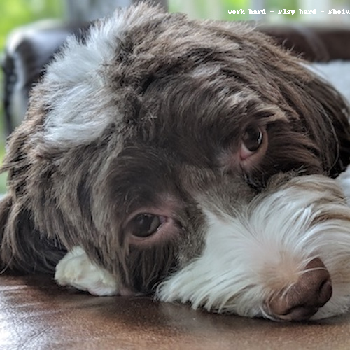
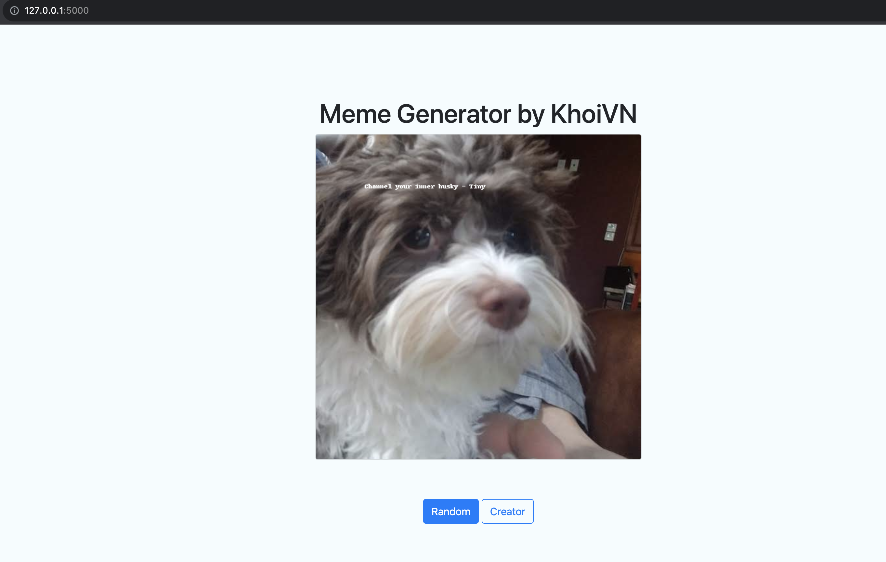
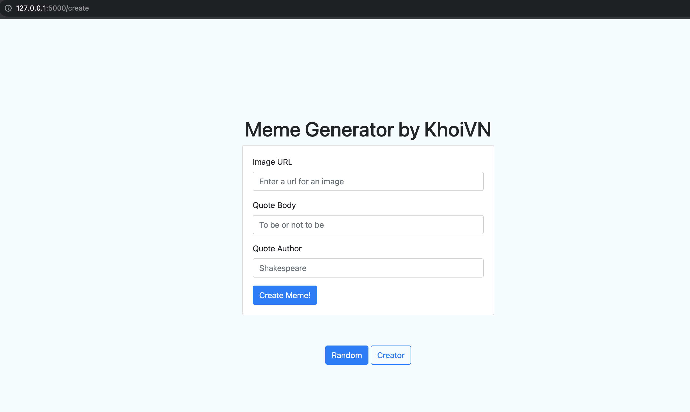
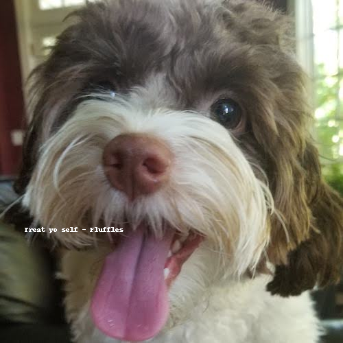

# Meme Generator Project

## Overview
This project is a meme generator. It takes a random image from a folder and a random quote from a file and combines them into a meme. The meme is then saved to a folder and the path to the meme is returned.

Source code: [vnk8071/meme_generator](https://github.com/vnk8071/machine-learning-in-production/tree/main/projects/meme_generator)

## Technologies
| # | Name | Description |
| --- | --- | --- |
| 1 | Python | Programming language with version greater than 3.6 |
| 2 | Pandas | Read csv file |
| 3 | Xpdf | Read pdf file |
| 4 | Pillow | Python Imaging Library |
| 5 | Flask | Web framework |
| 6 | Flake8 | Linter |
| 7 | Pytest | Testing framework |
| 8 | Logging | Logging library |
| 9 | Pre-commit | Pre-commit hooks |
| 10 | Docker | Containerization |

## Installation
```make
make install
```

## Structure
```
.
├── Dockerfile
├── Makefile
├── MemeEngine
│   ├── __init__.py
│   └── generator.py
├── QuoteEngine
│   ├── __init__.py
│   ├── base.py
│   ├── csv_ingestor.py
│   ├── doc_ingestor.py
│   ├── ingestor.py
│   ├── pdf_ingestor.py
│   ├── quote_model.py
│   └── text_ingestor.py
├── README.md
├── _data
│   ├── DogQuotes
│   │   ├── DogQuotesCSV.csv
│   │   ├── DogQuotesDOCX.docx
│   │   ├── DogQuotesPDF.pdf
│   │   └── DogQuotesTXT.txt
│   ├── SimpleLines
│   │   ├── SimpleLines.csv
│   │   ├── SimpleLines.docx
│   │   ├── SimpleLines.pdf
│   │   └── SimpleLines.txt
│   └── photos
│       └── dog
│           ├── xander_1.jpg
│           ├── xander_2.jpg
│           ├── xander_3.jpg
│           └── xander_4.jpg
├── app.py
├── images
│   ├── ui_create.png
│   └── ui_random.png
├── meme.py
├── output
│   ├── 2023-09-28-21-46-29.png
│   └── 2023-09-28-21-47-36.png
├── pytest.ini
├── requirements.txt
├── src
│   ├── logger.py
│   └── utils.py
├── templates
│   ├── base.html
│   ├── meme.html
│   └── meme_form.html
└── tests
    └── test_logger.py
```

## Usage
### Quote Engine
Using base class `IngestorInterface` to ingest different types of files.
With:
- @classmethod `can_ingest` method to check if the file can be ingested.
- @classmethod `parse` method to parse the file.

Subclasses with single inheritance: `IngestorCSV`, `IngestorDOC`, `IngestorPDF`, `IngestorText`

Multiple inheritance: `Ingestor`

Example:
```
from QuoteEngine.ingestor import Ingestor

ingestor = Ingestor.parse(path='./_data/DogQuotes/DogQuotesCSV.csv')
for quote in ingestor.quotes:
    print(quote)
```

### Meme Engine
Using `Pillow` to manipulate images.

Example:
```
from MemeEngine.generator import MemeGenerator
meme = MemeGenerator(output_dir='./output')

meme.make_meme('./_data/photos/dog/xander_1.jpg', 'Work hard', 'Play hard')
```

### Generate a meme
```
python meme.py --path "_data/photos/dog/xander_1.jpg" --body "Work hard Play hard" --author "KhoiVN"
```

Result
```
2023-09-28 21:46:29,309 - MemeEngine.generator - INFO - Generating meme from image: _data/photos/dog/xander_1.jpg
2023-09-28 21:46:29,355 - MemeEngine.generator - INFO - Adding quote: b'Work hard - Play hard - KhoiVN' to the image
2023-09-28 21:46:29,525 - MemeEngine.generator - INFO - Meme was saved to: output/2023-09-28-21-46-29.png
```



### Generate a random meme
```
python meme.py
```

Result
```
2023-09-28 21:47:36,845 - QuoteEngine.text_ingestor - INFO - Parsing TXT file: ./_data/DogQuotes/DogQuotesTXT.txt
2023-09-28 21:47:36,846 - QuoteEngine.text_ingestor - INFO - IngestorText can ingest this file.
2023-09-28 21:47:36,846 - QuoteEngine.doc_ingestor - INFO - Parsing DOC file: ./_data/DogQuotes/DogQuotesDOCX.docx
2023-09-28 21:47:36,847 - QuoteEngine.doc_ingestor - INFO - IngestorDOC can ingest this file.
2023-09-28 21:47:36,859 - QuoteEngine.pdf_ingestor - INFO - Parsing PDF file: ./_data/DogQuotes/DogQuotesPDF.pdf
2023-09-28 21:47:36,859 - QuoteEngine.pdf_ingestor - INFO - IngestorPDF can ingest this file.
2023-09-28 21:47:36,884 - QuoteEngine.csv_ingestor - INFO - Parsing CSV file: ./_data/DogQuotes/DogQuotesCSV.csv
2023-09-28 21:47:36,885 - QuoteEngine.csv_ingestor - INFO - IngestorCSV can ingest this file.
2023-09-28 21:47:36,898 - MemeEngine.generator - INFO - Generating meme from image: _data/photos/dog/xander_1.jpg
2023-09-28 21:47:36,924 - MemeEngine.generator - INFO - Adding quote: b'Treat yo self - Fluffles' to the image
2023-09-28 21:47:37,092 - MemeEngine.generator - INFO - Meme was saved to: output/2023-09-28-21-47-36.png
```


### Run web service
```
make run
...
* Serving Flask app 'app'
* Debug mode: off
WARNING: This is a development server. Do not use it in a production deployment. Use a production WSGI server instead.
* Running on http://127.0.0.1:5000
```

- Go to http://127.0.0.1:5000



- Creator with image and quote



Output save in static folder to show in web service


### Dockerize
```
make docker-build-run
```

## Lint and Format
```
make lint
autopep8 --in-place --aggressive --aggressive **/*.py
```

Result
```
flake8 --max-line-length=120 --exclude=venv --verbose
flake8.checker            MainProcess    253 INFO     Making checkers
flake8.main.application   MainProcess    716 INFO     Finished running
flake8.main.application   MainProcess    717 INFO     Reporting errors
flake8.main.application   MainProcess    719 INFO     Found a total of 7 violations and reported 0
```

## Cleaning
```
make pycache-remove
```
