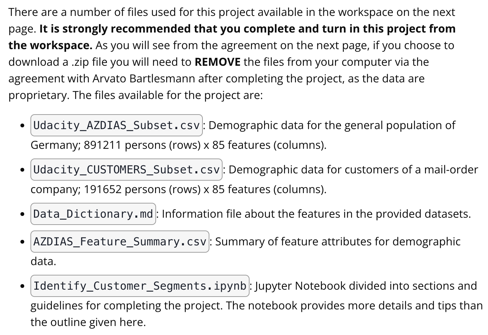
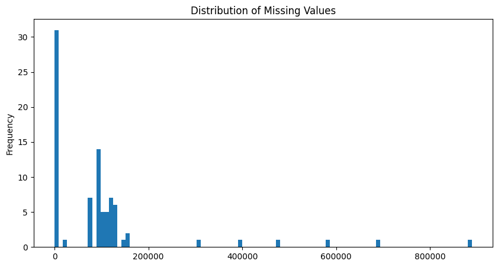
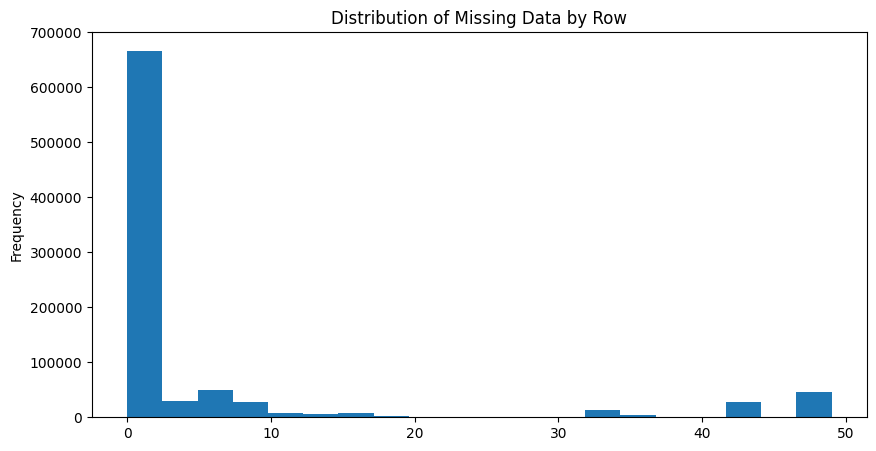
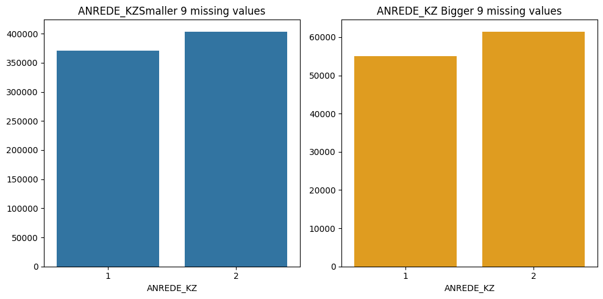
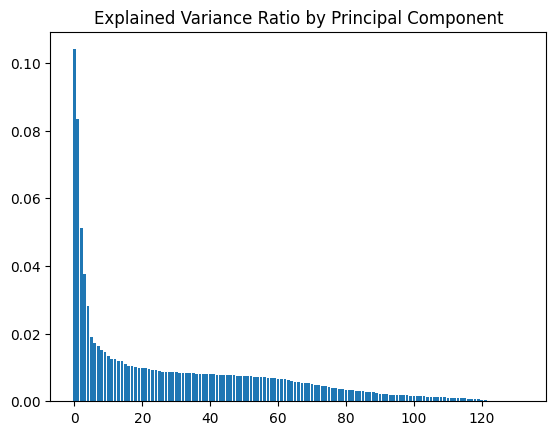
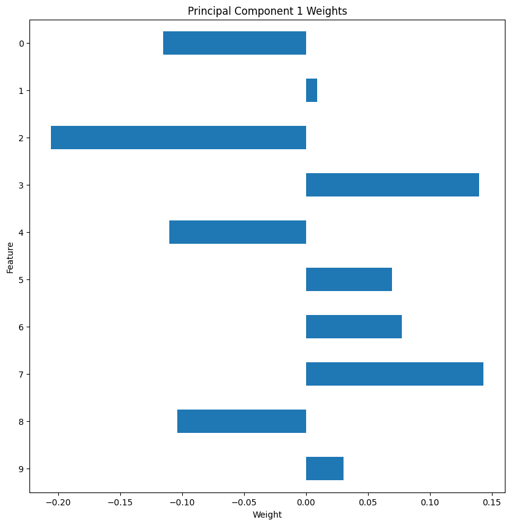
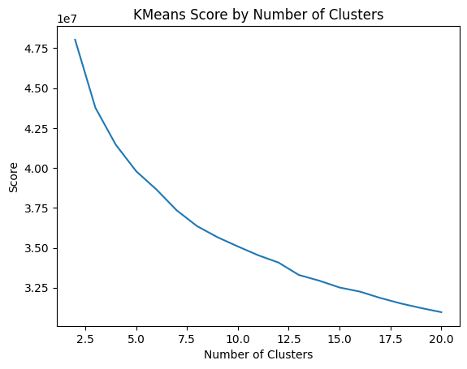
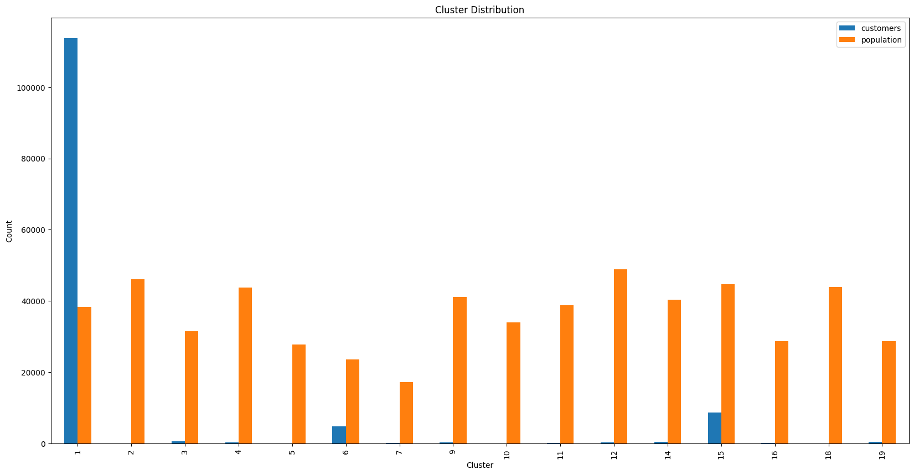

# Identify Customer Segments

## Project Overview
In this project, I will apply unsupervised learning techniques on demographic and spending data for a sample of German households. I will preprocess the data, apply dimensionality reduction techniques, and implement clustering algorithms to segment customers with the goal of optimizing customer outreach for a mail order company.

## Project Instructions

Details in `KhoiVN_Identify_Customer_Segments.ipynb`

### Installation
```bash
pip install -r requirements.txt
```

### Dataset


### Preprocessing
1. Assess Missing Data
```python
def remove_missing_or_unknown(df):
    '''
    INPUT:
        df - pandas dataframe
    OUTPUT:
        df - pandas dataframe with missing or unknown data values converted to NaNs
    '''
    df_summary = pd.read_csv('AZDIAS_Feature_Summary.csv', sep=';')
    for i, row in enumerate(df_summary['missing_or_unknown']):
        if df_summary['missing_or_unknown'][i] != '[]':
            missing_or_unknown = df_summary['missing_or_unknown'][i].strip('[]').split(',')
            for j in range(len(missing_or_unknown)):
                if missing_or_unknown[j] in ['X', 'XX']:
                    df[df_summary['attribute'][i]].replace(missing_or_unknown[j], np.nan, inplace=True)
                else:
                    df[df_summary['attribute'][i]].replace(int(missing_or_unknown[j]), np.nan, inplace=True)
    return df
```

- Missing value in each column


- Missing value in each row


- Split subset of data with missing value with threshold 9 in each row


Discussion:
- We will split the data into two subsets: one for data points that are above 10 for missing values, and a second subset for points below that threshold.
- Compare distribution of values between the two groups. If the distributions of non-missing features look similar between the data with many missing values and the data with few or no missing values, then we could argue that simply dropping those points from the analysis won't present a major issue.
- Remove columns that have more than threshold of missing data.

2. Re-Encode Features
- Re-Encode Categorical Features
```python
binary_columns = df_azdias_categorical.columns[(df_azdias_categorical.nunique() == 2)].tolist()
print("Binary columns: ", binary_columns)
multi_level_columns = df_azdias_categorical.columns[(df_azdias_categorical.nunique() > 2)].tolist()
print("Multi-level columns: ", multi_level_columns)
```

Then apply one-hot encoding to the binary and multi-level categorical data.
```python
df_azdias_smaller_9_missing = pd.get_dummies(
    data=df_azdias_smaller_9_missing,
    columns=multi_level_columns_new,
    prefix=multi_level_columns_new,
    dtype='int8'
)
```

- Re-Encode Mixed Features
```python
df_summary[df_summary['type'] == 'mixed']
```

Then feature engineer the mixed data by `Data_Dictionary.md`.

Discussion:
For the categorical features, I first identified which columns were categorical and separated them into binary variables (with 2 values) and multiple variables.
- The 5 binary categorical features all provide relevant information for forming customer segments, so the decision was made to keep them all, including the non-numerical feature related to the building's location in East or West Germany prior to 1991. This feature may be less useful now than it was 10 or 20 years ago.
- For the multi-categorical variables, each category was analyzed individually:
- The categories `CJT_GESAMTTYP`, `FINANZTYP`, `NATIONALITAET_KZ`, `SHOPPER_TYP`, and `ZABEOTYP` all related to person-level features without being too detailed, so the decision was made to keep them and one-hot encode them.
- For `LP_FAMILIE_FEIN`, `LP_FAMILIE_GROB`, `LP_STATUS_FEIN`, and `LP_STATUS_GROB`, the decision was made to drop the "Grobs" which were summaries of the "Feins". The level of segregation was better for identifying customer segments in the more detailed "Fein" scales, but it was unnecessary to keep both.
- The category `GEBAEUDETYP` provided no additional value for customer segmentation as it related to building-level features which could be inferred from `ANZ_HAUSHALTE_AKTIV`, so it was dropped.
- Between `CAMEO_DEUG_2015` and `CAMEO_DEU_2015`, which both relate to wealth/life stage typology, the decision was made to keep only the rough scale of `CAMEO_DEUG_2015`. `CAMEO_DEU_2015` was too detailed for this particular customer segment analysis, and it would be appropriate to use it in a second analysis after primary customer segments have been identified for fine-tuning marketing efforts.
- Lastly, `GFK_URLAUBERTYP` is a detailed analysis of vacation habits with 12 categories. It was a close choice on whether to keep or drop it for the same reasons discussed above. On balance, it was kept and one-hot encoded because it was a person-level feature.

### Feature Transformation
1. Apply Imputation
```python
from sklearn.impute import SimpleImputer

simple_imputer = SimpleImputer()
df = pd.DataFrame(simple_imputer.fit_transform(df))
```

2. Perform Feature Scaling
```python
from sklearn.preprocessing import StandardScaler

scaler = StandardScaler()
df = pd.DataFrame(scaler.fit_transform(df))
```

3. PCA
```python
from sklearn.decomposition import PCA

pca = PCA()
df = pd.DataFrame(pca.fit_transform(df))
```



4. Interpret Principal Components
```python
def show_pca_weights(principal_component, number_of_weights):
    ratio = pd.DataFrame(pca.explained_variance_ratio_, columns=['Explained_Variance_Ratio'])
    weights = pd.DataFrame(pca.components_, columns=list(df_azdias_cleaned.columns.values))
    result = pd.concat([ratio, weights], axis=1, sort=False, join='inner')
    print("Principal Component", principal_component, "Weights")
    print(result.iloc[(principal_component)-1].sort_values(ascending=False)[:number_of_weights])

    result = result.sort_values(by='Explained_Variance_Ratio', ascending=False)
    result = result.iloc[principal_component-1:principal_component,1:]
    result = result.transpose()
    result = result.iloc[:number_of_weights,:]
    result = result.iloc[::-1]
    result.plot.barh(figsize=(10,10),legend=False)
    plt.title('Principal Component {} Weights'.format(principal_component))
    plt.xlabel('Weight')
    plt.ylabel('Feature')
    plt.show()
```



Discussion:
I investigated the features by mapping each weight to their corresponding feature name, then sorted the features according to weight. The most interesting features for each principal component, then, were those at the beginning and end of the sorted list.

### Clustering
1. Apply Clustering to General Population
```python
from sklearn.cluster import KMeans

kmeans = KMeans(n_clusters=20)
kmeans.fit(df)
```



```python
kmeans_20 = KMeans(n_clusters=20, n_init=10, max_iter=100, random_state=8071)
population = kmeans_20.fit_predict(df_pca)
```

2. Apply Clustering to the Customer Data
```python
customers_cluster = kmeans_20.predict(customers_cleaned)
```

3. Compare Customer Data to Demographics Data



Discussion: I computed the proportion of data points in each cluster for the general population and the customer data. I visualized the ratios in cluster representation between groups. I used Seaborn's countplot() or barplot() function. I also accounted for the number of data points in this subset, for both the general population and customer datasets, when making my computations. I found that cluster 13 is overrepresented in the customer dataset compared to the general population. I inferred that people in this cluster are likely to be older, less wealthy, and less likely to be mainstream consumers. I found that cluster 2 is underrepresented in the customer dataset compared to the general population.

### Conclusion
I used unsupervised learning techniques to organize the general population into clusters, then used those clusters to see which of them comprise the main user base for the company. I found that people in cluster 13 are more likely to be customers of the mail-order company, while people in cluster 2 are less likely to be customers of the mail-order company. I also found that people in cluster 13 are likely to be older, less wealthy, and less likely to be mainstream consumers, while people in cluster 2 are likely to be younger, more wealthy, and more likely to be mainstream consumers. The company can use this information to target marketing campaigns towards these two groups accordingly.
