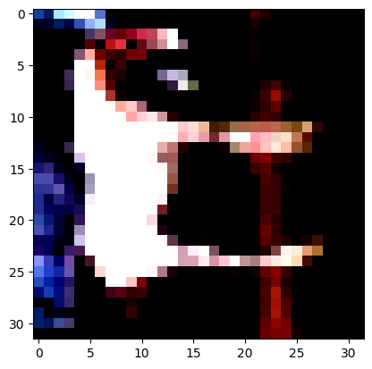
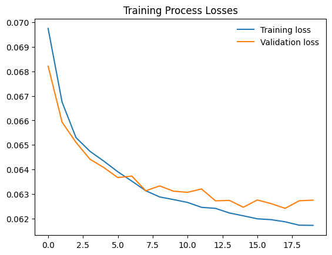
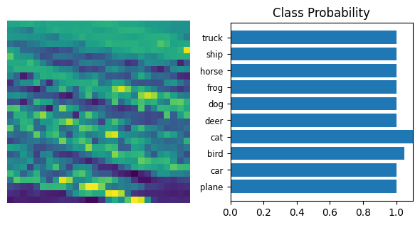

# Image Classification with Pytorch

## Project Overview
Demonstrate the skills in this course by building an image classifier and object detection system using PyTorch. To do this project, you'll need to pull together the new deep learning skills you've just learned, such as data augmentation and building neural networks in order to solve the problem presented in the scenario below.

## Dataset
CIFAR10 dataset is used for this project. The dataset contains 60,000 32x32 color images in 10 different classes. The 10 different classes represent airplanes, cars, birds, cats, deer, dogs, frogs, horses, ships, and trucks. There are 6,000 images of each class. The dataset is divided into 50,000 training images and 10,000 testing images. The classes are completely mutually exclusive. There is no overlap between automobiles and trucks. "Automobile" includes sedans, SUVs, things of that sort. "Truck" includes only big trucks. Neither includes pickup trucks.

## Step-by-step Project
### Step 0: Configure environment
Details in `config.py`

### Step 1: Import the Datasets
```python
train_transform = transforms.Compose([
    transforms.RandomHorizontalFlip(),
    transforms.ToTensor(),
    transforms.Normalize(CFG.MEAN, CFG.STD)
])

test_transform = transforms.Compose([
    transforms.ToTensor(),
    transforms.Normalize(CFG.MEAN, CFG.STD)
])

training_set = torchvision.datasets.CIFAR10(root=CFG.DATA_DIR, train=True, download=True, transform=train_transform)
testing_set = torchvision.datasets.CIFAR10(root=CFG.DATA_DIR, train=False, download=True, transform=test_transform)

train_set, val_set = torch.utils.data.random_split(training_set, [40000, 10000])
train_loader = torch.utils.data.DataLoader(train_set, batch_size=CFG.BATCH_SIZE, shuffle=True, num_workers=CFG.NUM_WORKERS)
val_loader = torch.utils.data.DataLoader(val_set, batch_size=CFG.BATCH_SIZE, shuffle=False, num_workers=CFG.NUM_WORKERS)
test_loader = torch.utils.data.DataLoader(testing_set, batch_size=CFG.BATCH_SIZE, shuffle=False, num_workers=CFG.NUM_WORKERS)
```

### Step 2: Visualize the Datasets
Clipping input data to the valid range for imshow with RGB data ([0..1] for floats or [0..255] for integers).
horse



### Step 3: Build the Model
```python
class Network(nn.Module):
    def __init__(self):
        super().__init__()
        self.fc1 = nn.Linear(1024*3, 256)
        self.fc2 = nn.Linear(256, 128)
        self.fc3 = nn.Linear(128, 64)
        self.fc4 = nn.Linear(64, 10)
        self.dropout = nn.Dropout(0.2)

    def forward(self, x):
        x = x.view(x.shape[0], -1)
        x = self.dropout(F.relu(self.fc1(x)))
        x = self.dropout(F.relu(self.fc2(x)))
        x = self.dropout(F.relu(self.fc3(x)))
        x = F.softmax(self.fc4(x), dim=1)

        return x
```

### Step 4: Train the Model
```python
criterion = nn.CrossEntropyLoss()
optimizer = optim.SGD(model.parameters(), lr=CFG.LEARNING_RATE)

for images, labels in train_loader:
    images = images.view(images.size(0), -1)
    images = images.to(CFG.DEVICE)
    labels = labels.to(CFG.DEVICE)
    optimizer.zero_grad()

    output = model(images)
    loss = criterion(output, labels)
    loss.backward()
    optimizer.step()
```



### Step 5: Test the Model
```python
test_correct = 0
model.eval()
with torch.no_grad():
    for images, labels in test_loader:
        images = images.view(images.size(0), -1)
        images = images.to(CFG.DEVICE)
        labels = labels.to(CFG.DEVICE)
        log_ps = model(images)
        ps = torch.exp(log_ps)
        top_p, top_class = ps.topk(1, dim=1)
        equals = top_class == labels.view(*top_class.shape)
        test_correct += equals.sum().item()
```

Accuracy of the network on the 10000 test images: 0.481

### Step 6: Inference
```python
model.eval()
data_iter = iter(test_loader)
images, labels = next(data_iter)
img = images[0]
img = img.view(1, 1024*3)

with torch.no_grad():
    output = model.forward(img)

ps = torch.exp(output)
```



### Step 7: Save the Model
```python
torch.save(model.state_dict(), 'best_cifar10_checkpoint.pth')
```

### Step 8: Load the Model
```python
model.load_state_dict(torch.load('best_cifar10_checkpoint.pth'))
```

## Future Work
- [ ] Use a pretrained model
- [ ] Use more data augmentation techniques
- [ ] Use a different optimizer
- [ ] Use a different learning rate scheduler
- [ ] Use a different loss function
