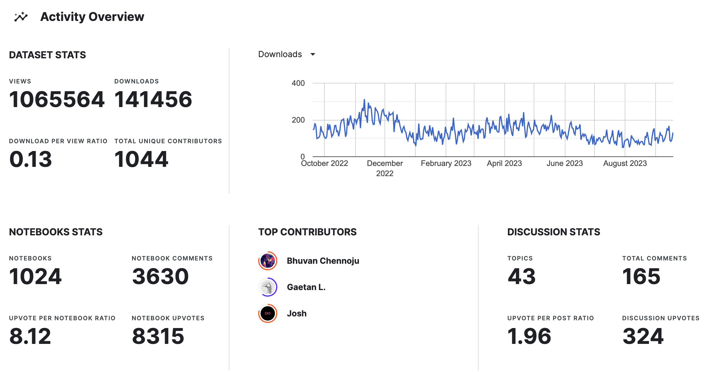
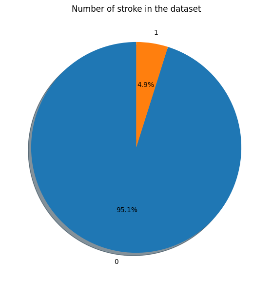
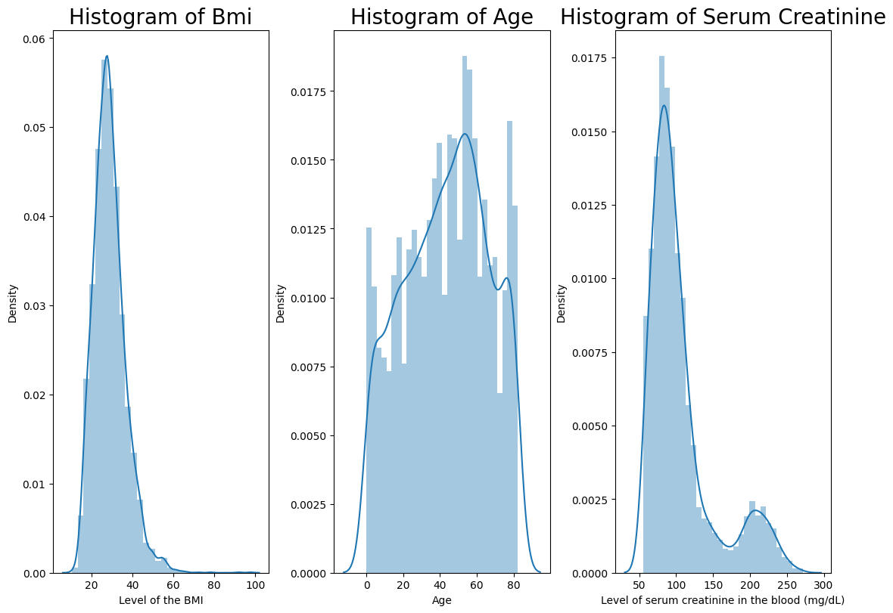
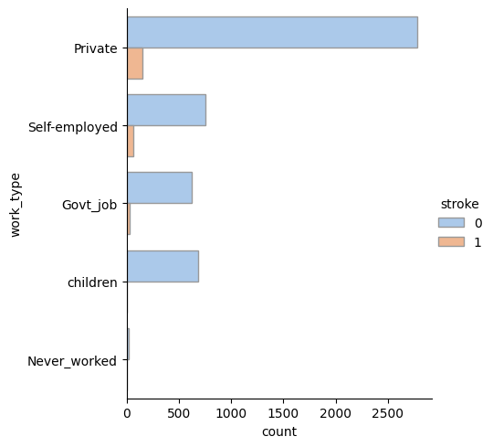
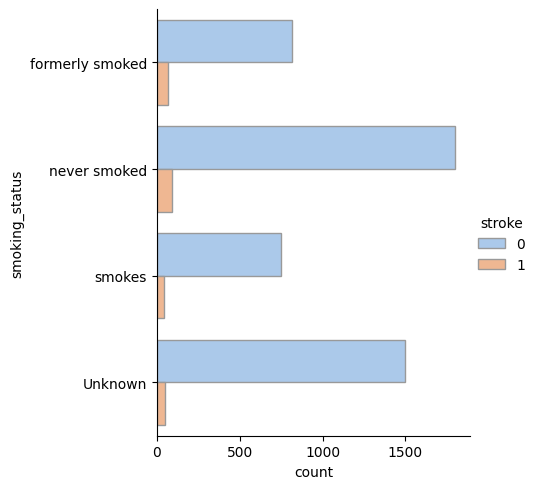
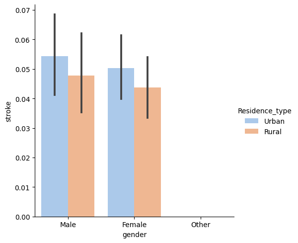
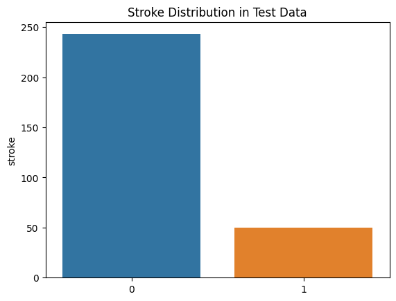
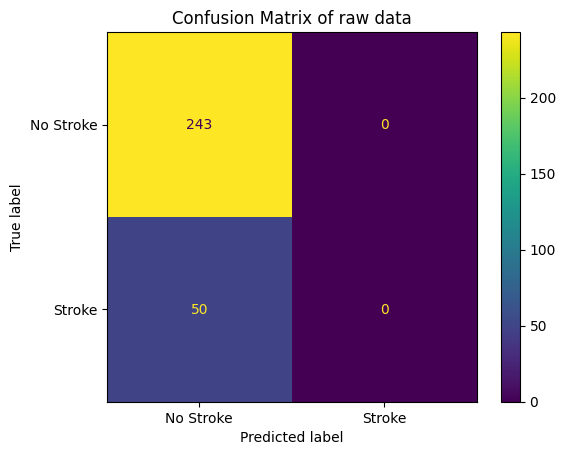
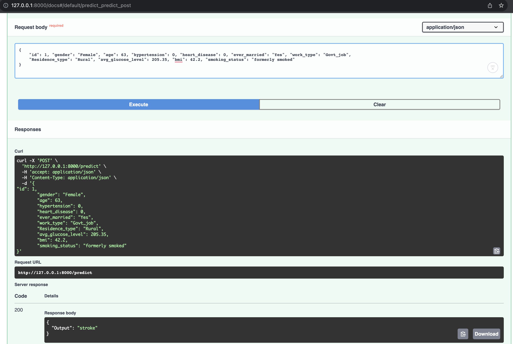
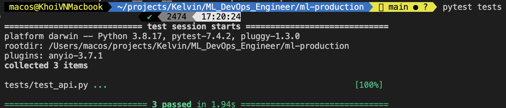

# Stroke Prediction Capstone

## Domain Background

According to the World Health Organization (WHO) stroke is the 2nd leading cause of death globally, responsible for approximately 11% of total deaths. It will be good if we detect and prevent this deadly disease in time, it will bring happiness to the sick and have more time to live.

## Problem Statement

Currently, classification methods using machine learning and deep learning have become popular to assist doctors in diagnosing stroke and providing timely treatment. Here, we use two models of machine learning to predict stroke based on the input parameters like gender, age, various diseases, and smoking status. The challenge of working with imbalanced datasets is that most machine learning techniques will ignore, and in turn have poor performance on, the minority class, although typically it is performance on the minority class that is most important.

## Installation
### Create virtual environment
```bash
pip install -r requirements.txt
```

### Install pre-commit hooks
```bash
make pre-commit-install
```

## Dataset

In this project, we will use the dataset provided by [Kaggle](https://www.kaggle.com/datasets/fedesoriano/stroke-prediction-dataset)


This dataset is used to predict whether a patient is likely to get stroke based on the input parameters like gender, age, various diseases, and smoking status. Each row in the data provides relavant information about the patient.

|#| Feature      | Description |
|-| ---------------- | ----------- |
|1| id        | unique identifier       |
|2| gender        | "Male", "Female" or "Other"        |
|3| age        | age of the patient        |
|4| hypertension        | 0 if the patient doesn't have hypertension, 1 if the patient has hypertension        |
|5| heart_disease       | n0 if the patient doesn't have any heart diseases, 1 if the patient has a heart disease |
|6| ever_married    | "No" or "Yes" |
|7| work_type    | "children", "Govt_jov", "Never_worked", "Private" or "Self-employed" |
|8| Residence_type    | "Rural" or "Urban" |
|9| avg_glucose_level       | average glucose level in blood |
|10| bmi    | body mass index |
|11| smoking_status    | "formerly smoked", "never smoked", "smokes" or "Unknown"* |
|12| stroke    | 1 if the patient had a stroke or 0 if not|

## EDA
Details in `explore_data_analysis/EDA.ipynb`
- Check type each column of dataset
```
RangeIndex: 5110 entries, 0 to 5109
Data columns (total 12 columns):
 #   Column             Non-Null Count  Dtype
---  ------             --------------  -----
 0   id                 5110 non-null   int64
 1   gender             5110 non-null   object
 2   age                5110 non-null   float64
 3   hypertension       5110 non-null   int64
 4   heart_disease      5110 non-null   int64
 5   ever_married       5110 non-null   object
 6   work_type          5110 non-null   object
 7   Residence_type     5110 non-null   object
 8   avg_glucose_level  5110 non-null   float64
 9   bmi                4909 non-null   float64
 10  smoking_status     5110 non-null   object
 11  stroke             5110 non-null   int64
dtypes: float64(3), int64(4), object(5)
```

- Check missing values
```
id                     0
gender                 0
age                    0
hypertension           0
heart_disease          0
ever_married           0
work_type              0
Residence_type         0
avg_glucose_level      0
bmi                  201
smoking_status         0
stroke                 0
dtype: int64
```

- The dataset is imbalanced, with only 4.9% of the rows belonging to the positive class.




- Histogram of numeric columns


-> `bmi` and `avg_glucose_level` are skewed
-> `age` is normal distribution

- Value counts of category columns



-> Stroke patients are mostly private workers



-> Stroke patients are equally distributed in smoking status

- Correlation with binary columns





- Correlation matrix


## Data Preprocessing
Details in `extract_transform_load/pipeline.py`
### Extract
- Read csv file
- Extract metadata

```
2023-09-23 20:20:44,678 - extract_transform_load.extract - INFO - Metadata: {'file_path': 'data/healthcare-dataset-stroke-data.csv', 'shape': (5110, 12), 'columns': ['id', 'gender', 'age', 'hypertension', 'heart_disease', 'ever_married', 'work_type', 'Residence_type', 'avg_glucose_level', 'bmi', 'smoking_status', 'stroke'], 'dtypes': {'id': dtype('int64'), 'gender': dtype('O'), 'age': dtype('float64'), 'hypertension': dtype('int64'), 'heart_disease': dtype('int64'), 'ever_married': dtype('O'), 'work_type': dtype('O'), 'Residence_type': dtype('O'), 'avg_glucose_level': dtype('float64'), 'bmi': dtype('float64'), 'smoking_status': dtype('O'), 'stroke': dtype('int64')}, 'category_columns': [], 'numeric_columns': ['id', 'age', 'hypertension', 'heart_disease', 'avg_glucose_level', 'bmi', 'stroke']}
```

### Transform
- Fill missing values in `bmi` column with mean
- Drop rows with `Other` in `gender` column
- Drop `id` column
- Reformatting type of `age` column to int64

### Load
- Strategy: split stroke data into train and test sets with test size of 0.2 and split non-stroke data into train and test sets with test size of 0.05
- Save train and test sets to csv files



The current ratio of stroke is `17.06%` in test set

## Feature Engineering
Details in `feature_engineering/pipeline.py`

### Standardlize
- Label encoding for category columns
- Standardizing numeric columns
```
2023-09-23 20:24:30,992 - feature_engineering.standardlize - INFO - Standardizing ['age', 'hypertension', 'heart_disease', 'avg_glucose_level', 'bmi']
2023-09-23 20:24:31,001 - feature_engineering.standardlize - INFO - Label encoding ['gender', 'ever_married', 'work_type', 'Residence_type', 'smoking_status']
2023-09-23 20:24:31,076 - feature_engineering.standardlize - INFO - Standardizing ['age', 'hypertension', 'heart_disease', 'avg_glucose_level', 'bmi']
2023-09-23 20:24:31,087 - feature_engineering.standardlize - INFO - Label encoding ['gender', 'ever_married', 'work_type', 'Residence_type', 'smoking_status']
```

### SMOTE
- Balancing data with target class stroke in train set


### Feature Selection
```python
from sklearn.feature_selection import RFE
selected_feature_count = int(
    np.round(0.6 * df_train.shape[1])
)
rfe = RFE(
    estimator=RandomForestClassifier(random_state=random_state),
    n_features_to_select=selected_feature_count,
)
```

Result
```
2023-09-23 20:24:35,801 - feature_engineering.feature_selection - INFO - 7 important features
2023-09-23 20:24:35,801 - feature_engineering.feature_selection - INFO - Index(['gender', 'age', 'hypertension', 'work_type', 'avg_glucose_level',
       'bmi', 'smoking_status'],
      dtype='object')
2023-09-23 20:24:35,885 - feature_engineering.feature_selection - INFO - Saved data/df_train_feature_engineering_smote_selection.csv and data/df_test_feature_engineering_selection.csv
2023-09-23 20:24:35,888 - __main__ - INFO - Pipeline completed
```

## Hyperparameter Tuning
Using SageMaker Hyperparameter Tuning to find best hyperparameters for Random Forest model


Details in `training/sagemaker-hyperparameter-tuning.ipynb`

## Model Training
### Logistic Regression
```python
from sklearn.linear_model import LogisticRegression

model = LogisticRegression(
    random_state=args.random_state,
    penalty=args.penalty,
    C=1.0,
    solver=args.solver,
    max_iter=args.max_iter,
)
```
Result
```
2023-09-23 20:58:28,721 - __main__ - INFO - Running k-fold cross-validation
2023-09-23 20:58:28,756 - __main__ - INFO - Fold 1: Accuracy=79.805% | F1-score=80.296% | AUC=0.798
2023-09-23 20:58:28,786 - __main__ - INFO - Fold 2: Accuracy=79.372% | F1-score=80.330% | AUC=0.793
2023-09-23 20:58:28,815 - __main__ - INFO - Fold 3: Accuracy=78.506% | F1-score=79.377% | AUC=0.786
2023-09-23 20:58:28,848 - __main__ - INFO - Fold 4: Accuracy=78.831% | F1-score=79.497% | AUC=0.789
2023-09-23 20:58:28,876 - __main__ - INFO - Fold 5: Accuracy=78.873% | F1-score=79.938% | AUC=0.788
2023-09-23 20:58:28,877 - __main__ - INFO - CV Accuracy: Mean 79.077% & STD 0.457%
2023-09-23 20:58:28,877 - __main__ - INFO - CV F1-score: Mean 79.888% & STD  0.395%
2023-09-23 20:58:28,877 - __main__ - INFO - CV AUC: Mean 0.791 & STD  0.005
2023-09-23 20:58:28,910 - __main__ - INFO - test set - Accuracy : 78.840%
2023-09-23 20:58:28,910 - __main__ - INFO - test set - F1-score : 56.338%
2023-09-23 20:58:28,910 - __main__ - INFO - test set - AUC: 0.793
2023-09-23 20:58:28,918 - __main__ - INFO - Classification_report
              precision    recall  f1-score   support

           0       0.95      0.79      0.86       243
           1       0.43      0.80      0.56        50

    accuracy                           0.79       293
   macro avg       0.69      0.79      0.71       293
weighted avg       0.86      0.79      0.81       293
2023-09-23 20:58:28,919 - __main__ - INFO - Confusion matrix:
[[191  52]
 [ 10  40]]
```

### Random Forest
```python
from sklearn.ensemble import RandomForestClassifier

model = RandomForestClassifier(
    random_state=args.random_state,
    n_estimators=args.n_estimators,
    max_depth=args.max_depth,
    min_samples_split=args.min_samples_split,
)
```
Result
```
2023-09-23 21:06:09,088 - __main__ - INFO - Running k-fold cross-validation
2023-09-23 21:06:10,716 - __main__ - INFO - Fold 1: Accuracy=89.009% | F1-score=89.288% | AUC=0.891
2023-09-23 21:06:12,276 - __main__ - INFO - Fold 2: Accuracy=88.630% | F1-score=89.186% | AUC=0.886
2023-09-23 21:06:13,821 - __main__ - INFO - Fold 3: Accuracy=89.117% | F1-score=89.404% | AUC=0.891
2023-09-23 21:06:15,407 - __main__ - INFO - Fold 4: Accuracy=88.468% | F1-score=88.900% | AUC=0.885
2023-09-23 21:06:16,963 - __main__ - INFO - Fold 5: Accuracy=89.382% | F1-score=89.738% | AUC=0.894
2023-09-23 21:06:16,964 - __main__ - INFO - CV Accuracy: Mean 88.921% & STD 0.331%
2023-09-23 21:06:16,964 - __main__ - INFO - CV F1-score: Mean 89.303% & STD  0.274%
2023-09-23 21:06:16,964 - __main__ - INFO - CV AUC: Mean 0.889 & STD  0.003
2023-09-23 21:06:18,885 - __main__ - INFO - test set - Accuracy : 78.157%
2023-09-23 21:06:18,885 - __main__ - INFO - test set - F1-score : 54.286%
2023-09-23 21:06:18,885 - __main__ - INFO - test set - AUC: 0.773
2023-09-23 21:06:18,891 - __main__ - INFO - Classification_report
              precision    recall  f1-score   support

           0       0.94      0.79      0.86       243
           1       0.42      0.76      0.54        50

    accuracy                           0.78       293
   macro avg       0.68      0.77      0.70       293
weighted avg       0.85      0.78      0.80       293

2023-09-23 21:06:18,892 - __main__ - INFO - Confusion matrix:
[[191  52]
 [ 12  38]]
```

### LightGBM
```python
from lightgbm import LGBMClassifier

model = LGBMClassifier(
        random_state=args.random_state,
        n_estimators=args.n_estimators,
        max_depth=args.max_depth,
        learning_rate=args.learning_rate,
    )
```

Result
```
2023-09-23 21:13:11,054 - __main__ - INFO - Running k-fold cross-validation
2023-09-23 21:13:11,617 - __main__ - INFO - Fold 1: Accuracy=89.875% | F1-score=90.090% | AUC=0.899
2023-09-23 21:13:12,034 - __main__ - INFO - Fold 2: Accuracy=89.659% | F1-score=90.280% | AUC=0.896
2023-09-23 21:13:12,477 - __main__ - INFO - Fold 3: Accuracy=88.901% | F1-score=89.250% | AUC=0.889
2023-09-23 21:13:12,989 - __main__ - INFO - Fold 4: Accuracy=89.063% | F1-score=89.555% | AUC=0.891
2023-09-23 21:13:13,926 - __main__ - INFO - Fold 5: Accuracy=89.328% | F1-score=89.659% | AUC=0.893
2023-09-23 21:13:13,926 - __main__ - INFO - CV Accuracy: Mean 89.365% & STD 0.362%
2023-09-23 21:13:13,927 - __main__ - INFO - CV F1-score: Mean 89.767% & STD  0.372%
2023-09-23 21:13:13,927 - __main__ - INFO - CV AUC: Mean 0.894 & STD  0.003
2023-09-23 21:13:14,593 - __main__ - INFO - test set - Accuracy : 70.990%
2023-09-23 21:13:14,593 - __main__ - INFO - test set - F1-score : 48.485%
2023-09-23 21:13:14,593 - __main__ - INFO - test set - AUC: 0.746
2023-09-23 21:13:14,602 - __main__ - INFO - Classification_report
              precision    recall  f1-score   support

           0       0.94      0.69      0.80       243
           1       0.35      0.80      0.48        50

    accuracy                           0.71       293
   macro avg       0.65      0.75      0.64       293
weighted avg       0.84      0.71      0.74       293

2023-09-23 21:13:14,603 - __main__ - INFO - Confusion matrix:
[[168  75]
 [ 10  40]]
```

### XGBoost
```python
from xgboost import XGBClassifier

model = XGBClassifier(
    random_state=args.random_state,
    n_estimators=args.n_estimators,
    max_depth=args.max_depth,
    learning_rate=args.learning_rate,
)
```

Result
```
2023-09-23 21:16:21,089 - __main__ - INFO - Running k-fold cross-validation
2023-09-23 21:16:21,398 - __main__ - INFO - Fold 1: Accuracy=89.063% | F1-score=89.357% | AUC=0.891
2023-09-23 21:16:21,704 - __main__ - INFO - Fold 2: Accuracy=89.767% | F1-score=90.362% | AUC=0.897
2023-09-23 21:16:22,002 - __main__ - INFO - Fold 3: Accuracy=88.738% | F1-score=89.178% | AUC=0.888
2023-09-23 21:16:22,296 - __main__ - INFO - Fold 4: Accuracy=88.684% | F1-score=89.243% | AUC=0.887
2023-09-23 21:16:22,589 - __main__ - INFO - Fold 5: Accuracy=88.732% | F1-score=89.189% | AUC=0.887
2023-09-23 21:16:22,589 - __main__ - INFO - CV Accuracy: Mean 88.997% & STD 0.408%
2023-09-23 21:16:22,590 - __main__ - INFO - CV F1-score: Mean 89.466% & STD  0.453%
2023-09-23 21:16:22,590 - __main__ - INFO - CV AUC: Mean 0.890 & STD  0.004
2023-09-23 21:16:22,943 - __main__ - INFO - test set - Accuracy : 72.355%
2023-09-23 21:16:22,943 - __main__ - INFO - test set - F1-score : 50.909%
2023-09-23 21:16:22,943 - __main__ - INFO - test set - AUC: 0.770
2023-09-23 21:16:22,950 - __main__ - INFO - Classification_report
              precision    recall  f1-score   support

           0       0.96      0.70      0.81       243
           1       0.37      0.84      0.51        50

    accuracy                           0.72       293
   macro avg       0.66      0.77      0.66       293
weighted avg       0.85      0.72      0.76       293

2023-09-23 21:16:22,952 - __main__ - INFO - Confusion matrix:
[[170  73]
 [  8  42]]
```

## Evaluation metrics
- Confusion matrix with raw data



- Confusion matrix with feature engineering + SMOTE + feature selection


- Accuracy-F1-AUC


Explanation:
- With raw data, the model is overfitting and skewed to negative class (not stroke) and get the same result (accuracy, F1 score, AUC) with benchmark models.
- With feature engineering, the model is not overfitting and can learn with positive class (stroke) and get better result in F1 score and AUC than benchmark models, however the accuracy is lower than their benchmark because we get better accuracy in positive class and lower in negative class.
- In hyperparameter tuning, we can see that the Random Forest model increase the result than default hyperparameter.
- We just have 293 rows in test set, so the result is not stable, we need more data to get better result. We can see that the result of Logistic Regression model is better than other models, but in production with large data, I think we will choose Random Forest model to deploy.

## API
Using FastAPI to create API for inference.

Details in `api/inference.py`


## Test API
Using pytest to test API.

Details in `tests/test_api.py`



## Conclusion
- The dataset is imbalanced, with only 4.9% of the rows belonging to the positive class.
- The benchmark model is a logistic regression model with the default hyperparameter which has the accuracy between 70 and 80%.
- With feature engineering, the model is not overfitting and can learn with positive class (stroke) and get better result in F1 score and AUC than benchmark models, however the accuracy is lower than their benchmark because we get better accuracy in positive class and lower in negative class.
- In hyperparameter tuning, we can see that the Random Forest model increase the result than default hyperparameter.
- We just have 293 rows in test set, so the result is not stable, we need more data to get better result. We can see that the result of Logistic Regression model is better than other models, but in production with large data, I think we will choose Random Forest model to deploy.

## Future work
- Get more data
- Try other models
- Try other hyperparameters
- Try other feature selection methods
- Try other data augmentation methods
- Try other metrics
- Try training in SageMaker and deploy to SageMaker endpoint
