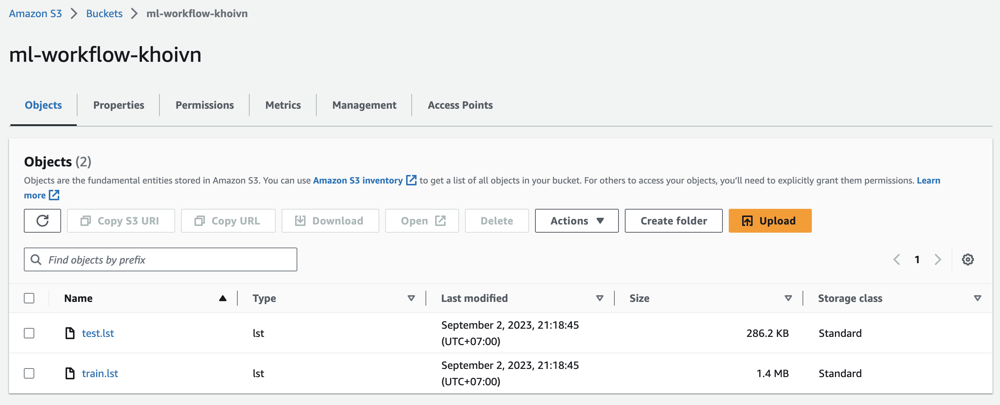
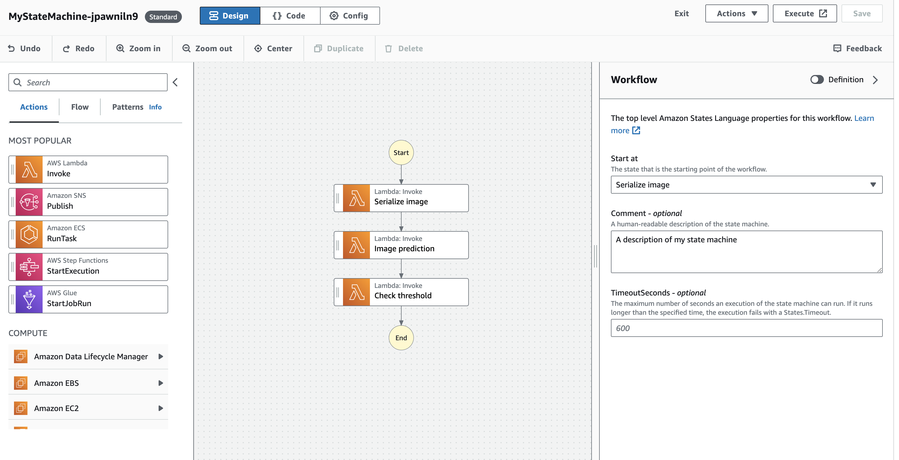
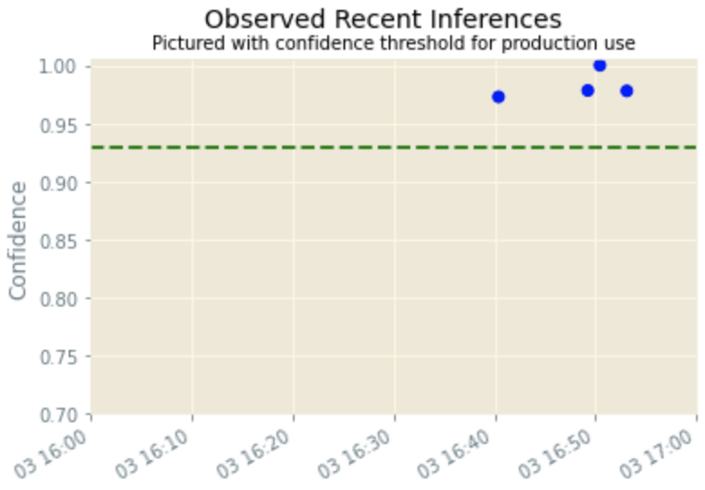
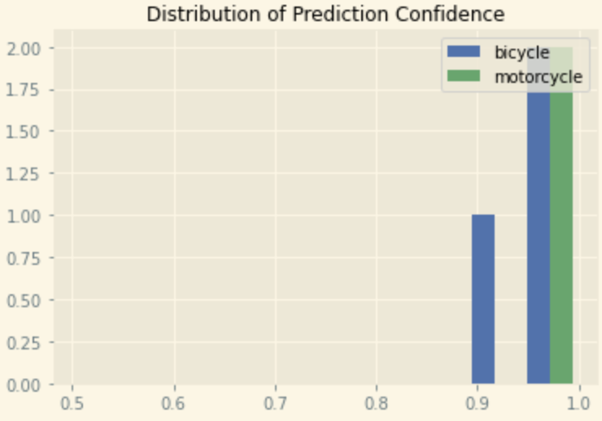

# Build a ML Workflow For Scones Unlimited On Amazon SageMaker

## Overview
In this project, using AWS Sagemaker to build an image classification model that can tell bicycles apart from motorcycles. You'll deploy your model, use AWS Lambda functions to build supporting services, and AWS Step Functions to compose your model and services into an event-driven application. At the end of this project, you will have created a portfolio-ready demo that showcases your ability to build and compose scalable, ML-enabled, AWS applications.

## Data
Link CIFAR100: https://www.cs.toronto.edu/~kriz/cifar-100-python.tar.gz

## Create bucket


## Feature Engineering
Use label 8 and 48
```python
df_train = df_train[(df_train['labels'] == 8) | (df_train['labels'] == 48)]
df_test = df_test[(df_test['labels'] == 8) | (df_test['labels'] == 48)]
```

## Setup AWS Sagemaker
```bash
import sagemaker

session = sagemaker.Session()

bucket = "ml-workflow-khoivn"
print("Default Bucket: {}".format(bucket))

region = session.boto_region_name
print("AWS Region: {}".format(region))

role = sagemaker.get_execution_role()
print("RoleArn: {}".format(role))
```

## Upload data to S3
```bash
import os

os.environ["DEFAULT_S3_BUCKET"] = bucket
!aws s3 sync ./train s3://${DEFAULT_S3_BUCKET}/train/
!aws s3 sync ./test s3://${DEFAULT_S3_BUCKET}/test/
```

## Train model on Sagemaker
```python
# Use the image_uris function to retrieve the latest 'image-classification' image
algo_image = sagemaker.image_uris.retrieve('image-classification', region, version='latest')
s3_output_location = f"s3://{bucket}/models/image_model"
```

```python
img_classifier_model=sagemaker.estimator.Estimator(
    image_uri=algo_image,
    role=role,
    instance_count=1,
    instance_type='ml.p3.2xlarge',
    output_path=s3_output_location,
    sagemaker_session=sagemaker.Session()
)

img_classifier_model.set_hyperparameters(
    image_shape='3,32,32',
    num_classes=2,
    num_training_samples=len(df_train)
)
```

```python
from sagemaker.debugger import Rule, rule_configs
from sagemaker.session import TrainingInput
model_inputs = {
        "train": sagemaker.inputs.TrainingInput(
            s3_data=f"s3://{bucket}/train/",
            content_type="application/x-image"
        ),
        "validation": sagemaker.inputs.TrainingInput(
            s3_data=f"s3://{bucket}/test/",
            content_type="application/x-image"
        ),
        "train_lst": sagemaker.inputs.TrainingInput(
            s3_data=f"s3://{bucket}/train.lst",
            content_type="application/x-image"
        ),
        "validation_lst": sagemaker.inputs.TrainingInput(
            s3_data=f"s3://{bucket}/test.lst",
            content_type="application/x-image"
        )
}
img_classifier_model.fit(model_inputs)
```

Result:
```bash
2023-09-03 16:20:57 Starting - Starting the training job...
2023-09-03 16:21:21 Starting - Preparing the instances for trainingProfilerReport-1693758056: InProgress
.........
2023-09-03 16:22:41 Downloading - Downloading input data...
2023-09-03 16:23:21 Training - Downloading the training image...............
2023-09-03 16:25:51 Training - Training image download completed. Training in progress....
...
[09/03/2023 16:29:28 INFO 139962714154816] Epoch[29] Batch [20]#011Speed: 191.406 samples/sec#011accuracy=0.976190
[09/03/2023 16:29:30 INFO 139962714154816] Epoch[29] Train-accuracy=0.980847
[09/03/2023 16:29:30 INFO 139962714154816] Epoch[29] Time cost=4.990
[09/03/2023 16:29:30 INFO 139962714154816] Epoch[29] Validation-accuracy=0.802083
```

## Deploy model
```python
from sagemaker.model_monitor import DataCaptureConfig

data_capture_config = DataCaptureConfig(
    enable_capture=True,
    sampling_percentage=100,
    destination_s3_uri=f"s3://{bucket}/data_capture"
)
deployment = img_classifier_model.deploy(
    initial_instance_count=1,
    instance_type='ml.m5.xlarge',
    data_capture_config=data_capture_config
    )

endpoint = deployment.endpoint_name
print(endpoint)
```

## Inferencing
```python
predictor = sagemaker.predictor.Predictor('image-classification-2023-09-03-16-30-39-872')

from sagemaker.serializers import IdentitySerializer
import base64

predictor.serializer = IdentitySerializer("image/png")
with open("./test/bicycle_s_001789.png", "rb") as f:
    payload = f.read()


inference = predictor.predict(payload)
print(inference)
```

## Lambda function
```bash
Detail in lambda.py
```

## Step function


Example input:
```bash
{
  "image_data": "",
  "s3_bucket": "ml-workflow-khoivn",
  "s3_key": "test/bicycle_s_001789.png"
}
```

Export defines to JSON: MyStateMachine-jpawniln9.asl.json

## Testing and Evaluation
```bash
import random
import boto3
import json


def generate_test_case():
    # Setup s3 in boto3
    s3 = boto3.resource('s3')

    # Randomly pick from sfn or test folders in our bucket
    objects = s3.Bucket(bucket).objects.filter(Prefix="test")

    # Grab any random object key from that folder!
    obj = random.choice([x.key for x in objects])

    return json.dumps({
        "image_data": "",
        "s3_bucket": bucket,
        "s3_key": obj
    })
generate_test_case()
```

## Plot report



## Notebook
Pipeline: [](../../projects/ml_workflow_for_scones_unlimited/project-KhoiVN.ipynb)

Export to HTML: project-KhoiVN.html
