# Operationalizing an AWS Image Classification Project

By improving and preparing an image classification project for production-grade deployment, you'll demonstrate that you have the skills to work on the most advanced ML pipelines in the world. You'll be prepared to do excellent work as an ML engineer with the ability to optimize ML pipelines for efficiency, speed, and security.

Link Write-up: https://docs.google.com/document/d/1HbFQ48U6uNV3GFZIxSJeFGaTAeVe7g3ZcDJo26vgWKo/edit?usp=sharing

## Bucket S3
### Create bucket
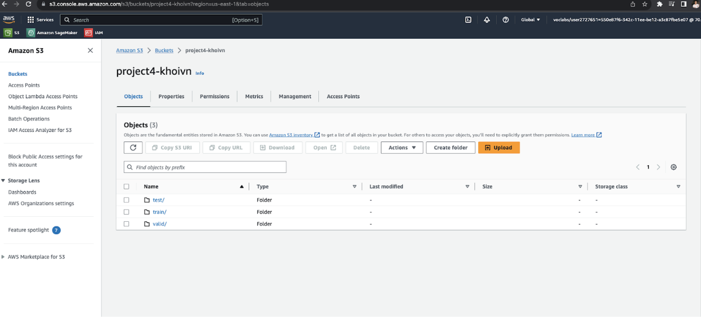

### Dataset
The provided dataset is the dogbreed classification dataset which can be found in the classroom.
```bash
!wget https://s3-us-west-1.amazonaws.com/udacity-aind/dog-project/dogImages.zip
```

### Access
Upload the data to an S3 bucket through the AWS Gateway so that SageMaker has access to the data.
```bash
!aws s3 cp dogImages s3://project4-khoivn/ --recursive
```

## Setup EC2
Create an EC2 instance with the following configuration:
- AMI: Deep Learning AMI GPU Pytorch 1.13.1
- Instance Type: t2.large
- Storage: 45 GB
- Security Group: Allow SSH and HTTP
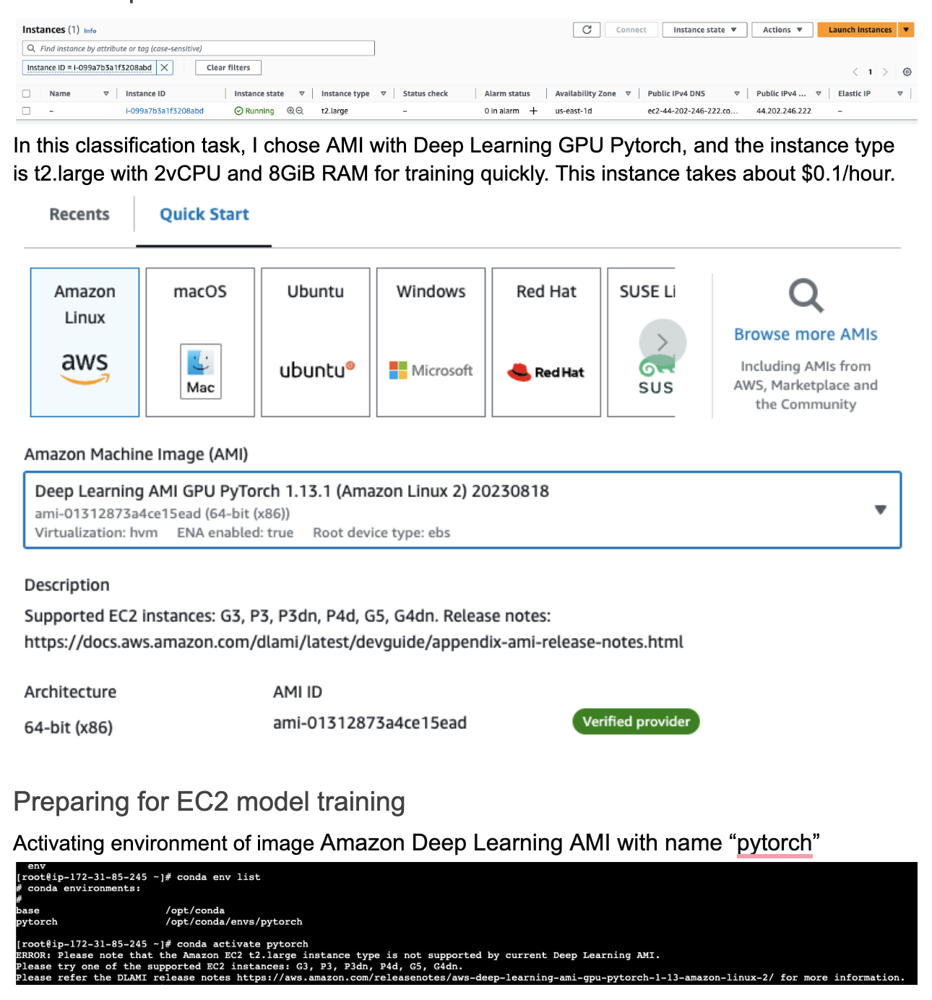

## Training model
### Model
Choose Resnet18 as the pretrained model and replace the last layer with a new layer that has the number of classes as the output.

```bash
def get_model(self):
    '''
        Using a Resnet18 pretrained model
    '''
    model = models.resnet18(pretrained=True)

    for param in model.parameters():
        param.requires_grad = False

    model.fc = nn.Sequential(
        nn.Linear(in_features=512, out_features=128),
        nn.ReLU(inplace=True),
        nn.Linear(in_features=128, out_features=133)
    )
    return model
```

### Hyperparameter Tuning Job
- Learning rate with a range of 0.001 to 0.1 and type of continuous (ContinuousParameter)
- Batch size with a range of 32, 64, 128, 256, 512 and type of categorical (CategoricalParameter)
- Metric definition for the objective metric of average test loss

```bash
hyperparameter_ranges = {
    "lr": ContinuousParameter(0.001, 0.1),
    "batch-size": CategoricalParameter([32, 64, 128, 256, 512]),
}

objective_metric_name = "average test loss"
objective_type = "Minimize"
metric_definitions = [{"Name": "average test loss", "Regex": "Test set: Average loss: ([0-9\\.]+)"}]
```

### Best Hyperparameters
```bash
hyperparameters = {
    "lr": 0.0033047276512977604,
    "batch-size": 512,
}
```
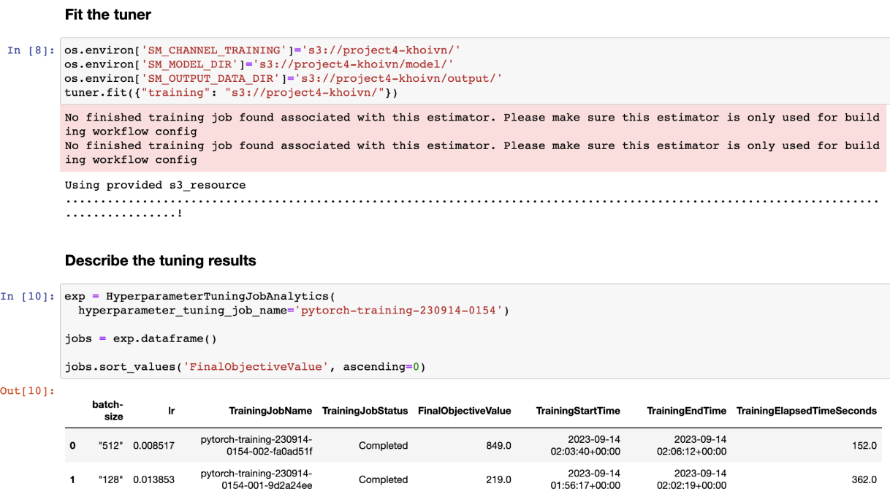

### Training Job


### Training Job Multiple Instances
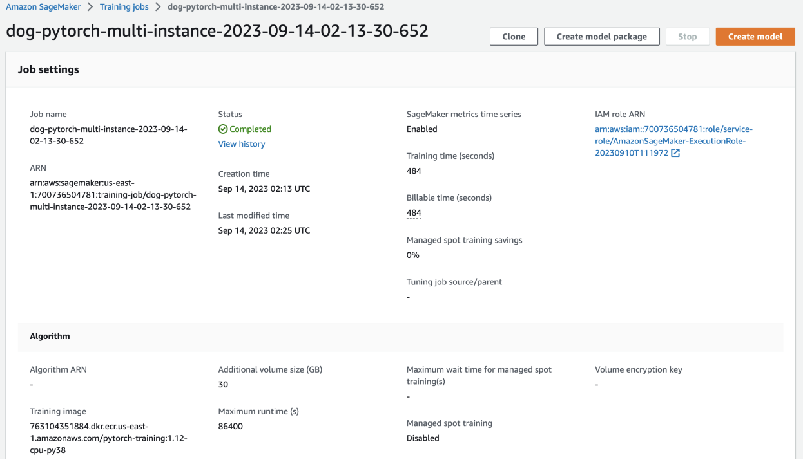

### Debugging and Profiling
Use practice in the course to debug and profile the training job.
Link: https://learn.udacity.com/nanodegrees/nd009t/parts/fb5cc8ed-69a8-4e9a-8d62-f034aa9f1994/lessons/e7ad71c4-e91e-46f1-a877-e37024fc2ebd/concepts/a7960dd1-1d8b-48ac-810b-ad34084dfba8

Follow the instructions:
- In the [SageMaker Debugger](https://sagemaker.readthedocs.io/en/stable/api/training/debugger.html) documentation to configure the debugger.
- In the [SageMaker Profiler](https://sagemaker.readthedocs.io/en/stable/api/training/profiler.html) documentation to configure the profiler.

```bash
rules = [
    Rule.sagemaker(rule_configs.loss_not_decreasing()),
    Rule.sagemaker(rule_configs.overfit()),
    Rule.sagemaker(rule_configs.overtraining()),
    Rule.sagemaker(rule_configs.poor_weight_initialization()),
    ProfilerRule.sagemaker(rule_configs.ProfilerReport()),
]

profiler_config = ProfilerConfig(
    system_monitor_interval_millis=500, framework_profile_params=FrameworkProfile(num_steps=10)
)

hook_config = DebuggerHookConfig(
    hook_parameters={"train.save_interval": "1", "eval.save_interval": "1"}
)
```

### Training and saving on EC2
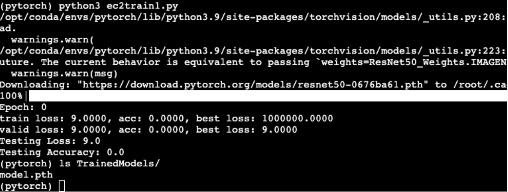

## Model Deployment
### Deploy model
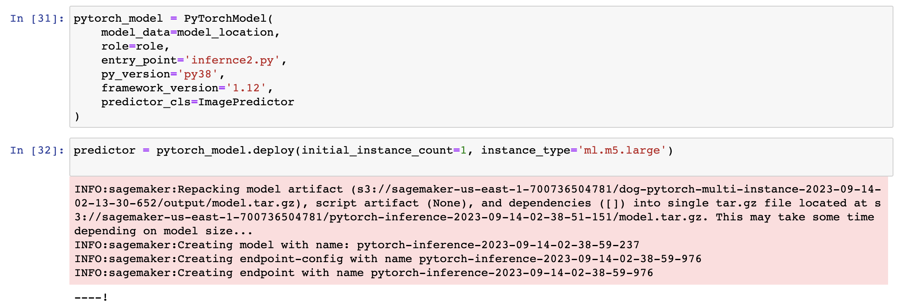

The inference script already handles the data transformation to tensors, so we only need to pass image in bytes format as the payload for the endpoint.

### Endpoint
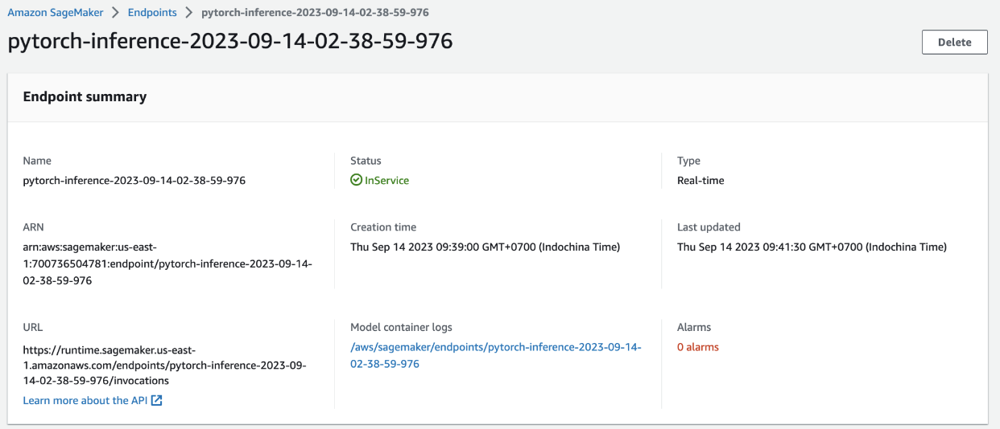

### Inference
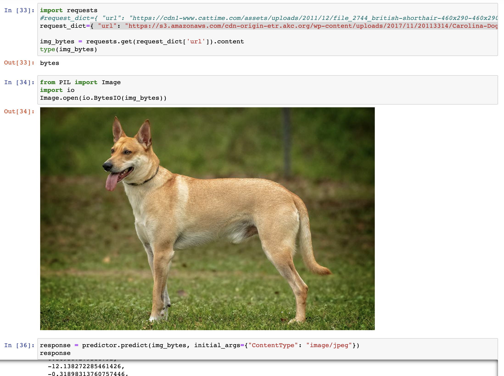

## Setup Lambda Function
### Create Lambda Function
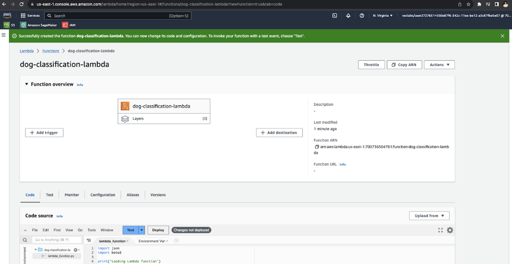

### Deploy and Test Lambda Function
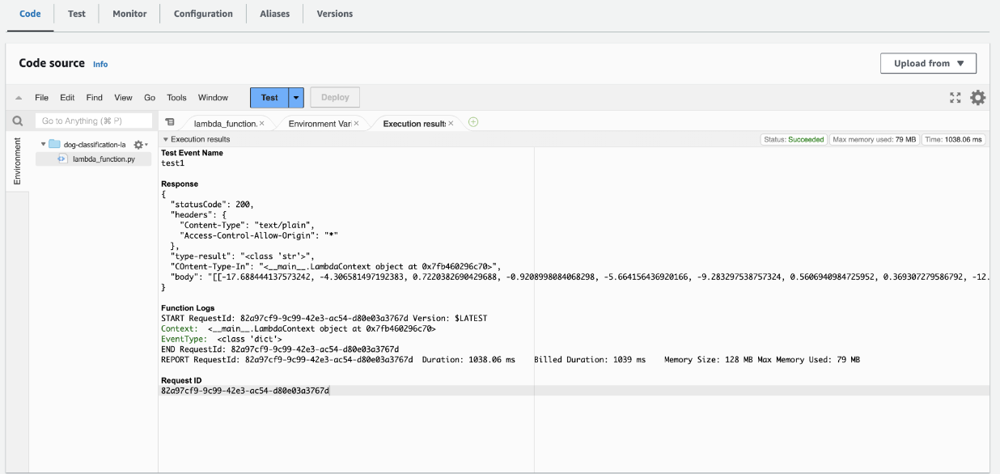

## Concurrency and auto-scaling
### Concurrency Lambda Function
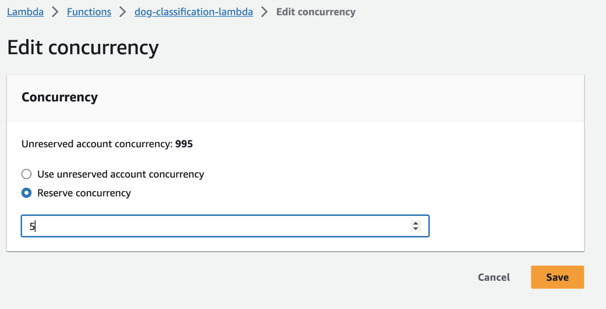

### Auto-scaling Endpoint
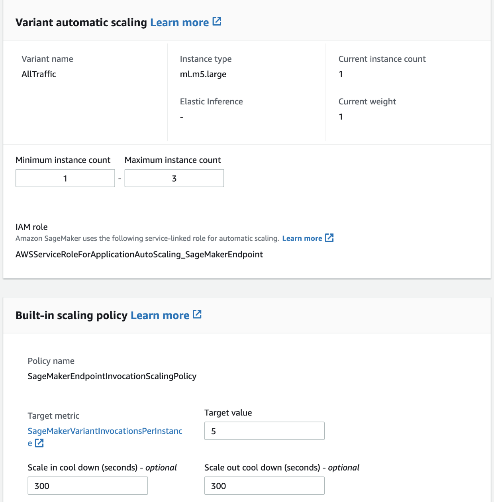

### Run shell
```bash
i = 0
while (i < 100):
    response = predictor.predict(img_bytes, initial_args={"ContentType": "image/jpeg"})
    i += 1
```
