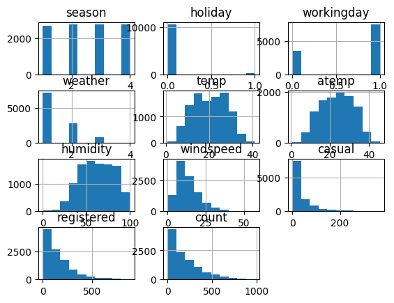
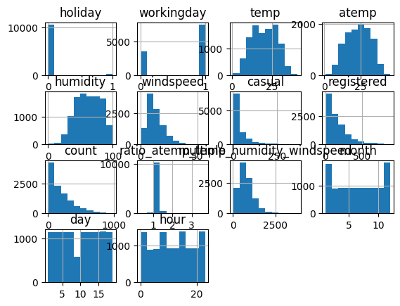
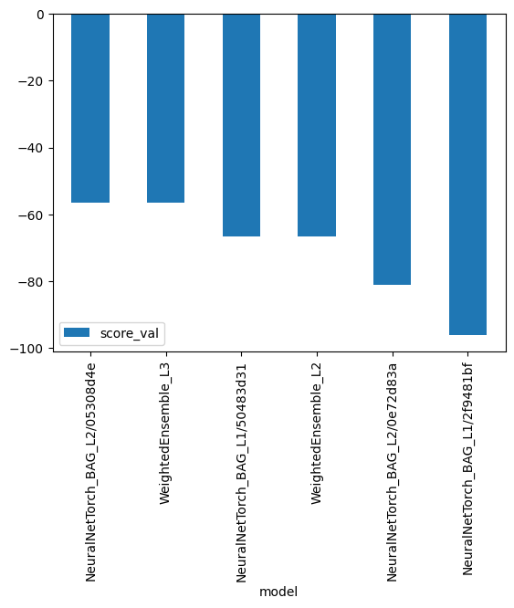
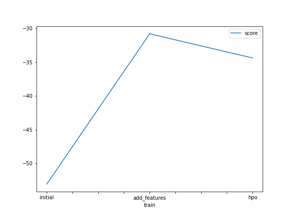
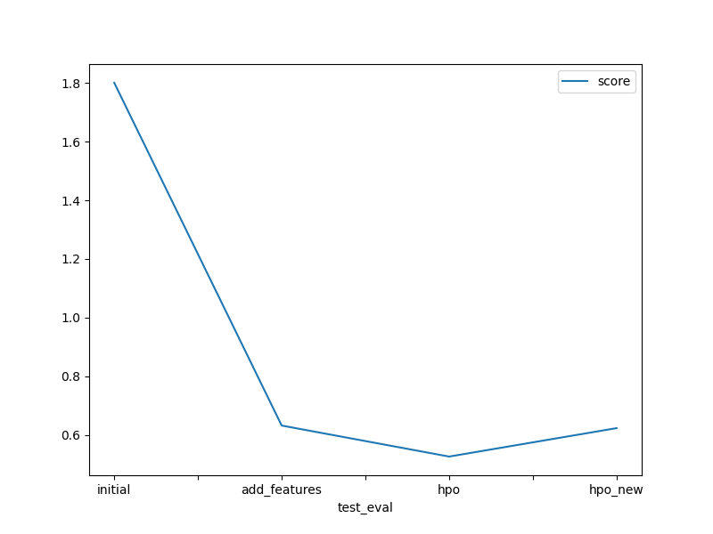

# Predict Bike Sharing Demand with AutoGluon

## Overview
In this project, students will apply the knowledge and methods they learned in the Introduction to Machine Learning course to compete in a Kaggle competition using the AutoGluon library. The goal of this project is to predict the total count of bikes rented during each hour covered by the test set, using only information available prior to the rental period.

## Data
Link Kaggle: https://www.kaggle.com/competitions/bike-sharing-demand/data

## EDA


## Feature Engineering


### Create new features
```python
train["ratio_atemp_temp"] = train["atemp"]/train["temp"]
train["multiple_humidity_windspeed"] = train["humidity"]*train["windspeed"]
train['month'] = pd.to_datetime(train['datetime']).dt.month
train['day'] = pd.to_datetime(train['datetime']).dt.day
train['hour'] = pd.to_datetime(train['datetime']).dt.hour
```

### Make some columns to category
```python
train["season"] = train["season"].astype("category")
train["weather"] = train["weather"].astype("category")
```

## Train with AutoGluon
```python
predictor = TabularPredictor(label=label, eval_metric="root_mean_squared_error").fit(train.drop(["casual", "registered"], axis=1), time_limit=600, presets="best_quality")
predictor.fit_summary()
```

```bash
*** Summary of fit() ***
Estimated performance of each model:
                  model   score_val  pred_time_val   fit_time
0   WeightedEnsemble_L2   -1.416316       3.854366  89.183216
1              CatBoost   -2.386901       0.007979  33.255971
2         ExtraTreesMSE   -2.467690       0.188373   5.665460
3       RandomForestMSE   -2.659286       0.128780  10.890972
4              LightGBM   -2.768913       0.050336   1.539279
5         LightGBMLarge   -3.027961       0.132025   3.965537
6       NeuralNetFastAI   -3.585707       0.022072  18.352351
7               XGBoost   -3.760492       0.008220   0.902130
8            LightGBMXT   -4.046178       3.454475  18.856312
9        NeuralNetTorch   -9.397015       0.023924  27.690659
10       KNeighborsDist  -92.442085       0.023581   0.131277
11       KNeighborsUnif -109.739422       0.049793   2.574461
Number of models trained: 12
Types of models trained:
{'LGBModel', 'XTModel', 'CatBoostModel', 'XGBoostModel', 'KNNModel', 'WeightedEnsembleModel', 'NNFastAiTabularModel', 'TabularNeuralNetTorchModel', 'RFModel'}

'leaderboard':
                   model   score_val       pred_time_val    fit_time
 0   WeightedEnsemble_L2   -1.416316       3.854366         89.183216
 1              CatBoost   -2.386901       0.007979         33.255971
 2         ExtraTreesMSE   -2.467690       0.188373         5.665460
 3       RandomForestMSE   -2.659286       0.128780         10.890972
 4              LightGBM   -2.768913       0.050336         1.539279
 5         LightGBMLarge   -3.027961       0.132025         3.965537
 6       NeuralNetFastAI   -3.585707       0.022072         18.352351
 7               XGBoost   -3.760492       0.008220         0.902130
 8            LightGBMXT   -4.046178       3.454475         18.856312
 9        NeuralNetTorch   -9.397015       0.023924         27.690659
 10       KNeighborsDist  -92.442085       0.023581         0.131277
 11       KNeighborsUnif -109.739422       0.049793         2.574461
```

Best model:

## Evaluation
```bash
predictions = predictor.predict(test)
```

## Submission
```bash
submission["count"] = predictions
submission.to_csv("submission/submission.csv", index=False)
```

### First submission

```bash
fileName        date                 description           status    publicScore  privateScore
--------------  -------------------  --------------------  --------  -----------  ------------
submission.csv  2023-08-31 15:29:03  first raw submission  complete  1.80095      1.80095
```

### Second submission

```bash
fileName                     date                 description           status    publicScore  privateScore
---------------------------  -------------------  --------------------  --------  -----------  ------------
submission_new_features.csv  2023-08-31 16:12:31  new features          complete  0.63184      0.63184
submission.csv               2023-08-31 15:29:03  first raw submission  complete  1.80095      1.80095
```

### Third submission

```bash
fileName                     date                 description                        status    publicScore  privateScore
---------------------------  -------------------  ---------------------------------  --------  -----------  ------------
submission_new_hpo.csv       2023-08-31 16:32:51  new features with hyperparameters  complete  0.52606      0.52606
submission_new_features.csv  2023-08-31 16:12:31  new features                       complete  0.63184      0.63184
submission.csv               2023-08-31 15:29:03  first raw submission               complete  1.80095      1.80095
```

### Fourth submission

```bash
fileName                     date                 description                            status    publicScore  privateScore
---------------------------  -------------------  -------------------------------------  --------  -----------  ------------
submission_new_hpo.csv       2023-09-01 05:49:19  new features with new hyperparameters  complete  0.62304      0.62304
submission_new_hpo.csv       2023-08-31 16:32:51  new features with hyperparameters      complete  0.52606      0.52606
submission_new_features.csv  2023-08-31 16:12:31  new features                           complete  0.63184      0.63184
submission.csv               2023-08-31 15:29:03  first raw submission                   complete  1.80095      1.80095
```

## Notebook
Pipeline: [](../../projects/predict_bike_sharing_demand/project-KhoiVN.ipynb)

Export to HTML: project-KhoiVN.html

## Plot report
### Train score


### Test score


## Report project
Details in [report-project.md](../../projects/predict_bike_sharing_demand/report-project.md)
