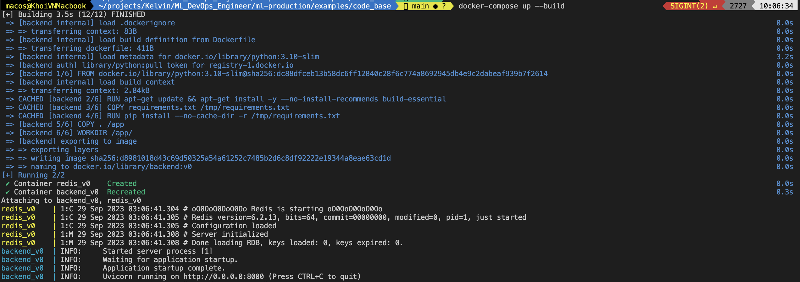
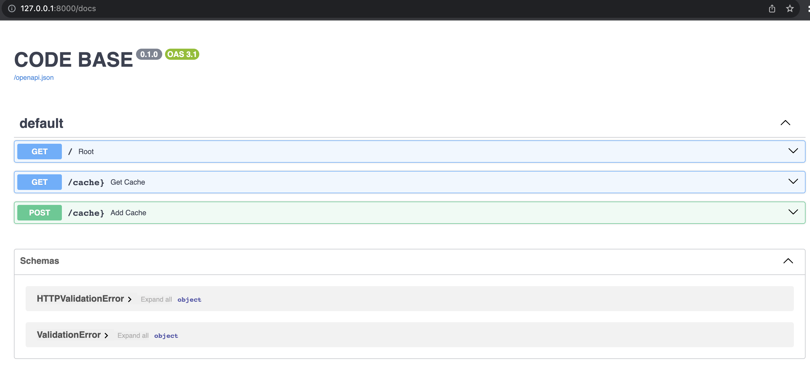
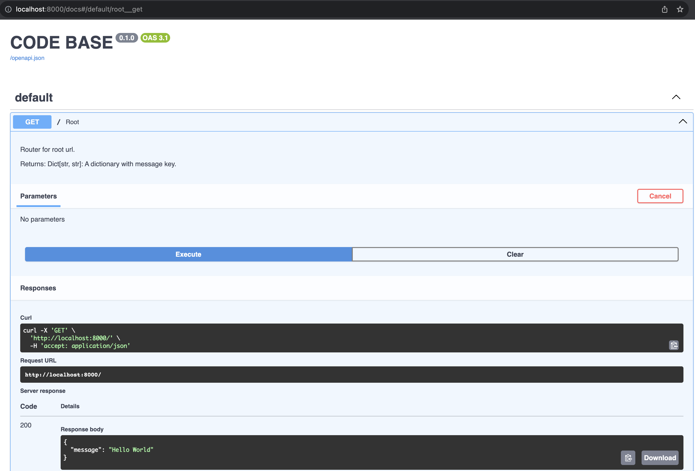

# Python Code Based

## 1. Introduction
This is a code base for python. It contains some useful functions and classes.

## 2. Technical Details
### 2.1. Structure
The structure of this code base is as follows:
```
.
├── Dockerfile
├── Makefile
├── README.md
├── api
│   ├── __init__.py
│   └── app.py
├── backend
├── core
│   ├── __init__.py
│   ├── config.py
│   └── exception.py
├── dev.env
├── docker-compose.yml
├── docs
│   └── README.md
├── module
│   └── cache
│       ├── __init__.py
│       ├── base.py
│       ├── memory.py
│       └── redis.py
├── pytest.ini
├── requirements.txt
├── src
│   ├── __init__.py
│   ├── logger.py
│   └── utils.py
└── tests
    └── test_logger.py
```

### 2.2. Technologies
| # | Name | Description |
|---|------|-------------|
| 1 | Python | Python is an interpreted, high-level and general-purpose programming language. |
| 2 | Flake8 | The tool for style guide enforcement. |
| 3 | Pytest | The tool for unit test. |
| 4 | Makefile | The tool for automation. |
| 5 | Pre-commit | The tool for pre-commit hook. |
| 6 | FastAPI | The tool for API development. |
| 7 | Pydantic | The tool for data validation. |
| 8 | Redis | The tool for cache. |
| 9 | Docker | The tool for containerization. |
| 10 | Docker Compose | The tool for container orchestration. |
| 11 | Logging | The tool for logging. |
| 12 | Github Action | The tool for CI/CD. |


### 2.3. Details of Technologies
1. **Flake8**: The tool for style guide enforcement. It is used to check the code style.
2. **Pytest**: The tool for unit test. It is used to test the code.
3. **Makefile**: The tool for automation. It is used to automate the process of code style checking, unit testing, and code formatting.
4. **Pre-commit**: The tool for pre-commit hook. It is used to check the code style before committing.
5. **FastAPI**: The tool for API development. It is used to develop the API.
6. **Pydantic**: The tool for data validation. It is used to validate the data.
7. **Redis**: The tool for cache. It is used to cache the data.
8. **Docker**: The tool for containerization. It is used to containerize the application.
9. **Docker Compose**: The tool for container orchestration. It is used to orchestrate the containers.
10. **Logging**: The tool for logging. It is used to log the information.
11. **.env**: The file for environment variables. It is used to store the environment variables.
12. **.gitignore**: The file for git ignore. It is used to ignore the files and folders.

### 2.4. Details of Folders
1. **api**: The folder for API. It is used to store the API.
2. **core**: The folder for core. It is used to store the core like config and exception.
3. **module**: The folder for module. It is used to store the modules like cache.
4. **src**: The folder for source code. It is used to store the source code.
5. **tests**: The folder for unit test. It is used to store the unit test.

## 3. Getting Started
### 3.1. Prerequisites
Using conda or pip to install the packages in requirements.txt.
```
make install
```

### 3.2. Build docker
```
make docker-compose-up
```


### 3.3. Web API
```
http://localhost:8000/docs
```



- Request root with method GET.



- Request add and get with curl
```curl
curl -X 'POST' \
  'http://localhost:8000/cache' \
  -H 'accept: application/json' \
  -d ''
```
Response
```json
{
  "cache": "Added value to cache successfully"
}
```

```curl
curl -X 'GET' \
  'http://localhost:8000/cache' \
  -H 'accept: application/json'
```

Response
```json
{
  "cache": [
    "2023-09-29-03-19-35",
    "2023-09-29-03-20-33",
    "2023-09-29-03-28-38 - LOGIN",
    "2023-09-29-03-31-40 - LOGIN"
  ]
}
```

## 4. Lint
```make
make lint
```

Result
```
flake8 --max-line-length=120 --exclude=venv --verbose
flake8.checker            MainProcess    249 INFO     Making checkers
flake8.main.application   MainProcess    721 INFO     Finished running
flake8.main.application   MainProcess    721 INFO     Reporting errors
flake8.main.application   MainProcess    722 INFO     Found a total of 1 violations and reported 0
```

## 5. Test
```make
make test
```

Result
```
pytest --verbose tests
=================================================================================== test session starts ====================================================================================
platform darwin -- Python 3.10.13, pytest-7.4.2, pluggy-1.3.0 -- /Users/macos/miniconda3/envs/practice-python3/bin/python
cachedir: .pytest_cache
rootdir: /Users/macos/projects/Kelvin/ML_DevOps_Engineer/ml-production/examples/code_base
configfile: pytest.ini
plugins: anyio-3.7.1
collected 1 item

tests/test_logger.py::test_log PASSED                                                                                                                                                [100%]

==================================================================================== 1 passed in 0.01s =====================================================================================
```

## 6. Code Formatting
```make
make format
```

Result
```
autopep8 --verbose --in-place --aggressive --aggressive --max-line-length=120 **/*.py
read config path: /Users/macos/projects/Kelvin/ML_DevOps_Engineer/ml-production/examples/code_base/.flake8
enable config: section=flake8, key=exclude, value=
venv
.venv
__pycache__
notebooks
enable config: section=flake8, key=max-line-length, value=120
[file:core/__init__.py]
--->  Applying global fix for E231
--->  Applying global fix for E721
--->  Applying global fix for W690
--->  0 issue(s) to fix {}
[file:src/__init__.py]
--->  Applying global fix for E231
--->  Applying global fix for E721
--->  Applying global fix for W690
--->  0 issue(s) to fix {}
[file:api/__init__.py]
--->  Applying global fix for E231
--->  Applying global fix for E721
--->  Applying global fix for W690
--->  0 issue(s) to fix {}
[file:core/config.py]
--->  Applying global fix for E231
--->  Applying global fix for E721
--->  Applying global fix for W690
--->  0 issue(s) to fix {}
[file:tests/test_logger.py]
--->  Applying global fix for E231
--->  Applying global fix for E721
--->  Applying global fix for W690
--->  0 issue(s) to fix {}
[file:core/exception.py]
--->  Applying global fix for E231
--->  Applying global fix for E721
--->  Applying global fix for W690
--->  0 issue(s) to fix {}
[file:src/logger.py]
--->  Applying global fix for E231
--->  Applying global fix for E721
--->  Applying global fix for W690
--->  0 issue(s) to fix {}
[file:src/utils.py]
--->  Applying global fix for E231
--->  Applying global fix for E721
--->  Applying global fix for W690
--->  0 issue(s) to fix {}
[file:api/app.py]
--->  Applying global fix for E231
--->  Applying global fix for E721
--->  Applying global fix for W690
--->  0 issue(s) to fix {}
```

## Continuous Integration
Github Action in `.github/workflows/ci.yml`
