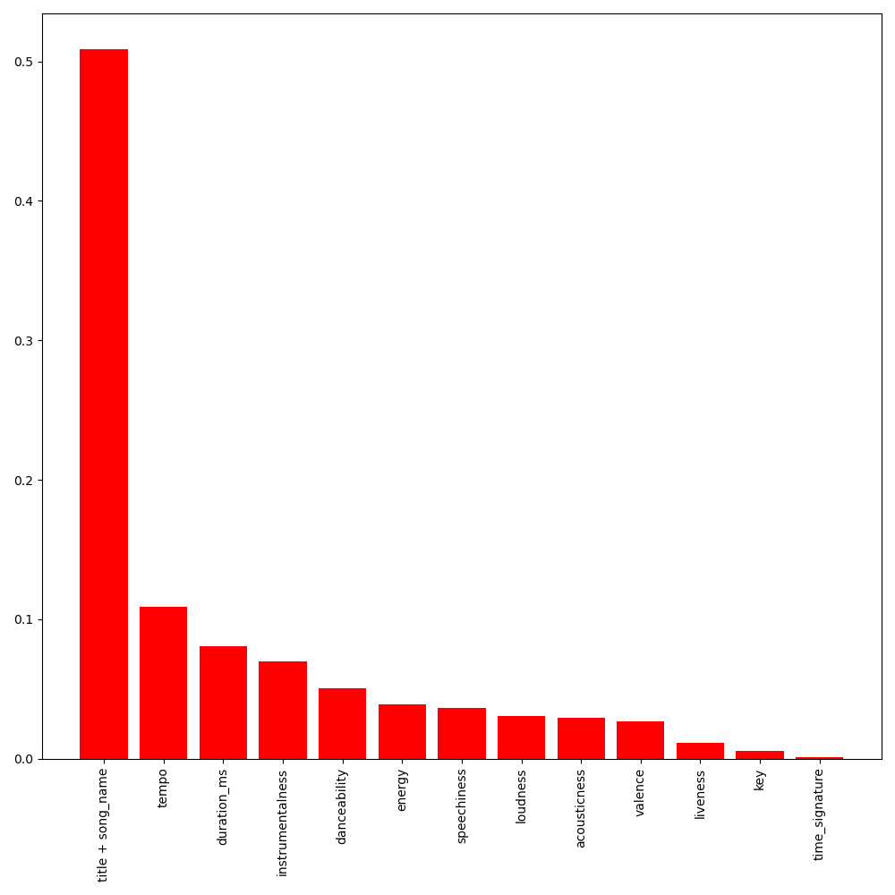

# End-to-end Machine Learning Pipeline

## Introduction
This example demonstrates how to build an end-to-end machine learning pipeline using MLflow. The pipeline consists of the following steps:
- Download data
- Preprocess data
- Check data
- Segregate data
- Train model

Script:
```bash
cd examples/e2e_machine_learning_pipeline && mlflow run .
```

## Prerequisites
- Python version 3.8 or later
- Weight & Biases account

## Technology stack
- Python
- Conda
- Hydra
- Mlflow
- Weight & Biases

## Step-by-step guide
### Step 0: Setup
```bash
- Setup conda
- Install mlflow
- Login wandb
```

### Step 1: Download data
The data is stored in a public GitHub repository. The following command downloads the data and stores it in Wandb artifact.
```bash
[2023-08-17 22:29:43,838][root][INFO] - >>>Downloading data
...
python download_data.py --file_url 'https://github.com/udacity/nd0821-c2-build-model-workflow-exercises/blob/master/lesson-2-data-exploration-and-preparation/exercises/exercise_4/starter/genres_mod.parquet?raw=true' \
                        --artifact_name raw_data.parquet \
                        --artifact_type raw_data \
                        --artifact_description 'Data as downloaded'
```
### Step 2: Preprocess data
```bash
[2023-08-17 22:31:17,192][root][INFO] - >>>Preprocessing data
...
python preprocess.py --input_artifact raw_data.parquet:latest \
                     --artifact_name preprocessed_data.csv \
                     --artifact_type preprocessed_data \
                     --artifact_description 'Data with preprocessing applied'
```

### Step 3: Check data
```bash
[2023-08-17 22:57:54,310][root][INFO] - >>>Checking data
...
pytest -s -vv . --reference_artifact exercise_14/preprocessed_data.csv:latest \
                --sample_artifact preprocessed_data.csv:latest \
                --ks_alpha 0.05
```

Results:
```bash
test_data.py::test_column_presence_and_type PASSED
test_data.py::test_class_names PASSED
test_data.py::test_column_ranges PASSED
test_data.py::test_kolmogorov_smirnov PASSED
```

### Step 4: Segregate data
```bash
[2023-08-17 23:09:00,199][root][INFO] - >>>Splitting data into train, val and test
...
python segregate.py --input_artifact preprocessed_data.csv:latest \
                    --artifact_root data \
                    --artifact_type segregated_data \
                    --test_size 0.3 \
                    --random_state 42 \
                    --stratify genre
...
2023-08-17 23:11:19,940 Downloading and reading artifact
2023-08-17 23:11:22,068 Splitting data into train, val and test
2023-08-17 23:11:22,131 Uploading the train dataset to data_train.csv
2023-08-17 23:11:22,532 Logging artifact
2023-08-17 23:11:28,299 Uploading the test dataset to data_test.csv
2023-08-17 23:11:28,568 Logging artifact
```

### Step 5: Train and Evaluate model
```bash
[2023-08-17 23:11:50,062][root][INFO] - >>>Training random forest
...
python random_forest.py --train_data data_train.csv:latest \
                        --model_config /Users/macos/projects/Kelvin/ML_DevOps_Engineer/ml-production/examples/e2e_machine_learning_pipeline/outputs/2023-08-17/23-07-51/random_forest_config.yml \
                        --export_artifact model_export \
                        --random_seed 42 \
                        --val_size 0.3 \
                        --stratify genre
...
2023-08-17 23:40:31,004 Downloading and reading train artifact
2023-08-17 23:40:32,994 Extracting target from dataframe
2023-08-17 23:40:32,999 Splitting train/val
2023-08-17 23:40:33,038 Setting up pipeline
2023-08-17 23:40:33,047 Fitting
2023-08-17 23:40:37,335 Scoring
...
[2023-08-17 23:33:28,765][root][INFO] - >>>Evaluating random forest
...
wandb: Run summary:
wandb: AUC 0.9542
```


