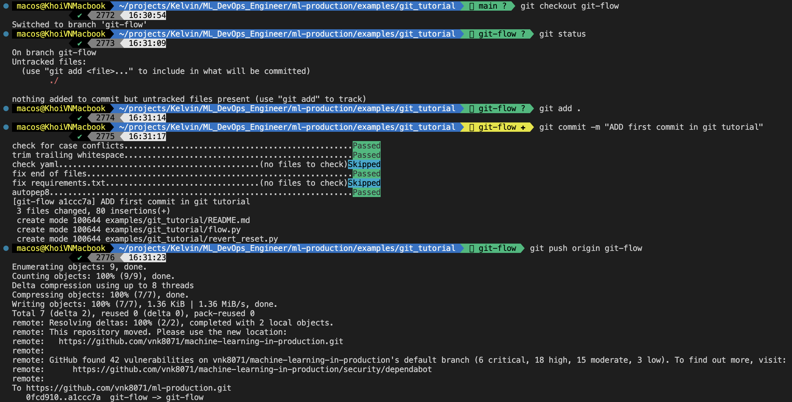
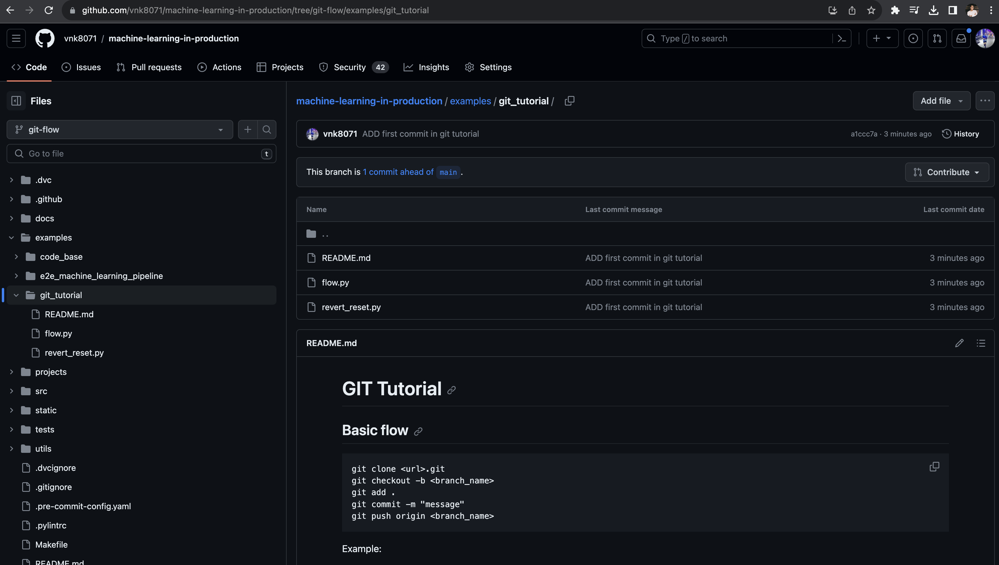
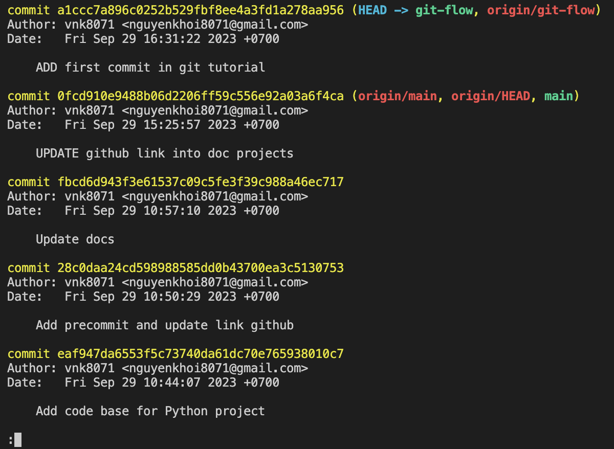
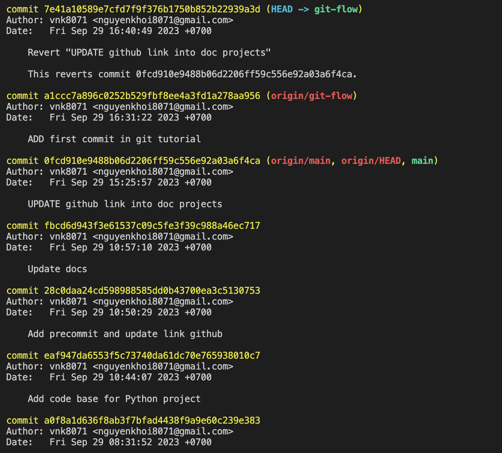

# GIT Tutorial

## Basic flow
```git
git clone <url>.git
git checkout -b <branch_name>
git add .
git commit -m "message"
git push origin <branch_name>
```

Example:
Follow the instructions in `flow.py`:


Check remote branches:


## Back in time
### Revert
```git
git log
git revert <commit_hash>
git commit -m "[REVERT] <commit_hash>"
git push origin <branch_name>
```

Example:
Follow the instructions in `revert.py`:


We want to revert the commit `0fcd910e9488b06d2206ff59c556e92a03a6f4ca`:
```git
git revert 0fcd910e9488b06d2206ff59c556e92a03a6f4ca
git commit -m "[REVERT] 0fcd910e9488b06d2206ff59c556e92a03a6f4ca"
```

Result:
```
[git-flow 7e41a10] Revert "UPDATE github link into doc projects"
 7 files changed, 14 deletions(-)
```


We can see that the commit `0fcd910e9488b06d2206ff59c556e92a03a6f4ca` is reverted.

### Reset
```git
git log
git reset --hard <commit_hash>
git commit -m "[RESET] <commit_hash>"
git push origin <branch_name>
```


We can see that the commit `0fcd910e9488b06d2206ff59c556e92a03a6f4ca` is reset.
