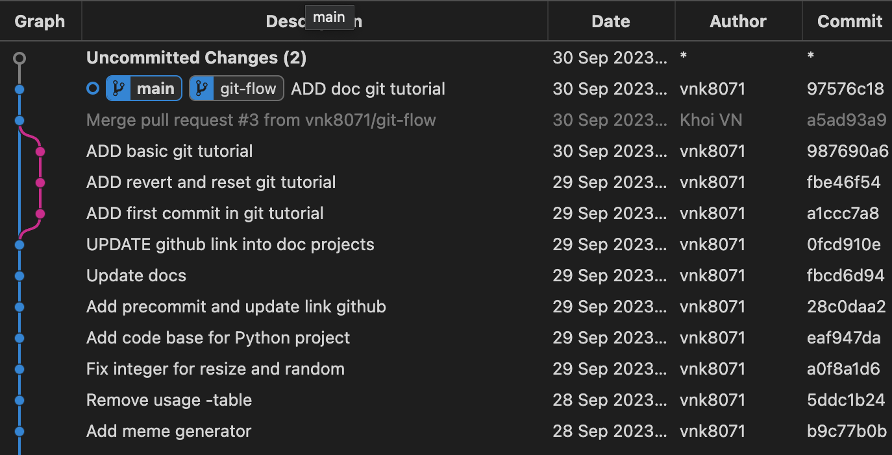

# GIT Tutorial

## Overview
Version control is a system that records changes to a file or set of files over time so that you can recall specific versions later. It allows you to revert files or project to a previous version, track modifications and modifying individuals, and compare changes. It is essential for the integrity of the project and the people working on it.

And last but not least, 80% of the time we're just going to use about 20% of the available git commands.

## Configuration
```git
git config --global user.name "name"
git config --global user.email "email"
```

## Workflow

@source: [A successful Git branching model](https://nvie.com/posts/a-successful-git-branching-model/)

## Commands and definitions
| # | Command | Definition |
| --- | --- | --- |
| 1 | `git clone <url>.git` | Clone a repository into a new directory |
| 2 | `git checkout -b <branch_name>` | Create a new branch and switch to it |
| 3 | `git add .` | Add all files to staging area |
| 4 | `git commit -m "message"` | Commit changes to head |
| 5 | `git push origin <branch_name>` | Push changes to remote repository |
| 6 | `git log` | Show commit logs |
| 7 | `git revert <commit_hash>` | Revert a commit |
| 8 | `git reset --hard <commit_hash>` | Reset to a commit |
| 9 | `git branch` | List all local branches |
| 10 | `git branch -r` | List all remote branches |
| 11 | `git branch -a` | List all local and remote branches |
| 12 | `git branch -d <branch_name>` | Delete a local branch |
| 13 | `git push origin --delete <branch_name>` | Delete a remote branch |
| 14 | `git checkout <branch_name>` | Switch to a branch |
| 15 | `git checkout -` | Switch to the previous branch |
| 16 | `git checkout -- <file_name>` | Discard changes to a file |
| 17 | `git merge <branch_name>` | Merge a branch into the active branch |
| 18 | `git fetch` | Fetch changes from remote repository |
| 19 | `git pull` | Fetch and merge changes from remote repository |
| 20 | `git stash` | Stash changes in a dirty working directory |
| 21 | `git stash list` | List all stashed changesets |
| 22 | `git stash pop` | Apply stashed changes to working directory |
| 23 | `git stash drop` | Discard stashed changesets |
| 24 | `git rebase` | Reapply commits on top of another base tip |
| 25 | `git rebase -i HEAD~<number_of_commits>` | Rebase interactive |
| 26 | `git rebase --continue` | Continue rebase after resolving conflicts |
| 27 | `git rebase --abort` | Abort rebase |

**Note**:
- `git pull` = `git fetch` + `git merge`
- `git pull --rebase` = `git fetch` + `git rebase`

**Details** in [Git Cheat Sheet](https://github.github.com/training-kit/downloads/github-git-cheat-sheet.pdf) and [Book](https://git-scm.com/book/en/v2/)

## Basic flow
```git
git clone <url>.git
git checkout -b <branch_name>
git add .
git commit -m "message"
git push origin <branch_name>
```

Example:
Follow the instructions in `flow.py`:


Check remote branches:


## Common workflow patterns
### Single branch workflow
- Use a single branch for all changes.
- Use tags to mark important commits.


| # | Benefits | Drawbacks |
| --- | --- | --- |
| 1 | It is simple. | It is not recommended to use in remote branches. |
| 2 | It is easy to resolve conflicts. | It is not recommended to use in large projects. |
| 3 | It is easy to revert a commit. | It is not recommended to use in colaborating with others. |


@source: [A successful Git branching model](https://nvie.com/posts/a-successful-git-branching-model/#incorporating-a-finished-feature-on-develop)
### Branch based development workflow
- The master/main is never committed to directly.
- New features are developed in separate branches, and then if colaborating with others, merged could be approved by pull request into the master/main branch.


@source: [Trunk Based Development](https://devcycle.com/blog/transitioning-to-trunk-based-development)

| # | Benefits | Drawbacks |
| --- | --- | --- |
| 1 | It is easy to revert a commit. | It is harder to resolve conflicts. |
| 2 | It is easy to review changes. | It is not recommended to use in local branches. |
| 3 | It is easy to collaborate with others. | Need dedicated time to review changes. |


## Back in time
### Revert
```git
git log
git revert <commit_hash>
git commit -m "[REVERT] <commit_hash>"
git push origin <branch_name>
```

Example:
Follow the instructions in `revert.py`:


We want to revert the commit `0fcd910e9488b06d2206ff59c556e92a03a6f4ca`:
```git
git revert 0fcd910e9488b06d2206ff59c556e92a03a6f4ca
git commit -m "[REVERT] 0fcd910e9488b06d2206ff59c556e92a03a6f4ca"
```

Result:
```
[git-flow 7e41a10] Revert "UPDATE github link into doc projects"
 7 files changed, 14 deletions(-)
```


We can see that the commit `0fcd910e9488b06d2206ff59c556e92a03a6f4ca` is reverted.

### Reset
```git
git log
git reset --hard <commit_hash>
git commit -m "[RESET] <commit_hash>"
git push origin <branch_name>
```


We can see that the commit `0fcd910e9488b06d2206ff59c556e92a03a6f4ca` is reset.


## Branches
### Create a branch
```git
git checkout -b <branch_name>
git push origin <branch_name>
```

Example:
Follow the instructions in `branch.py`:
```git
git checkout -b git-flow
```


```git
git push origin git-flow
```


### Delete a branch
```git
git branch -d <branch_name>
git push origin --delete <branch_name>
```

## Merge
```git
git checkout <branch_target>
git merge <branch_name>
git push origin <branch_target>
```


Follow the instructions in `merge.py`:
Ìf merge conflict, we need to resolve it first.

```git
git checkout main
git merge git-flow
```

Example:
```git
<<<<<<< HEAD
This is the first line of the main branch.
=======
This is the first line of the git-flow branch.
>>>>>>> git-flow
```


Then accept the changes could be current | incoming | both and commit:
```git
git add .
git commit -m "Resolve conflict"
git push origin main
```

## Check changes
```git
git status
git log
git diff <commit_hash_1> <commit_hash_2>
git diff <branch_name_1> <branch_name_2>
```

## Remote


Before we can push to a team repository, we need to pull and resolve conflicts first.
```git
git pull
```

Then we can push to the team repository.
```git
git push origin <branch_name>
```

## Stash
Using `git stash` to save changes in a dirty working directory and then pull latest changes from remote repository.
```git
git stash save
git pull
```

Then we can apply stashed changes to working directory.
```git
git stash pop

or

git stash apply
```

Example:
```git
git checkout main
git pull
```

Then raise a bug and fix it.
```git
error: Your local changes to the following files would be overwritten by pull:
    README.md
Please commit your changes or stash them before you pull.
Aborting
```

In this case, we can stash changes and pull latest changes from remote repository.
```git
git stash save
git pull
```

Then we can apply stashed changes to working directory.
```git

## Rebase
Similar to merge, but rebase reapply commits on top of another base tip.
```git
git rebase <branch_name>
```

Example:
It squashes all commits of <branch_name> into one commit and reapply on top of <branch_target>.


Then it rewrites the history of <branch_target> and we need to force push to the remote repository.


| # | Benefits | Drawbacks |
| --- | --- | --- |
| 1 | It keeps the history clean. | It is harder to resolve conflicts. |
| 2 | It is easier to revert a commit. | It loses the context of the commits. |
| 3 | Using in local branches. | It is not recommended to use in remote branches. |

## Squash
Using squash to combine multiple commits into one commit.
```git
git rebase -i HEAD~<number_of_commits>
```

**Note**: Not recommended to use in remote branches when colaborating with others.

## Less used commands
| # | Command | Definition |
| --- | --- | --- |
| 1 | `git rename <old_name> <new_name>` | Rename a file |
| 2 | `git remote rename <old_name> <new_name>` | Rename a remote |
| 3 | `git restore --staged <file_name>` | Unstage a file |
