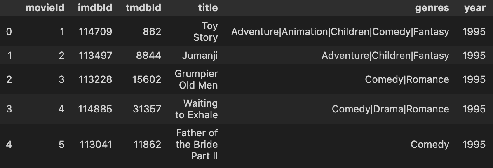
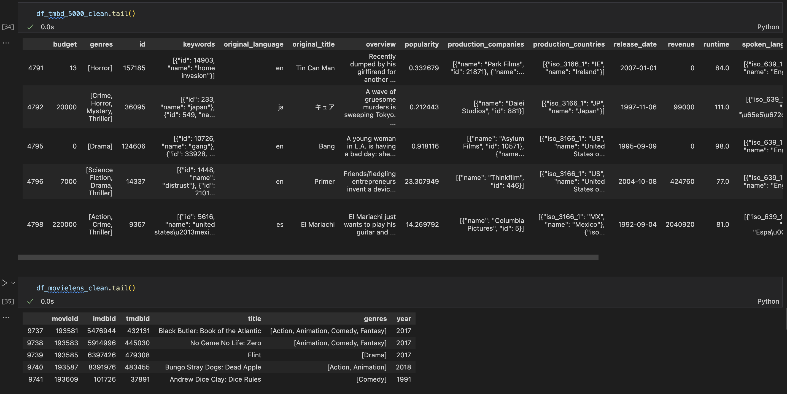
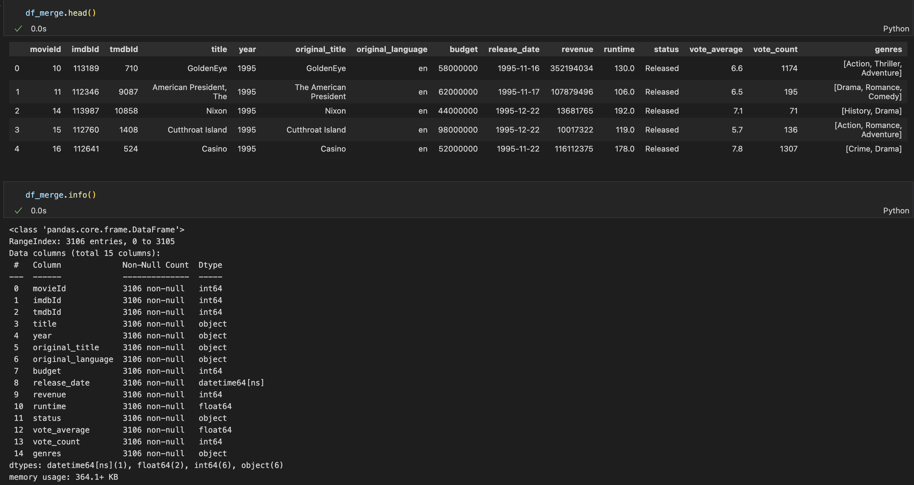
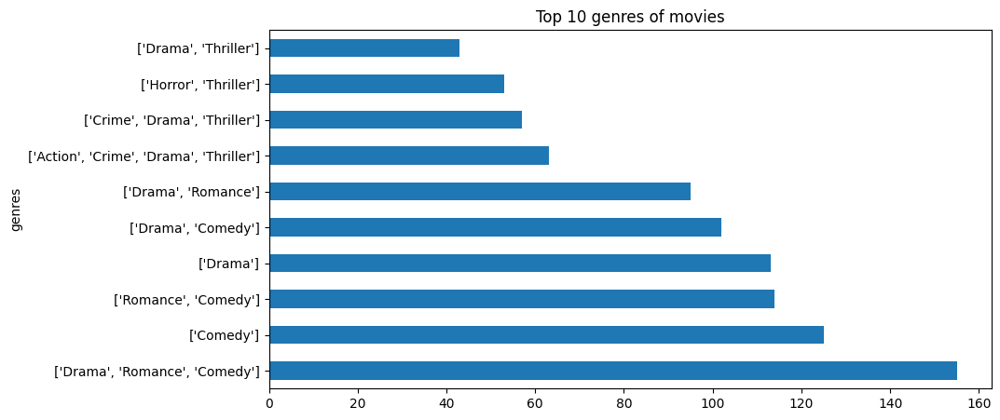
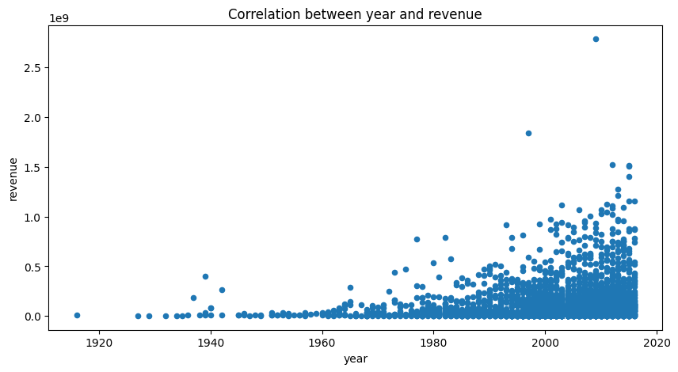
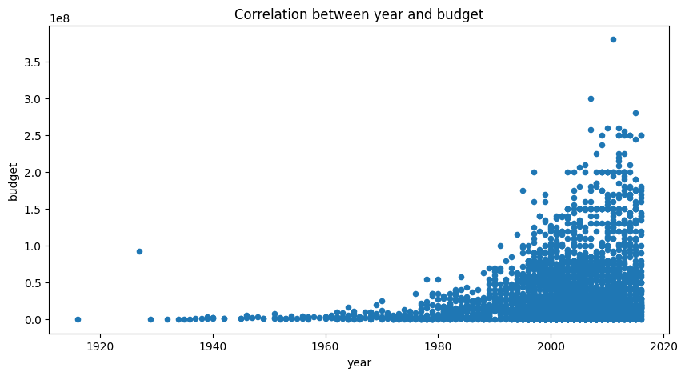

# Real-world Data Wrangling

## Introduction
In this project, you will apply the skills you acquired in the course to gather and wrangle real-world data with two datasets of your choice.

You will retrieve and extract the data, assess the data programmatically and visually, accross elements of data quality and structure, and implement a cleaning strategy for the data. You will then store the updated data into your selected database/data store, combine the data, and answer a research question with the datasets.

Throughout the process, you are expected to:
1. Explain your decisions towards methods used for gathering, assessing, cleaning, storing, and answering the research question
2. Write code comments so your code is more readable

## Installation
```bash
pip install -r requirements.txt
```

## Project Details
### Work directory
```bash
├── KhoiVN_data_wrangling.ipynb
├── README.md
├── data
│   ├── 18102023_movielens_cleaned.csv
│   ├── 18102023_tmdb_5000_movies_cleaned.csv
│   ├── 18102023_tmdb_merged.csv
│   ├── ml-latest-small
│   │   ├── README.txt
│   │   ├── links.csv
│   │   ├── movies.csv
│   │   ├── ratings.csv
│   │   └── tags.csv
│   ├── movielens.csv
│   └── tmdb_5000_movies.csv
└── requirements.txt
```

### Problem Statement
In previous projects, I have worked with data from TMDB with 5000 movies and have done some analysis on the data. I would like to continue working with this dataset and combine it with another dataset to answer a research question. I find dataset from [Google Dataset Search](https://datasetsearch.research.google.com/), [The U.S. Government’s open data](https://data.gov/), and [UCI Machine Learning Repository](https://archive.ics.uci.edu/ml/index.php) but I don't find any dataset that I can combine with TMDB dataset. So I decide to use dataset from [grouplens.org](https://grouplens.org/datasets/movielens). Dataset small included 100,000 ratings and 3,600 tag applications applied to 9,000 movies by 600 users (Last updated 9/2018).

Research question: Can two datasets be combined and keep the integrity of the data?

### Pipeline
1. Gather data
2. Assess data
3. Clean data
4. Store data

More details in notebook `KhoiVN_data_wrangling.ipynb`

## Gather Data
### Dataset 1
- Type: CSV File
- Method: The data was gathered using the "Downloading files manually" method from Kaggle. The dataset was downloaded from the following link: https://www.kaggle.com/datasets/tmdb/tmdb-movie-metadata?select=tmdb_5000_movies.csv
- Dataset variables:
    *   *Variable 1: budget* - The budget in which the movie was made.
    *   *Variable 2: id* - The identification number of the movie.
    *   *Variable 3: homepage* - The homepage of the movie.
    *   *Variable 4: original_language* - The language in which the movie was made.
    *   *Variable 5: original_title* - The title of the movie before translation or adaptation.
    *   *etc.*

Download manually from Kaggle (https://www.kaggle.com/datasets/tmdb/tmdb-movie-metadata)


### Dataset 2
- Type: CSV File
- Method: The data was gathered using the "Programmatically downloading files" method from grouplens.org Link dataset: https://grouplens.org/datasets/movielens/latest/
- Dataset variables:
    *   *Variable 1: movieId* - The identification number of the movie.
    *   *Variable 2: imdbId* - The identification number of the movie in the IMDB database.
    *   *Variable 3: tmdbId* - The identification number of the movie in the TMDB database.
    *   *Variable 4: title* - The title of the movie.
    *   *Variable 5: genres* - The genres of the movie.

```python
!wget https://files.grouplens.org/datasets/movielens/ml-latest-small.zip -P data

with zipfile.ZipFile("data/ml-latest-small.zip","r") as zip_ref:
    zip_ref.extractall("data/")
    os.remove("data/ml-latest-small.zip")
```

After pre-processing, we have 2 datasets:
- **tmdb_5000_movies.csv** - 4803 rows, 20 columns
- **movielens.csv** - 9742 rows, 5 columns (original dataset has 2 files: movies.csv and ratings.csv)

Primary key:
- id (tmdb_5000_movies.csv)
- movieId (movielens.csv)

## Assess Data
### Quality Issue 1: Wrong data type of column
Issue and justification:
- Wrong data type of column `release_date` in `tmdb_5000_movies.csv` dataset. The data type of column `release_date` is object but it should be datetime.
- Wrong data type of column `tmdbId` in `movielens.csv` dataset. The data type of column `tmdbId` is float but it should be int.
- Column `status` and `original_language` in `tmdb_5000_movies.csv` dataset has little number of unique values. It should be categorical data type.

### Quality Issue 2: Missing data
Issue and justification:
- The ratio of missing value in column `homepage` in `tmdb_5000_movies.csv` dataset is 64.35%. The missing value is represented by `NaN` value.
- Dataset `tmdb_5000_movies.csv` has empty list in `genres`, `keywords`, `production_companies`, `production_countries`, `spoken_languages` columns. The empty list is represented by `[]` value and it should be `NaN` value.

### Tidiness Issue 1: Multiple variables stored in one column
Issue and justification: Column `title` contains movie title and year of release with format `Title (Year)`. It should be separated into 2 columns: `title` and `year`.

### Tidiness Issue 2: Variables are stored in both columns
Issue and justification: Column `genres` in two datasets has different format. It should be merged into one column with format list[Genre1, Genre2, ...].

## Clean Data
Clean the data to solve the 4 issues corresponding to data quality and tidiness found in the assessing step. **Make sure you include justifications for your cleaning decisions.**

After the cleaning for each issue, please use **either** the visually or programatical method to validate the cleaning was successful.

At this stage, you are also expected to remove variables that are unnecessary for your analysis and combine your datasets. Depending on your datasets, you may choose to perform variable combination and elimination before or after the cleaning stage.

### Quality Issue 1: Wrong data type of column
Justification:
- The data type of column `release_date` in `tmdb_5000_movies.csv` dataset is datetime.
- The data type of column `tmdbId` in `movielens.csv` dataset is int.
- The data type of column `status` and `original_language` in `tmdb_5000_movies.csv` dataset is category.

Dataframe: tmdb_5000_movies
```python
<class 'pandas.core.frame.DataFrame'>
RangeIndex: 4803 entries, 0 to 4802
Data columns (total 20 columns):
 #   Column                Non-Null Count  Dtype
---  ------                --------------  -----
 0   budget                4803 non-null   int64
 1   genres                4803 non-null   object
 2   homepage              1712 non-null   object
 3   id                    4803 non-null   int64
 4   keywords              4803 non-null   object
 5   original_language     4803 non-null   category
 6   original_title        4803 non-null   object
 7   overview              4800 non-null   object
 8   popularity            4803 non-null   float64
 9   production_companies  4803 non-null   object
 10  production_countries  4803 non-null   object
 11  release_date          4802 non-null   datetime64[ns]
 12  revenue               4803 non-null   int64
 13  runtime               4801 non-null   float64
 14  spoken_languages      4803 non-null   object
 15  status                4803 non-null   category
 16  tagline               3959 non-null   object
 17  title                 4803 non-null   object
 18  vote_average          4803 non-null   float64
 19  vote_count            4803 non-null   int64
dtypes: category(2), datetime64[ns](1), float64(3), int64(4), object(10)
memory usage: 686.4+ KB
```

Dataframe: movielens
```python
<class 'pandas.core.frame.DataFrame'>
Index: 9734 entries, 0 to 9741
Data columns (total 5 columns):
 #   Column   Non-Null Count  Dtype
---  ------   --------------  -----
 0   movieId  9734 non-null   int64
 1   imdbId   9734 non-null   int64
 2   tmdbId   9734 non-null   int64
 3   title    9734 non-null   object
 4   genres   9734 non-null   object
dtypes: int64(3), object(2)
memory usage: 456.3+ KB
```

### Quality Issue 2: Missing data
Justification: After replace `[]` value by `NaN` value, and drop `homepage` column, the ratio of missing value in `tmdb_5000_movies.csv` dataset is 0%.

Dataframe: tmdb_5000_movies
```python
<class 'pandas.core.frame.DataFrame'>
Index: 3666 entries, 0 to 4798
Data columns (total 19 columns):
 #   Column                Non-Null Count  Dtype
---  ------                --------------  -----
 0   budget                3666 non-null   int64
 1   genres                3666 non-null   object
 2   id                    3666 non-null   int64
 3   keywords              3666 non-null   object
 4   original_language     3666 non-null   object
 5   original_title        3666 non-null   object
 6   overview              3666 non-null   object
 7   popularity            3666 non-null   float64
 8   production_companies  3666 non-null   object
 9   production_countries  3666 non-null   object
 10  release_date          3666 non-null   datetime64[ns]
 11  revenue               3666 non-null   int64
 12  runtime               3666 non-null   float64
 13  spoken_languages      3666 non-null   object
 14  status                3666 non-null   object
 15  tagline               3666 non-null   object
 16  title                 3666 non-null   object
 17  vote_average          3666 non-null   float64
 18  vote_count            3666 non-null   int64
dtypes: datetime64[ns](1), float64(3), int64(4), object(11)
memory usage: 572.8+ KB
```

### Tidiness Issue 1: Multiple variables stored in one column
Justification: After separate `title` column into `title` and `year` columns, the `title` column contains only movie title and `year` column contains only year of release.

Example: `title` column contains `Avatar` and `year` column contains `2009`.



### Tidiness Issue 2: Variables are stored in both columns
Justification: After process `genres` column, the `genres` column contains list of genres in both datasets.



### Remove unnecessary variables and combine datasets
Depending on the datasets, you can also peform the combination before the cleaning steps.



## Store Data
Store the clean dataset(s) in a CSV file with the main one named as format `[datetime]_[original_name]_cleaned.csv`.

Save the cleaned data to folder `data`:
- **18102023_tmdb_5000_movies_clean.csv** - 3666 rows, 11 columns
- **18102023_movielens_clean.csv** - 9734 rows, 6 columns
- **18102023_tbdb_merged.csv** - 3106 rows, 15 columns

## Analysis
1. Yes, two datasets can be combined and keep the integrity of the data in column `genres`. After combine two datasets, the `genres` column contains list of genres in both datasets. The relationship between genres and popularity movies is shown in the following figure.



2. Process tidy data in column `title` and `year` to get the relationship between year and revenue and budget movies. The relationship between year and revenue movies is shown in the following figure. And we can see that the revenue and budget of movies is increasing over the years.

The correlation between year and revenue:


The correlation between year and budget:


## Future Work
- More analysis on the data
- More visualization on the data
- More research question on the data
- More data cleaning on the data
