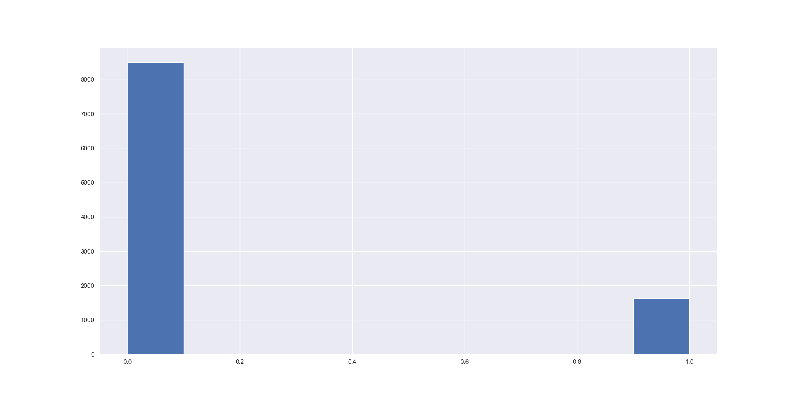
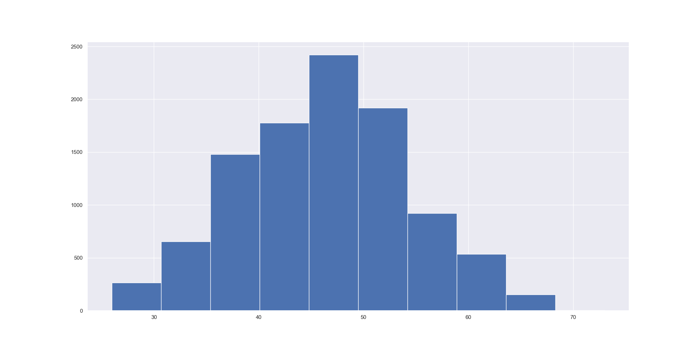
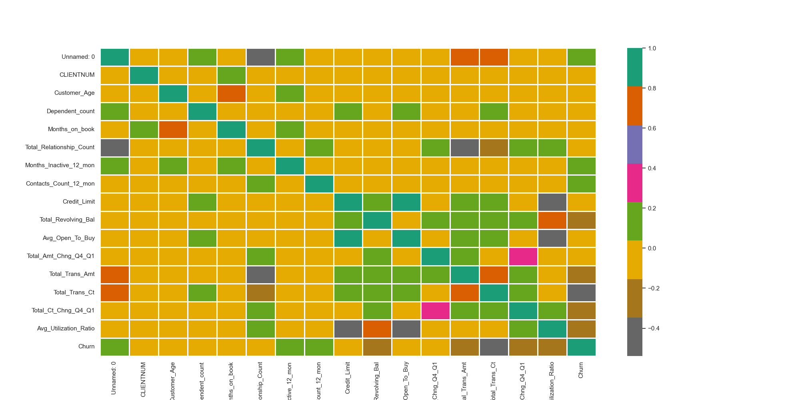

# Predict Customer Churn with Clean Code

[**Install**](#install) | [**Usage**](#usage) | [**Data**](#data) | [**EDA**](#eda) | [**Model**](#model) | [**Result**](#result) | [**Test**](#test) | [**Code Quality**](#code-quality) | [**Sequence Diagram**](#sequence-diagram)

## Project Description
This is a project to implement best coding practices.
```
Source code: projects/clean_code

.
├── README.md
├── churn_library.py
├── churn_script_logging_and_tests.py
├── data
│   └── bank_data.csv
├── images
│   ├── eda
│   │   ├── churn_histogram.png
│   │   ├── customer_age_histogram.png
│   │   ├── heatmap.png
│   │   ├── marital_status_counts.png
│   │   └── total_transaction_histogram.png
│   └── results
│       ├── cv_feature_importance.png
│       ├── lr_classification_report.png
│       ├── lr_rf_roc_curves.png
│       ├── lr_roc_curve.png
│       └── rf_classification_report.png
├── logs
│   └── churn_library.log
├── models
│   ├── logistic_model.pkl
│   └── rfc_model.pkl
└── requirements.txt
```

## Install
```bash
pip install -r requirements.txt
```

## Usage
```bash
python churn_library.py
```

## Data
```bash
PATH = data/bank_data.csv

       Unnamed: 0  CLIENTNUM  ... Total_Ct_Chng_Q4_Q1  Avg_Utilization_Ratio
0               0  768805383  ...               1.625                  0.061
1               1  818770008  ...               3.714                  0.105
2               2  713982108  ...               2.333                  0.000
3               3  769911858  ...               2.333                  0.760
4               4  709106358  ...               2.500                  0.000
...           ...        ...  ...                 ...                    ...
10122       10122  772366833  ...               0.857                  0.462
10123       10123  710638233  ...               0.683                  0.511
10124       10124  716506083  ...               0.818                  0.000
10125       10125  717406983  ...               0.722                  0.000
10126       10126  714337233  ...               0.649                  0.189
[10127 rows x 22 columns]

root - INFO - (10127, 22)

Unnamed: 0                  0
CLIENTNUM                   0
Attrition_Flag              0
Customer_Age                0
Gender                      0
Dependent_count             0
Education_Level             0
Marital_Status              0
Income_Category             0
Card_Category               0
Months_on_book              0
Total_Relationship_Count    0
Months_Inactive_12_mon      0
Contacts_Count_12_mon       0
Credit_Limit                0
Total_Revolving_Bal         0
Avg_Open_To_Buy             0
Total_Amt_Chng_Q4_Q1        0
Total_Trans_Amt             0
Total_Trans_Ct              0
Total_Ct_Chng_Q4_Q1         0
Avg_Utilization_Ratio       0
```

## EDA
Execute the following function to run EDA.
```bash
perform_eda
```

### Churn Histogram


### Customer Age Histogram


### Marital Status


### Total Transaction Histogram


### Heatmap


## Model
### Logistic Regression
```python
from sklearn.linear_model import LogisticRegression
lrc = LogisticRegression(solver='lbfgs', max_iter=3000)
```

### Random Forest
```python
from sklearn.ensemble import RandomForestClassifier
rfc = RandomForestClassifier(random_state=42)
```


## Result
### Logistic Regression
```
test results
              precision    recall  f1-score   support

           0       0.90      0.96      0.93      2543
           1       0.71      0.45      0.55       496

    accuracy                           0.88      3039
   macro avg       0.81      0.71      0.74      3039
weighted avg       0.87      0.88      0.87      3039

train results
              precision    recall  f1-score   support

           0       0.91      0.96      0.94      5957
           1       0.72      0.50      0.59      1131

    accuracy                           0.89      7088
   macro avg       0.82      0.73      0.76      7088
weighted avg       0.88      0.89      0.88      7088
```

### Random Forest
```
test results
              precision    recall  f1-score   support

           0       0.96      0.99      0.98      2543
           1       0.93      0.80      0.86       496

    accuracy                           0.96      3039
   macro avg       0.95      0.90      0.92      3039
weighted avg       0.96      0.96      0.96      3039

train results
              precision    recall  f1-score   support

           0       1.00      1.00      1.00      5957
           1       1.00      1.00      1.00      1131

    accuracy                           1.00      7088
   macro avg       1.00      1.00      1.00      7088
weighted avg       1.00      1.00      1.00      7088
```

### ROC Curve


## Feature Importance


*For more details, please check the log folder.*

## Test
```bash
pytest --cov=src --cov-report=term-missing --cov-report=xml churn_script_logging_and_tests.py

================================= test session starts ==================================
platform darwin -- Python 3.10.12, pytest-7.4.0, pluggy-1.2.0
rootdir: /Users/macos/projects/Kelvin/ML_DevOps_Engineer/ml-production
collected 5 items

churn_script_logging_and_tests.py .....                                          [100%]

=================================== warnings summary ===================================
churn_script_logging_and_tests.py::test_train_models
  /Users/macos/projects/Kelvin/ML_DevOps_Engineer/ml-production/churn_library.py:345: RuntimeWarning: More than 20 figures have been opened. Figures created through the pyplot interface (`matplotlib.pyplot.figure`) are retained until explicitly closed and may consume too much memory. (To control this warning, see the rcParam `figure.max_open_warning`). Consider using `matplotlib.pyplot.close()`.
    plt.figure(figsize=(15, 8))

-- Docs: https://docs.pytest.org/en/stable/how-to/capture-warnings.html
======================= 5 passed, 1 warning in 169.16s (0:02:49) =======================
```

## Code Quality
Style Guide - Format your refactored code using PEP 8 – Style Guide. Running the command below can assist with formatting. To assist with meeting pep 8 guidelines, use autopep8 via the command line commands below:
```bash
autopep8 --in-place --aggressive --aggressive churn_script_logging_and_tests.py
autopep8 --in-place --aggressive --aggressive churn_library.py
```

Style Checking and Error Spotting - Use Pylint for the code analysis looking for programming errors, and scope for further refactoring. You should check the pylint score using the command below.
```bash
pylint churn_library.py
pylint churn_script_logging_and_tests.py
```
Docstring - All functions and files should have document strings that correctly identifies the inputs, outputs, and purpose of the function. All files have a document string that identifies the purpose of the file, the author, and the date the file was created.

## Sequence Diagram

