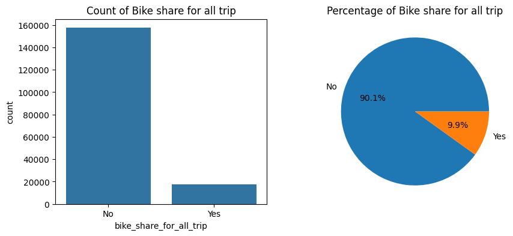
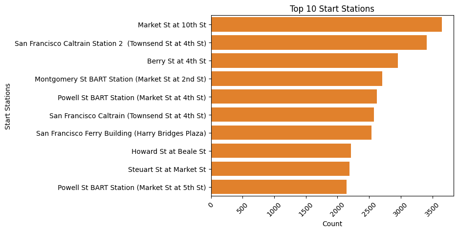
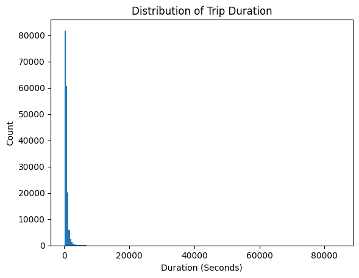
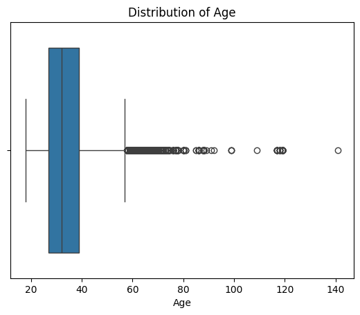
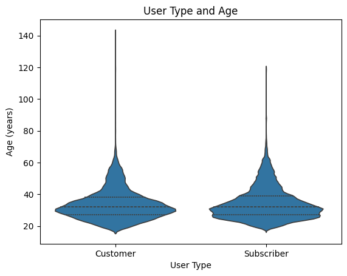
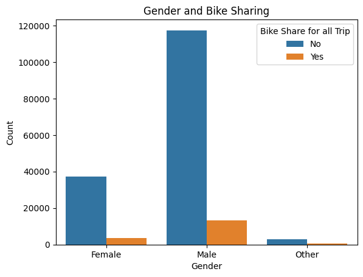
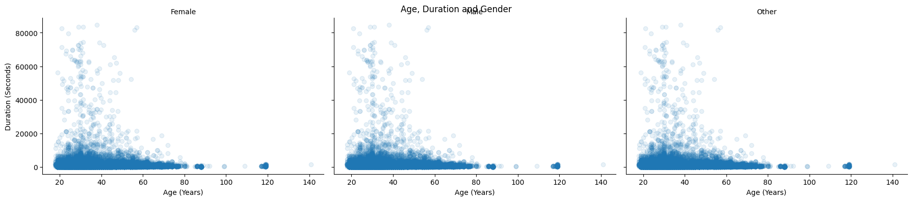
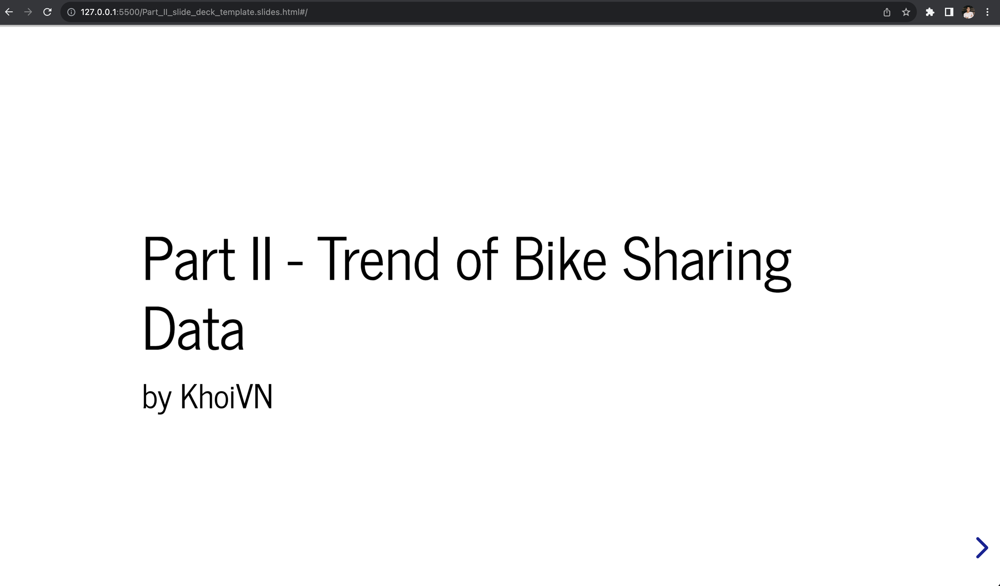
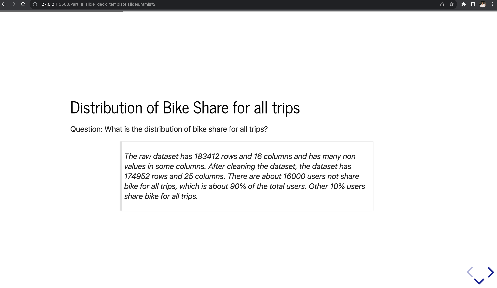
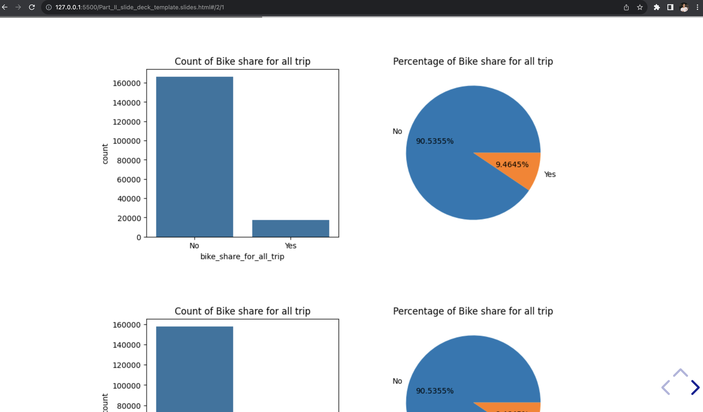

# Ford GoBike System Data Exploration
## by KhoiVN

## Work Directory
```
.
├── 201902-fordgobike-tripdata.csv
├── Part_II_notebook.ipynb
├── Part_II_notebook.slides.html
├── Part_I_notebook.html
├── Part_I_notebook.ipynb
├── README.md
```

## Dataset

> The data set includes information about individual rides made in a bike-sharing system covering the greater San Francisco Bay area. The data consists of 183,412 rows and 16 columns. The attributes included the trip duration, start time and end time with date, start station and end station names, start and end coordinates, customer type, bike share for all trip, and rental access method.

The dataset can be downloaded from [here](https://video.udacity-data.com/topher/2020/October/5f91cf38_201902-fordgobike-tripdata/201902-fordgobike-tripdata.csv).


## Step-by-step Data Exploration
### Gathering Data
```python
df = pd.read_csv('201902-fordgobike-tripdata.csv')
df.head()
```

### Assessing Data
```python
df.info()
df.describe()
df.isnull().sum()
```

### Cleaning Data
1. Drop null values
```python
df_clean = df.copy()
df_clean.dropna(inplace=True)
```

2. Wrong data type
```python
df['start_station_id'] = df['start_station_id'].astype('int64')
df['end_station_id'] = df['end_station_id'].astype('int64')

df['start_time'] = pd.to_datetime(df['start_time'])
df['end_time'] = pd.to_datetime(df['end_time'])

df['user_type'] = df['user_type'].astype('category')
df['member_birth_year'] = df['member_birth_year'].astype('int64')
df['member_gender'] = df['member_gender'].astype('category')
df['bike_share_for_all_trip'] = df['bike_share_for_all_trip'].astype('category')
```

3. Feature engineering
```python
df['member_age'] = 2019 - df['member_birth_year']
df['start_date'] = df['start_time'].dt.strftime('%Y-%m-%d')
df['start_hour'] = df['start_time'].dt.strftime('%H')
df['start_day'] = df['start_time'].dt.strftime('%A')
df['start_month'] = df['start_time'].dt.strftime('%B')
df['end_date'] = df['end_time'].dt.strftime('%Y-%m-%d')
df['end_hour'] = df['end_time'].dt.strftime('%H')
df['end_day'] = df['end_time'].dt.strftime('%A')
df['end_month'] = df['end_time'].dt.strftime('%B')
```

### Univariate Exploration
1. Distribution of bike share


2. Top 10 stations for starting and ending trips


3. Distribution of trip duration


4. Distribution of age


### Bivariate Exploration
1. The relationship between user type and age


2. The relationship between gender and bike share


### Multivariate Exploration
Gender, age and trip duration


## Summary of Findings

> To sum up, almost users who share bike for all trips are `Male` between `20-40` years old. The duration of the trip is inversely related to the age. The younger the user, the longer the trip. The ratio of `customer` and `subscriber` is the same for all ages. The most common periods of the day when trips start are 7-9 am and 4-6 pm. Users use the bike more on weekdays than weekends. `San Francisco Caltrain (Townsend St at 4th St)` and `Market St at 10th St` are the most popular stations for starting and ending trips. The percentage of using bike share for all trip is 10.1%.


## Key Insights for Presentation

> The goal of this presentation is to show the trend of bike sharing data in February 2019. The main focus is on the trip duration, the information of users, and the number of trips by user type.

> The presentation starts with the distribution of trip duration. Then, the information of users is presented. Finally, the number of trips by user type is shown. The presentation ends with the summary of the findings.

## Golive Extension
URL: localhost:5500


Question:


Visualization:


Conclusion:

