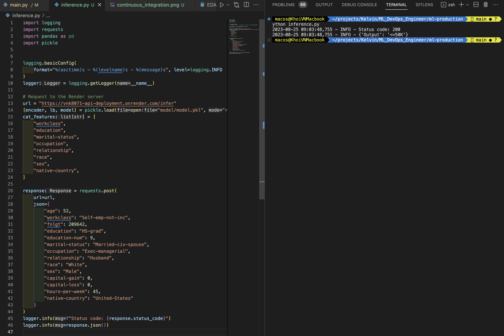

# Build an ML Pipeline for Short-term Rental Prices in NYC

[**Project Description**](#project-description) | [**Install**](#install) | [**Data**](#data) | [**Train model**](#train-model) | [**Run sanity checks**](#run-sanity-checks) | [**Run tests**](#run-tests) | [**CI/CD**](#cicd) | [**Dockerize**](#dockerize)  | [**Request API**](#request-api) | [**Model Card**](#model-card) | [**Code Quality**](#code-quality)

## Project Description
Apply the skills acquired in this course to develop a classification model on publicly available Census Bureau data. You will create unit tests to monitor the model performance on various data slices. Then, you will deploy your model using the FastAPI package and create API tests. The slice validation and the API tests will be incorporated into a CI/CD framework using GitHub Actions.

Source code: [vnk8071/deploy_ml_pipeline_in_production](https://github.com/vnk8071/machine-learning-in-production/tree/main/projects/deploy_ml_pipeline_in_production)


```bash
tree projects/deploy_ml_pipeline_in_production -I __pycache__

projects/deploy_ml_pipeline_in_production
├── EDA.ipynb
├── README.md
├── data
│   ├── census.csv
│   ├── census.csv.dvc
│   ├── census_clean.csv
│   └── census_clean.csv.dvc
├── images
│   ├── continuous_deployment.png
│   ├── continuous_integration.png
│   ├── live_get.png
│   ├── live_post.png
│   ├── local_post.png
│   └── settings_continuous_deployment.png
├── inference.py
├── main.py
├── model
│   └── model.pkl
├── model_card.md
├── module
│   ├── data.py
│   ├── model.py
│   └── train_model.py
├── requirements.txt
├── sanitycheck.py
├── slice_output.txt
└── tests
    ├── test_api.py
    └── test_model.py

6 directories, 24 files
```
| # | Feature               | Stack             |
|:-:|-----------------------|:-----------------:|
| 0 | Language              | Python            |
| 1 | Clean code principles | Autopep8, Pylint  |
| 2 | Testing               | Pytest            |
| 3 | Logging               | Logging           |
| 4 | Data versioning       | DVC               |
| 5 | Model versioning      | DVC               |
| 6 | Configuration         | Hydra             |
| 7 | Development API       | FastAPI           |
| 8 | Dockerize             | Docker            |
| 9 | Cloud computing       | Render            |
| 10| CI/CD                 | Github Actions    |


## Install
```bash
pip install -r requirements.txt
```

## Hydra
```python
@hydra.main(config_path=".", config_name="config", version_base="1.2")
```

## Data
### 1. Download data
```bash
data/census.csv
```
Link: https://archive.ics.uci.edu/ml/datasets/census+income

### 2. EDA
EDA in notebook: [](../../projects/deploy_ml_pipeline_in_production/EDA.ipynb)

### 3. Data versioning
```bash
dvc init
mkdir ../local_remote
dvc remote add -d localremote ../local_remote
dvc add data/census.csv
dvc add data/census_clean.csv
git add data/.gitignore data/census.csv.dvc data/census_clean.csv.dvc
git commit -m "Add data"
dvc push
```

## Train model
```bash
python train.py
```
Result
```
2023-08-25 20:32:56,405 - INFO - Splitting data into train and test sets...
2023-08-25 20:32:56,412 - INFO - Processing data...
2023-08-25 20:32:56,634 - INFO - Training model...
2023-08-25 20:32:57,052 - INFO - LogisticRegression(max_iter=1000, random_state=8071)
2023-08-25 20:32:57,058 - INFO - Saving model...
2023-08-25 20:32:57,059 - INFO - Model saved.
2023-08-25 20:32:57,059 - INFO - Inference model...
2023-08-25 20:32:57,060 - INFO - Calculating model metrics...
2023-08-25 20:32:57,074 - INFO - >>>Precision: 0.6551724137931034
2023-08-25 20:32:57,074 - INFO - >>>Recall: 0.24934383202099739
2023-08-25 20:32:57,075 - INFO - >>>Fbeta: 0.36121673003802285
2023-08-25 20:32:57,075 - INFO - Calculating model metrics on slices data...
2023-08-25 20:32:58,281 - INFO - >>>Metrics with slices data:
            feature  ...                    category
0         workclass  ...                     Private
1         workclass  ...                           ?
2         workclass  ...                 Federal-gov
3         workclass  ...            Self-emp-not-inc
4         workclass  ...                   State-gov
..              ...  ...                         ...
96   native-country  ...                   Nicaragua
97   native-country  ...                    Scotland
98   native-country  ...  Outlying-US(Guam-USVI-etc)
99   native-country  ...                     Ireland
100  native-country  ...                     Hungary

[101 rows x 5 columns]
```

## Run sanity checks
```bash
python sanity_checks.py
```
Result
```
============= Sanity Check Report ===========
2023-08-24 23:16:57,951 - INFO - Your test cases look good!
2023-08-24 23:16:57,951 - INFO - This is a heuristic based sanity testing and cannot guarantee the correctness of your code.
2023-08-24 23:16:57,951 - INFO - You should still check your work against the rubric to ensure you meet the criteria.
```

## Run tests
```bash
pytest tests/
```
Result
```
tests/test_api.py ....                                                         [ 33%]
tests/test_model.py ........                                                   [100%]
=========================== 12 passed, 4 warnings in 3.65s ===========================
```

## Dockerize
```
docker build -t deploy_ml_pipeline_in_production .
docker run -p 5000:5000 deploy_ml_pipeline_in_production
```

## CI/CD
### 1. Github Actions


### 2. CD with Render
Settings continuous deployment on Render


Deployed app


## Request API
### 1. Local
```bash
uvicorn module.api:app --reload
```
Result


### 2. Render
Check API get method at: https://vnk8071-api-deployment.onrender.com/docs


Script to request API method POST
```bash
python inference.py
```



## Model Card
```
Details in projects/deploy_ml_pipeline_in_production/model_card.md
```

## Code Quality
Style Guide - Format your refactored code using PEP 8 – Style Guide. Running the command below can assist with formatting. To assist with meeting pep 8 guidelines, use autopep8 via the command line commands below:
```bash
autopep8 --in-place --aggressive --aggressive .
```

Style Checking and Error Spotting - Use Pylint for the code analysis looking for programming errors, and scope for further refactoring. You should check the pylint score using the command below.
```bash
pylint -rn -sn .
```
Docstring - All functions and files should have document strings that correctly identifies the inputs, outputs, and purpose of the function. All files have a document string that identifies the purpose of the file, the author, and the date the file was created.
