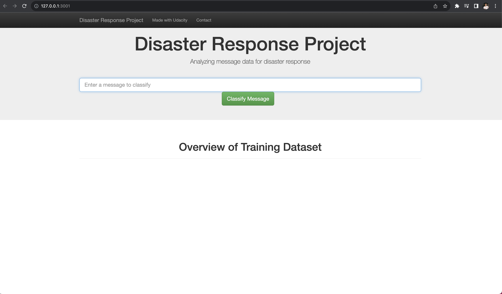
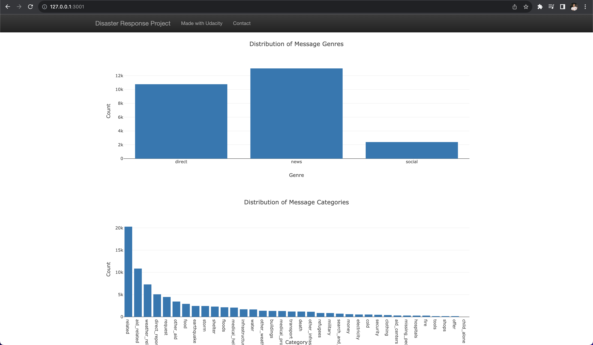
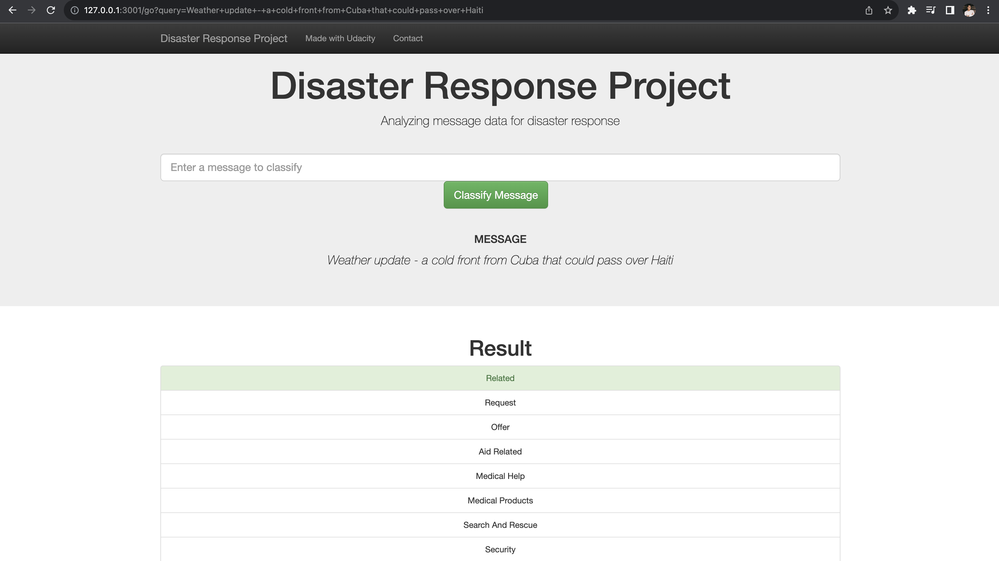

# Disaster Response Pipeline Project

## Project Overview
This project is part of the Udacity Data Scientist Nanodegree. The goal of this project is to build a Natural Language Processing (NLP) model to categorize messages sent during disasters. The model is trained on a dataset containing real messages that were sent during disaster events. The model is then used to classify new messages.

## Installation
```bash
pip install -r requirements.txt
```

## ETL
```python
python data/process_data.py data/disaster_messages.csv data/disaster_categories.csv data/DisasterResponse.db
```

Result:
```
Loading data...
    MESSAGES: data/disaster_messages.csv
    CATEGORIES: data/disaster_categories.csv
Cleaning data...
related
1.0    19906
0.0     6122
Name: count, dtype: int64
request
0.0    21554
1.0     4474
Saving data...
    DATABASE: data/DisasterResponse.db
Cleaned data saved to database!
```

## ML Pipeline
```python
python models/train_classifier.py data/DisasterResponse.db models/classifier.pkl
```

Result:
```
Best parameter...
{'clf__estimator__min_samples_split': 2, 'clf__estimator__n_estimators': 20}

Category: direct_report
              precision    recall  f1-score   support

           0       0.87      0.99      0.92      4226
           1       0.86      0.37      0.52      1018

    accuracy                           0.87      5244
   macro avg       0.87      0.68      0.72      5244
weighted avg       0.87      0.87      0.84      5244

Accuracy: 0.8663234172387491
F1 score: 0.8438181640637614
Precision: 0.8660863377069168
Recall: 0.8663234172387491
Saving model...
    MODEL: models/classifier.pkl
Trained model saved!
```

## Flask Web App
```python
python run.py
```

Open http://127.0.0.1:3001/ in your browser.

## Screenshots
### Homepage


### Visualizations


### Classify Message

