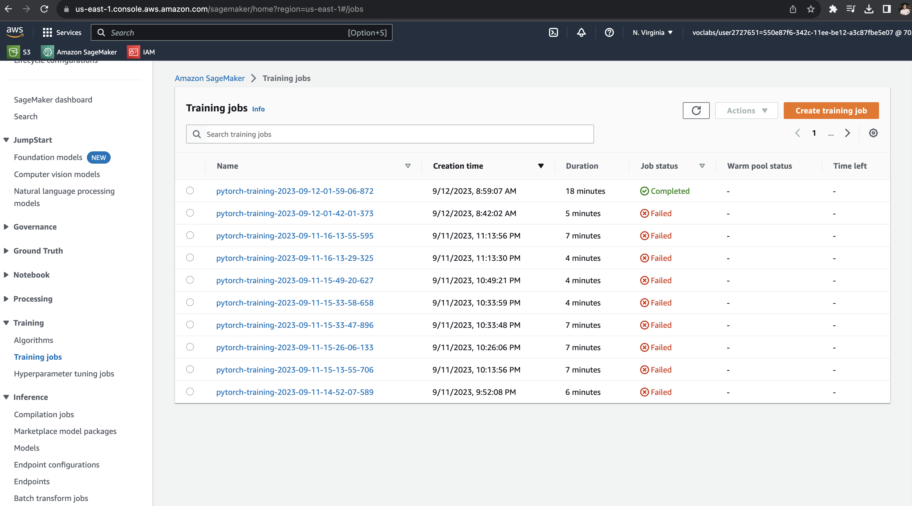
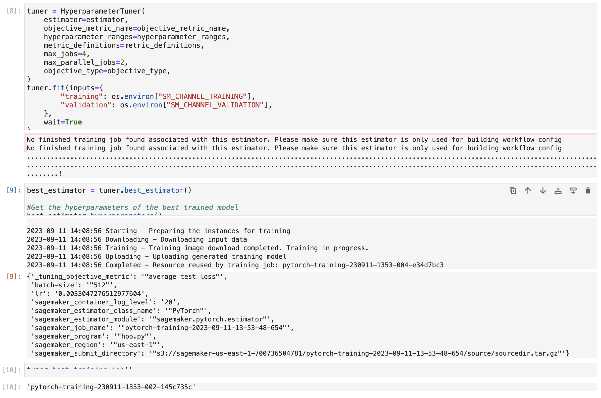
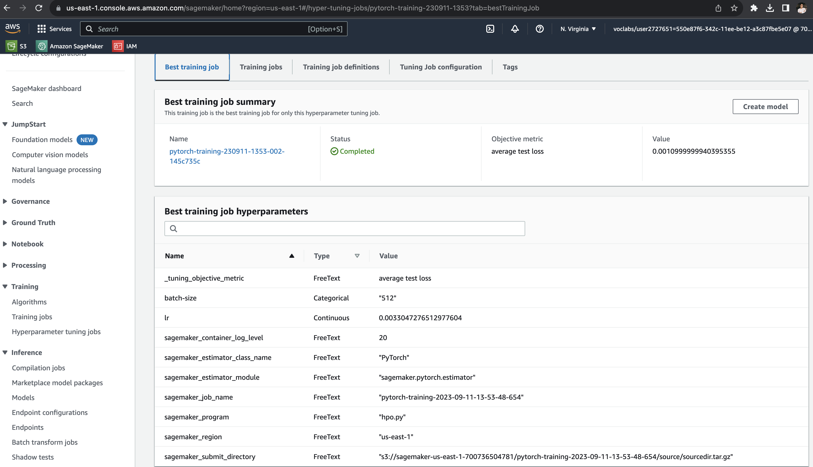
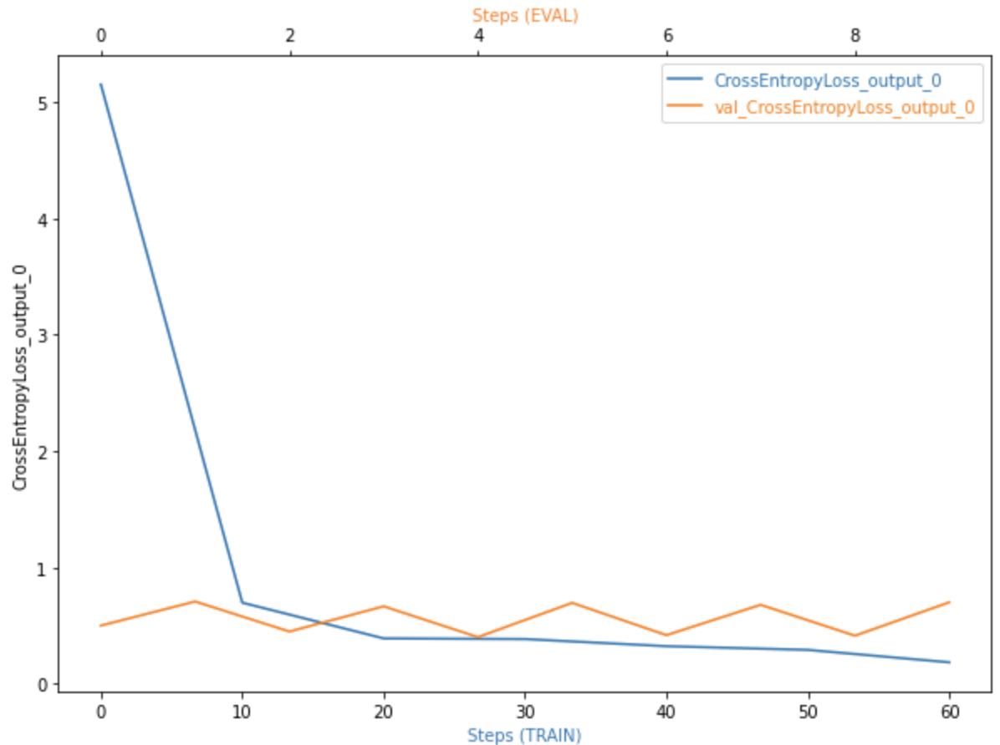
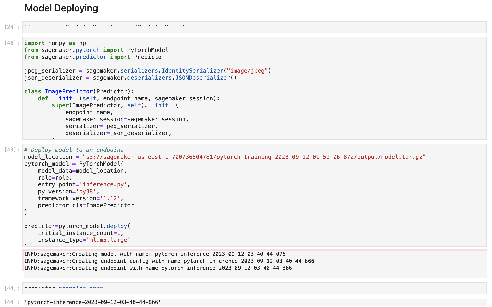
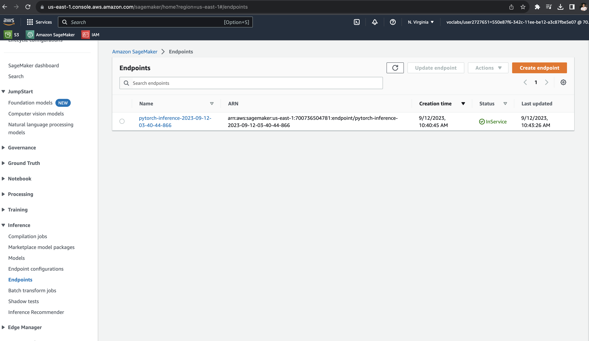
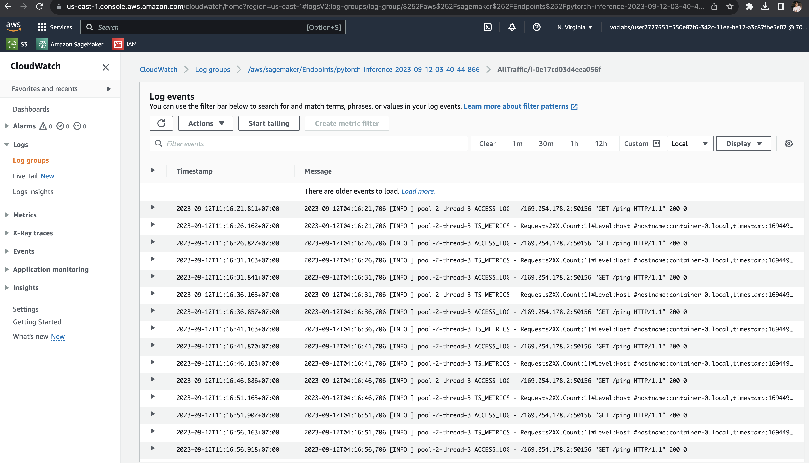
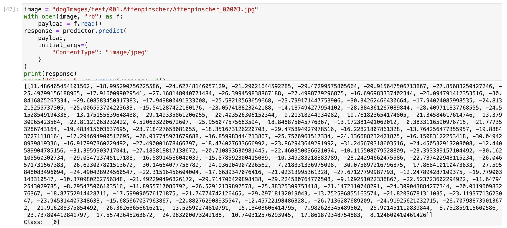

# Image Classification using AWS SageMaker

Use AWS Sagemaker to train a pretrained model that can perform image classification by using the Sagemaker profiling, debugger, hyperparameter tuning and other good ML engineering practices. This can be done on either the provided dog breed classication data set or one of your choice.

## Dataset
The provided dataset is the dogbreed classification dataset which can be found in the classroom.
```bash
!wget https://s3-us-west-1.amazonaws.com/udacity-aind/dog-project/dogImages.zip
```

### Access
Upload the data to an S3 bucket through the AWS Gateway so that SageMaker has access to the data.
```bash
session = sagemaker.Session()

bucket = "image-classification-using-sagemaker"
print("Default Bucket: {}".format(bucket))

region = session.boto_region_name
print("AWS Region: {}".format(region))

role = sagemaker.get_execution_role()
print("RoleArn: {}".format(role))

os.environ["DEFAULT_S3_BUCKET"] = bucket

!aws s3 sync ./dogImages/train s3://${DEFAULT_S3_BUCKET}/data/train/
!aws s3 sync ./dogImages/valid s3://${DEFAULT_S3_BUCKET}/data/valid/
!aws s3 sync ./dogImages/test s3://${DEFAULT_S3_BUCKET}/data/test/
```

## Hyperparameter Tuning

### Model
Choose VGG16 as the pretrained model and replace the last layer with a new layer that has the number of classes as the output. This model is DNN with 3 hidden layers and 1 output layer.

```bash
def net(target_class_count):
    '''
        Using a VGG16 pretrained model
    '''
    model = models.vgg16(pretrained=True)
    for param in model.parameters():
        param.requires_grad = False

    num_features = model.classifier[-1].in_features
    features = list(model.classifier.children())[:-1]
    features.extend([nn.Linear(num_features, target_class_count)])
    model.classifier = nn.Sequential(*features)

    return model
```

### Training Job


### Hyperparameter Tuning Job
- Learning rate with a range of 0.001 to 0.1 and type of continuous (ContinuousParameter)
- Batch size with a range of 32, 64, 128, 256, 512 and type of categorical (CategoricalParameter)
- Metric definition for the objective metric of average test loss

```bash
hyperparameter_ranges = {
    "lr": ContinuousParameter(0.001, 0.1),
    "batch-size": CategoricalParameter([32, 64, 128, 256, 512]),
}

objective_metric_name = "average test loss"
objective_type = "Minimize"
metric_definitions = [{"Name": "average test loss", "Regex": "Test set: Average loss: ([0-9\\.]+)"}]
```


### Best Hyperparameters
```bash
hyperparameters = {
    "lr": 0.0033047276512977604,
    "batch-size": 512,
}
```


## Debugging and Profiling
Use practice in the course to debug and profile the training job.
Link: https://learn.udacity.com/nanodegrees/nd009t/parts/fb5cc8ed-69a8-4e9a-8d62-f034aa9f1994/lessons/e7ad71c4-e91e-46f1-a877-e37024fc2ebd/concepts/a7960dd1-1d8b-48ac-810b-ad34084dfba8

Follow the instructions:
- In the [SageMaker Debugger](https://sagemaker.readthedocs.io/en/stable/api/training/debugger.html) documentation to configure the debugger.
- In the [SageMaker Profiler](https://sagemaker.readthedocs.io/en/stable/api/training/profiler.html) documentation to configure the profiler.

```bash
rules = [
    Rule.sagemaker(rule_configs.loss_not_decreasing()),
    Rule.sagemaker(rule_configs.overfit()),
    Rule.sagemaker(rule_configs.overtraining()),
    Rule.sagemaker(rule_configs.poor_weight_initialization()),
    ProfilerRule.sagemaker(rule_configs.LowGPUUtilization()),
    ProfilerRule.sagemaker(rule_configs.ProfilerReport()),
]

profiler_config = ProfilerConfig(
    system_monitor_interval_millis=500, framework_profile_params=FrameworkProfile(num_steps=10)
)

collection_config_list = [
    CollectionConfig(
        name="CrossEntropyLoss_output_0",
        parameters={
            "include_regex": "CrossEntropyLoss_output_0",
            "train.save_interval": "10",
            "eval.save_interval": "1"
        }
    )
]


hook_config = DebuggerHookConfig(
    hook_parameters={"train.save_interval": "100", "eval.save_interval": "10"},
    collection_configs=collection_config_list
)
```

### Results

The loss of training decreases as the training progresses. The loss of validation increases as the training progresses. This is a sign of overfitting.

More details of the profiler html/pdf file: `ProfilerReport/profiler-output/profiler-report.html`


## Model Deployment
### Deploy model


The inference script already handles the data transformation to tensors, so we only need to pass image in bytes format as the payload for the endpoint.

### Endpoint


### Inference
Debug inference with CloudWatch


Model predicts correctly with `image = dogImages/test/001.Affenpinscher/Affenpinscher_00003.jpg` and `label = 0`



## Standout Suggestions
**TODO (Optional):** This is where you can provide information about any standout suggestions that you have attempted.
