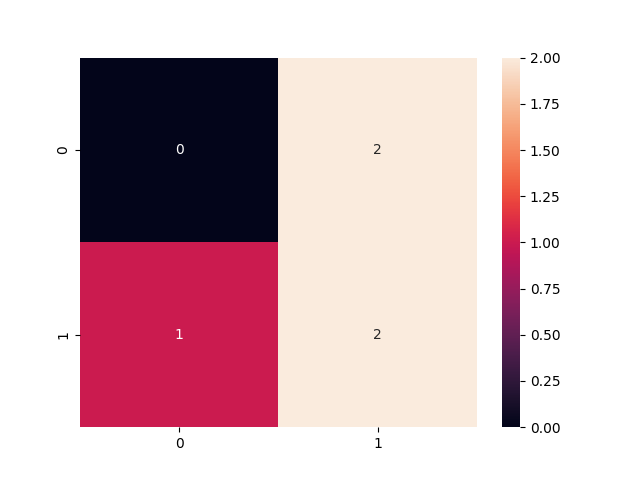
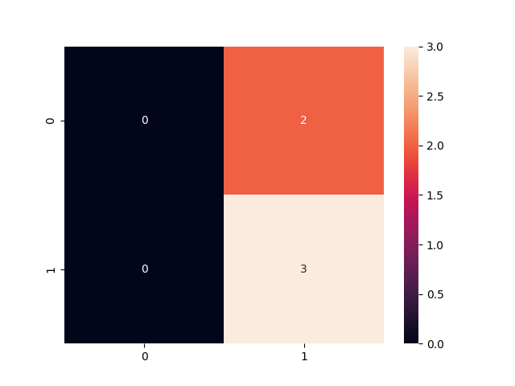

# Project: A Dynamic Risk Assessment System

[**Project Description**](#project-description) | [**Installation**](#installation) | [**Workspace**](#workspace) | [**Step-by-steps**](#step-by-steps) | [**Code Quality**](#code-quality)

## Project Description
The company needs you to create, deploy, and monitor a risk assessment ML model that will estimate the attrition risk of each of the company's 10,000 clients. If the model you create and deploy is accurate, it will enable the client managers to contact the clients with the highest risk and avoid losing clients and revenue.

Creating and deploying the model isn't the end of your work, though. Your industry is dynamic and constantly changing, and a model that was created a year or a month ago might not still be accurate today. Because of this, you need to set up regular monitoring of your model to ensure that it remains accurate and up-to-date. You'll set up processes and scripts to re-train, re-deploy, monitor, and report on your ML model, so that your company can get risk assessments that are as accurate as possible and minimize client attrition.

Source code: [vnk8071/ml_model_scoring_and_monitoring](https://github.com/vnk8071/machine-learning-in-production/tree/main/projects/ml_model_scoring_and_monitoring)

```bash
tree projects/ml_scoring_monitoring -I '__pycache__'

projects/ml_scoring_monitoring
├── README.md
├── apicalls.py
├── app.py
├── config.json
├── config.py
├── cronjob.txt
├── deployment.py
├── diagnostics.py
├── fullprocess.py
├── ingesteddata
│   ├── finaldata.csv
│   └── ingestedfiles.txt
├── ingestion.py
├── models
│   ├── apireturns2.txt
│   ├── confusionmatrix2.png
│   ├── latestscore.txt
│   └── trainedmodel.pkl
├── practicedata
│   ├── dataset1.csv
│   └── dataset2.csv
├── practicemodels
│   ├── apireturns.txt
│   ├── confusionmatrix.png
│   ├── latestscore.txt
│   └── trainedmodel.pkl
├── production_deployment
│   ├── ingestedfiles.txt
│   ├── latestscore.txt
│   └── trainedmodel.pkl
├── reporting.py
├── requirements.txt
├── scoring.py
├── sourcedata
│   ├── dataset3.csv
│   └── dataset4.csv
├── testdata
│   └── testdata.csv
├── training.py
└── wsgi.py
```

| # | Feature               | Stack             |
|:-:|-----------------------|:-----------------:|
| 0 | Language              | Python            |
| 1 | Clean code principles | Autopep8, Pylint  |
| 2 | Testing               | Pytest            |
| 3 | Logging               | Logging           |
| 4 | Auto trigger          | Cronjob           |

## Installation
```bash
pip install -r requirements.txt
```

## Workspace
```bash
/practicedata/. This is a directory that contains some data you can use for practice.
/sourcedata/. This is a directory that contains data that youll load to train your models.
/ingesteddata/. This is a directory that will contain the compiled datasets after your ingestion script.
/testdata/. This directory contains data you can use for testing your models.
/models/. This is a directory that will contain ML models that you create for production.
/practicemodels/. This is a directory that will contain ML models that you create as practice.
/production_deployment/. This is a directory that will contain your final, deployed models.
```

## Step-by-steps
### Step 1: Data Ingestion
```bash
python ingestion.py
```
- Writing the dataset
- Recording ingested files

### Step 2: Training, scoring, and deploying
```bash
python training.py
python scoring.py
python deployment.py
```
Training and Scoring an ML model is important because ML models are only worth deploying if they've been trained, and we're always interested in re-training in the hope that we can improve our model accuracy. Re-training and scoring, as we'll do in this step, are crucial so we can get the highest possible model accuracy.

### Step 3: Diagnostics
```bash
python diagnostics.py
```
- This function should take an argument that consists of a dataset, in a pandas DataFrame format. It should read the deployed model from the directory specified in the prod_deployment_path entry of your config.json file.
- The summary statistics you should calculate are means, medians, and standard deviations. You should calculate each of these for each numeric column in your data.
- The function should count missing data for the dataset stored in the directory specified by output_folder_path in config.json. It will return a list with the same number of elements as the number of columns in your dataset. Each element of the list will be the percent of NA values in a particular column of your data.
- Create a function that times how long it takes to perform the important tasks of your project. The important tasks you need to time are: data ingestion (your ingestion.py script from Step 1) and model training (your training.py script from Step 2)
- Python scripts, including the ones you've written for this project, usually depend on third-party modules. It's important to make sure that the modules you're importing are up-to-date. Create a function that checks the versions of the modules you're using in your project. It should take a list of modules as an argument, and return a list of the module names and versions.

### Step 4: Reporting
```bash
python reporting.py
```
Model reporting is important because reporting allows us as data scientists to be aware of all aspects of our data, our model, and our training processes, as well as their performance. Also, automated reporting enables us to keep stakeholders and leaders quickly and reliably informed about our ML efforts.



### Step 5: API Setup and Request
```bash
python app.py
python apicalls.py
```
Easily access ML diagnostics and results. Your API needs to have four endpoints: one for model predictions, one for model scoring, one for summary statistics, and one for other diagnostics.

### Step 6: Full Process
Make cronjob to run full process every 10 minutes
```bash
crontab -e
*/10 * * * * /Users/macos/projects/Kelvin/ML_DevOps_Engineer/nd0821-c4-KhoiVN1/cronjob.txt
```

```bash
python fullprocess.py
...
2023-08-28 22:18:19,618 - __main__ - INFO - There is new files. Ingesting new files...
2023-08-28 22:18:19,618 - ingestion - INFO - Files in the input folder: ['dataset4.csv', 'dataset3.csv']
2023-08-28 22:18:19,632 - ingestion - INFO - Merged dataframe:
   corporation  lastmonth_activity  ...  number_of_employees  exited
0         abcd                  99  ...                    3       0
1         asdf                1243  ...                   10       0
2         xyzz                   0  ...                   11       1
3         acme                 813  ...                    9       1
4         qwer                2989  ...                   90       0
5         tyui                 395  ...                   99       0
6         zxcv               19028  ...                   81       0
7         hjkl                 345  ...                    2       1
8         lmno                1024  ...                    3       1
9         qqqq                2145  ...                  110       1
10        corp                3891  ...                  998       0
11        ekci               10983  ...                 1200       0
12        dosk                 118  ...                   81       1
13        endi                1992  ...                    2       0
14        gudj                 455  ...                  298       1
15        nciw                  45  ...                   99       1
16        lsid                  36  ...                  541       0
17        pwls                  23  ...                   23       0
18        bqlx                  15  ...                  190       1
19        zmei                 100  ...                  999       1
20        wosl                   2  ...                 1359       0
21        xcvb                   0  ...                  282       1
22        dfgh                 500  ...                  949       0
23        ngrd                1234  ...                 3782       1
24        xful               98765  ...                  655       0
25        kshe                  34  ...                   18       1

[26 rows x 5 columns]
2023-08-28 22:18:19,637 - scoring - INFO - Scoring model
2023-08-28 22:18:19,644 - scoring - INFO - F1 score: 0.7741935483870968
2023-08-28 22:18:19,644 - __main__ - INFO - Model drift >> Previous F1_score 0.7499999999999999 != New F1_score 0.7741935483870968
2023-08-28 22:18:19,644 - __main__ - INFO - Re-training...
2023-08-28 22:18:19,644 - training - INFO - Training model
2023-08-28 22:18:19,651 - training - INFO - Model saved at /Users/macos/projects/Kelvin/ML_DevOps_Engineer/nd0821-c4-KhoiVN1/models/trainedmodel.pkl
2023-08-28 22:18:19,651 - __main__ - INFO - Re-deploying
2023-08-28 22:18:19,652 - deployment - INFO - All files saved at /Users/macos/projects/Kelvin/ML_DevOps_Engineer/nd0821-c4-KhoiVN1/production_deployment
```



## Code Quality
Style Guide - Format your refactored code using PEP 8 – Style Guide. Running the command below can assist with formatting. To assist with meeting pep 8 guidelines, use autopep8 via the command line commands below:
```bash
autopep8 --in-place --aggressive --aggressive .
```

Style Checking and Error Spotting - Use Pylint for the code analysis looking for programming errors, and scope for further refactoring. You should check the pylint score using the command below.
```bash
pylint -rn -sn .
```
Docstring - All functions and files should have document strings that correctly identifies the inputs, outputs, and purpose of the function. All files have a document string that identifies the purpose of the file, the author, and the date the file was created.
